import YoutubePlayer from "../../src/components/YoutubePlayer"

<YoutubePlayer videoId="r-_rMmiIrD0"/>

import HighlightBox from "../../src/components/HighlightBox"

import {
  ExpansionPanel,
  ExpansionPanelList,
  ExpansionPanelListItem
} from 'gatsby-theme-apollo-docs';

_In blockchains, the word governance describes the rules, process management and decision-making responsibilities by which the network participants keep the chain evolving._

It is always a challenging but important topic. This is especially true for blockchains on which participants issue security tokens, as the chain forms the source of truth, i.e. it establishes the state of facts and the rules of the network. A fundamental challenge is establishing a set of rules that provide assurance in an environment that is expected to evolve. A solution to this problem is to establish a strictly-enforced process that will govern the evolution of the rules.

There are two distinct **types of governance** in blockchain networks:

* On-chain governance, whereby rules and decisions are made on-chain, as in the case of Tezos, Cardano, Polkadot, and, you guessed it, Polymesh;
* Off-chain governance, whereby stakeholders debate on forums like Reddit, conferences, etc., as in the case of Ethereum and Bitcoin.

## Off-chain governance?

Off-chain is the manner by which early blockchain developers handled governance. It creates challenges. For example, in the case of disagreement about changes to the blockchain, the rift can lead to separate factions backing more than one implementation. This situation can lead to hard forks, which is two different sources of truth depending on which set of rules observers believe is authoritative. Were this to happen in regulated securities settings, there is no current legal or regulatory clarity that addresses the more relevant state of the security tokens. Capital market participants and regulators are unlikely to accept this uncertainty. Simply put, this must be prevented.

Next, even after stakeholders have reached consensus on a given change, node operators face a coordination problem when it comes to updating their systems. Nodes need to deploy their blockchain software within an agreed time-window. Again, node operators need to coordinate off-chain, for this to happen. If they disagree about deployments or the implementation, forks are likely.

## Polymesh's approach to on-chain governance

As opposed to off-chain governance, on-chain governance's benefits lie in its rules transparency, the provable inclusion of stakeholders in the decision-making process, and on-chain coordination.

Governance is **on-chain** and upgrades unfold by a prescribed process that addresses both the decision-making stage and coordination problem at the deployment stage. The process is designed to be compatible with regulatory regimes and it provides a solution to the challenges general-purpose blockchains have in the areas of identity, accountability, confidentiality, system governance and evolution.

Governance covers the following areas:

* the permissioning of operators and CDD providers,
* certain system primitives, such as inflation and reward rates, fines, and bonding periods, and
* chain upgrades.

This is a permissioned blockchain. Operators can join or leave the network and they are always known entities approved by the network users via the on-chain governance system.

Chain **upgrades**, i.e. changes to the protocol, are decided and implemented by certain stakeholders as delineated in the current governance system. Moreover, the node runtime is stored directly on-chain. Meaning an upgrade leads to a change of the on-chain representation of the runtime. Thus, each node checks if there is a new runtime, and if there is, starts working with that new version automatically. The possibility of non-malicious hard forks is therefore highly unlikely.

Another aspect of Polymesh that adds to the improbability of hard forks is the choice to use WebAssembly (WASM) for the protocol runtime. WASM bytecode was initially conceived to enable high-performance applications on webpages. For this reason, large software companies maintain WASM compilers and virtual machines for various operating system platforms. This landscape makes the risk of hard forks caused by compiler or platform bugs highly unlikely.

Polymesh’s clear-structured governance mechanism assists in achieving the finality required for legal transfer and payment probability. This is a big added value compared to the offer of general blockchains.

Adding to a fork improbability, Polymesh is built on the [Substrate Framework](https://www.substrate.io/). It allows for [forkless runtime upgrades](https://www.parity.io/a-brief-summary-of-everything-substrate-polkadot/), which results in seamless upgrades on the blockchain rather than risking a hard fork, as well as the recording and storing of the governance information on-chain. Any change to the blockchain is recorded directly on it. This is convenient from a chain management standpoint and enables the possibility for users to have a say in the chain management through a user-friendly interface, the _governance dApp_.

## The governance process

Upgrades to the Polymesh blockchain can be submitted for review and approval through a Polymesh Improvement Proposal (PIP). Proposals are concrete, on-chain actions. Areas relating to the off-chain realm are not addressed by PIPs.

Polymesh bases its governance on a **two chamber approach**. The first chamber consists of all POLYX token holders. Any POLYX holder has the right to submit a PIP by submitting detailed information regarding the change and bond POLYX to the PIP. The second chamber is the Polymesh Governing Council.

Let’s take a closer look at the stakeholders involved in governance!

Governance in Polymesh includes **three stakeholders**:

* the POLYX token holders,
* the Committees, and
* the Governing Council.

Any **POLYX token holder** can submit so-called _community-curated_ PIPs, and engage other holders so they signal their approval or disapproval of these PIPs.

The **Committees** are groups of individuals with up to 20 members. They are categorised by topics. Committees can submit _committee_ PIPs. These are similar to community-curated PIPs but cannot be signalled on, and they can always be enacted at any time in any order by the Governing Council, the decision-making body.

The **Governing Council** is a group of individuals or entities. It is the body responsible for decision-making. Currently, membership in the Committees and the Governing Council is not mutually exclusive, i.e. members can be part of both at the same time. Membership for a genesis block, i.e. the first block in the chain, is set ahead of time. The primary role of the Governing Council is to manage the blockchain, find consensus, and chart the general direction of development for the blockchain. It can fast-track proposals to deal with emergency fixes. Another role of the Governing Council is to manage the membership of Committees and of the Council itself.

<ExpansionPanel title="The stages of the governance process">
&nbsp;

<ExpansionPanelList>

Let’s take a more detailed look at the different stages of the governance process! How does a PIP become an upgrade to the Polymesh blockchain?

The governance process is comprised of the following **stages**:

<ExpansionPanelListItem number="1">

**Proposal**

To **propose** an upgrade, one has to submit a PIP. One can bond some POLYX to the proposal and add information specifying the proposal. When a PIP is submitted, it becomes visible and **support signalling** by the community of token holders can start. That is, POLYX token holders can signal support or dissent with the PIP by bonding some of their POLYX to it. For this, the native token is used as an indicator of the proposal’s popularity.
</ExpansionPanelListItem>

<ExpansionPanelListItem number="2">

**Signalling on community-curated PIPs**

The **signalling** during that phase comes down to the number of POLYX tokens bonded, where one POLYX equals one vote. Note that this 1-1 ratio could be modified by a PIP too. The number of POLYX tokens can be split, but at all times, one cannot use more POLYX than one holds at the time. During the bonding, the POLYX is locked, in that it cannot be spent but can **only** be withdrawn, and actually also be staked. This condition doesn’t make users opt between network security and the use of tokens. Once the proposal is through, i.e. the PIP reached enough support, or in case votes are withdrawn, the tokens are freed.

</ExpansionPanelListItem>

<ExpansionPanelListItem number="3">

**Snapshot**

After PIPs finalise the signalling stage, they are considered in a **Governing Council Meeting**. First, a snapshot of the proposals is taken and ordered by the number of "Yes" and "No" votes for each proposal.

</ExpansionPanelListItem>

<ExpansionPanelListItem number="4">

**Governing Council meeting**

How is the order of debate determined exactly? Does it go from most to least important proposal? The order of debate follows the order found in the snapshot.

The number of proposals revised during each session can be determined by the council.

</ExpansionPanelListItem>

<ExpansionPanelListItem number="5">

**Voting**

When considering each individual PIPs, council members can either "approve", "reject", or "skip" a proposal. With the caveat that there is only a fixed number of times a proposal can be skipped before it has to be approved or rejected, as a decision for each proposal is required.

Now, the signals come into play. The signals from the token holders are indications for the Governing Council to base their decisions on it in regard to support for a PIP as well as perceived importance. Signalling can be understood as a result of a compromise between managing the ecosystem effectively whilst incorporating the views from the wider Polymesh community.

</ExpansionPanelListItem>

<ExpansionPanelListItem number="5">

**Execution**

Once the Governing Council has approved PIPs, the so-called **Release Coordinator** executes them, i.e. schedules their implementation. The Release Coordinator is a member of the Governing Council, is appointed by it and can be replaced too.

The proposals are implemented on-chain, as PIPs and the snapshot are token-curated.

</ExpansionPanelListItem>
</ExpansionPanelList>
</ExpansionPanel>

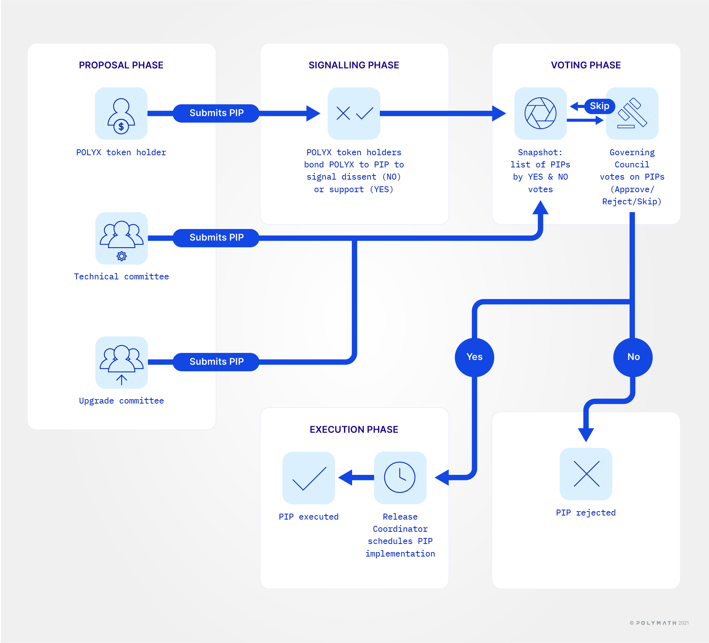

Transparency can be a tricky characteristic when it comes to voting procedures in general. In Polymesh, transparency is limited on voting records. Meaning, one cannot know who voted how, only the vote result as such.

<HighlightBox type="info">

Learn more and test-drive governance here [https://governance.polymesh.network/](https://governance.polymesh.network/).

</HighlightBox>

## Step-by-step: Governance possibilities with the Dashboard

Now that we have a clear understanding of the governance process itself, let’s take a look at how this translates to our Dashboard.

First, open up your browser and check that you are logged into your Polymesh Wallet. Open the dashboard by going to: [https://dashboard.polymath.network/](https://dashboard.polymath.network/).

If it’s your first time, you will probably see the following:

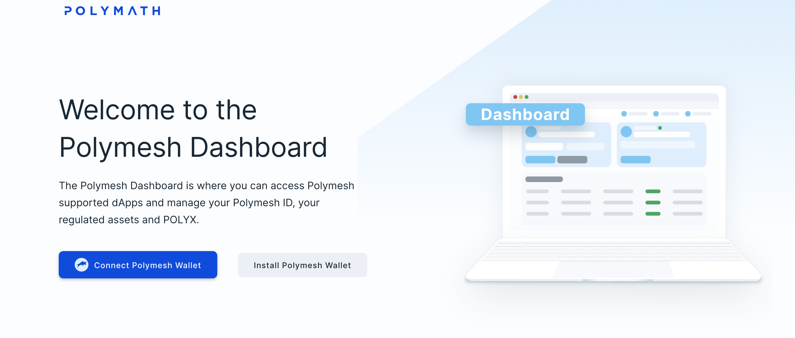

Click on `Connect Polymesh Wallet`. Your wallet will then ask you for an authorisation.

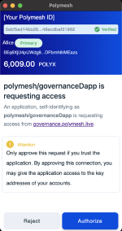

<!-- Obfuscate name of wallet owner -->

Click on `Authorize`.

The Dashboard will open in your browser.

Now, in the upper tab bar click on `Governance`.

This will lead you to:

Click on `Go to Governance` to be redirected to [https://governance.polymesh.network/](https://governance.polymesh.network/).

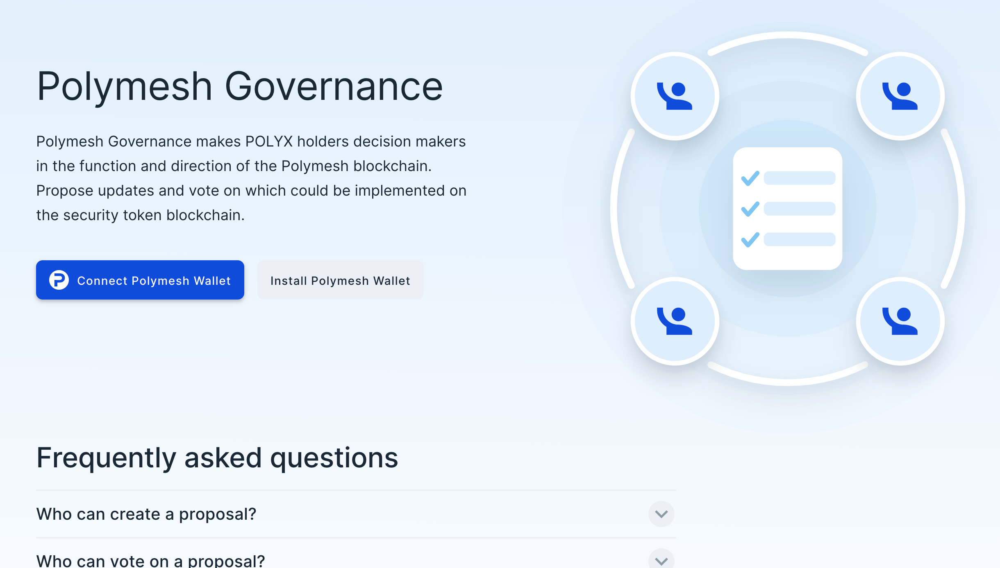

If you see the above, then please click on `Connect Polymesh Wallet`.

Once you have connected the wallet or if you don’t see the above, the redirect should lead you to:

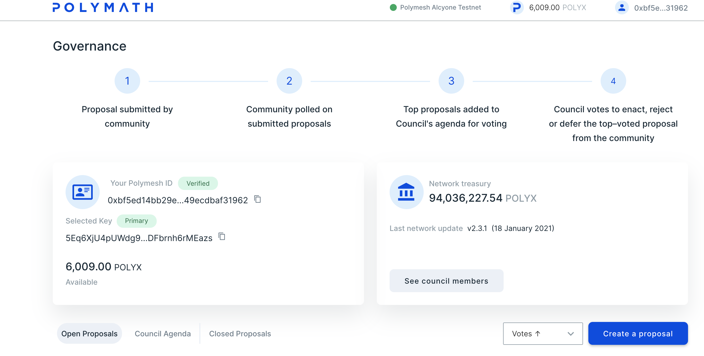

**Welcome to the Governance Dashboard!**

The dashboard also includes a short overview of your Polymesh ID, keys, and account balance.

With the dashboard you are able to:

* see who the council members are,
* gain insights into the closed proposals,
* take a look at the council agenda,
* check the open proposals, and
* create a proposal.

To see who the **members of the Governing Council** are, click on `See council members`.

You will be redirected to a list of the members with their corresponding identities, i.e. DID.

Do you want to take a look at past proposals? Just click on the tab at the lower half of the page saying `Closed Proposals`.

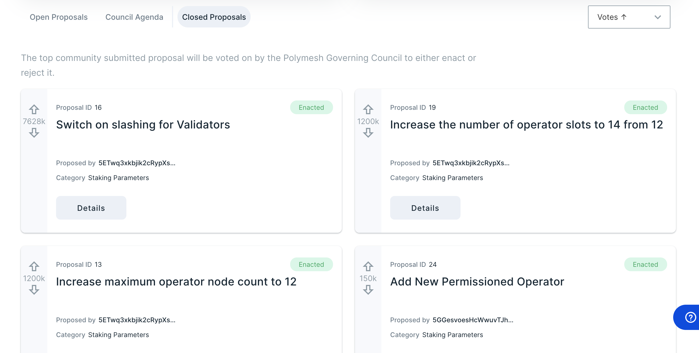

How is the council agenda looking? The same process applies; click on the tab at the lower half of the page titled `Council Agenda`.

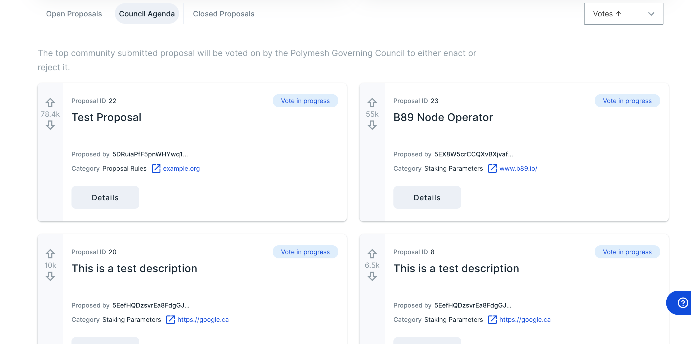

To have an overview of the current proposals, which will be open to signalling by token holders, click on the tab `Open Proposals`. You can sort the list of open PIPs by votes and proposal IDs.

All open proposals will be listed. The listing includes certain information on the PIPs:

* the proposal ID (at the upper left corner of each "proposal card"),
* right beneath it, the proposal name,
* the identity of the user that submit the proposal,
* the proposal’s category, and
* a button to participate in the signalling.

Click on `Have your say` to be directed to signalling for the PIP.

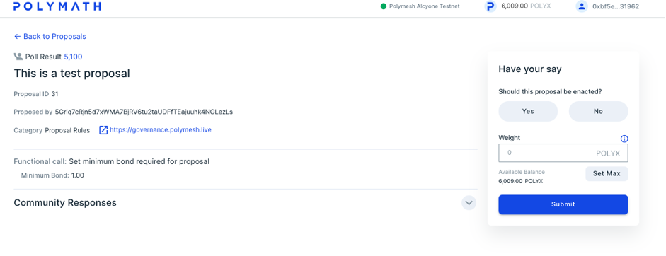

To participate in the signalling, click either on `Yes` or `No` to show support or dissent, and enter the amount of POLYX with which you want to weigh your vote. You can also use `Set Max` so that all your POLYX is used as weight for the proposal.

Now, click on `Submit`.

<HighlightBox type="info">

**You can only bond as much POLYX as you currently hold!**

</HighlightBox>

For example, let’s support the test proposal with 10 POLYX. So, click `Yes` and insert the number of POLYX in the field.

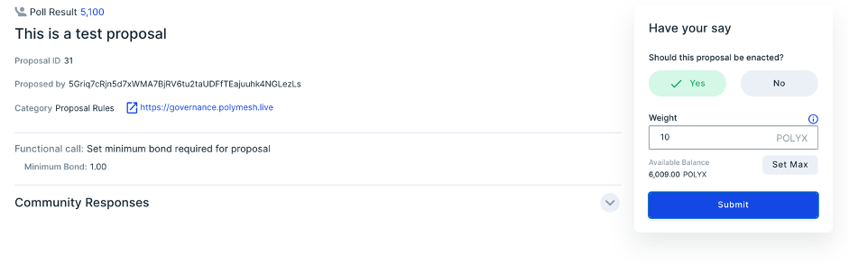

Once you hit `Submit`, a window opens for you to review and confirm your response. As long as the proposal remains open, you can change your vote.

Confirm if all looks good.

A window to your wallet will open, requesting you to sign your vote.

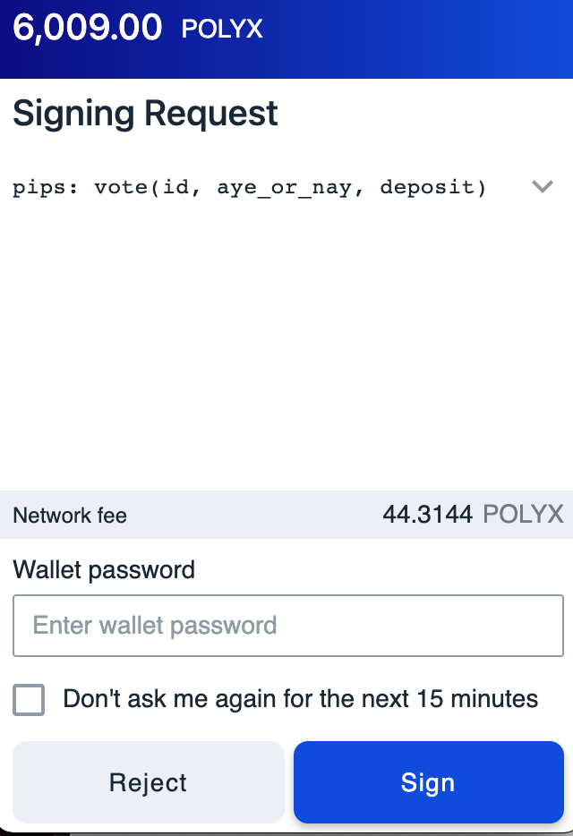

Click on `Sign` after entering your wallet password in the field.

In your browser, you should see:

**Congratulations! You just voted.**

Now that we have explored the Dashboard. Let’s just go for it and create a proposal!

In your governance dashboard, click on the button `Create a proposal`. This opens a side window in your browser that helps you include all the general information and implementation details necessary to submit a proposal.

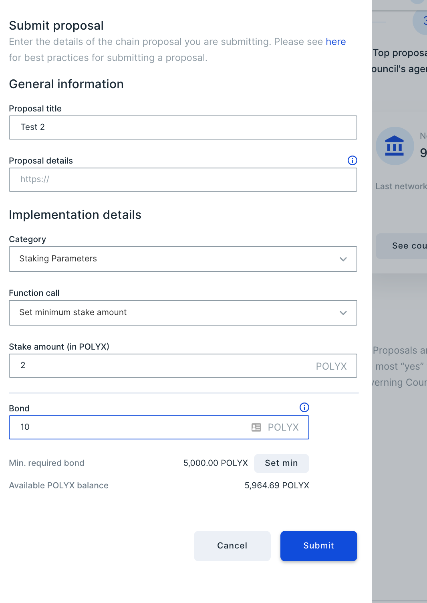

As general information, the proposal title and the proposal details, i.e. an URL to the details, is included. For the implementation details, one has to select a category for the proposal. The available categories are:

* User Balances,
* User Identity,
* Proposal Rules,
* User Identity,
* Proposal Rules,
* Polymesh Voting Rules,
* Staking Parameters, and
* System Preferences.

The function to call also has to be selected.

For the category _User Balances_ you can select _Force Transfer_. Afterwards, you need to specify:

* the Polymesh address from which tokens are transferred,
* the Polymesh address to which tokens are transferred, and
* the amount of POLYX to be transferred.

When selecting _User Identity_ the function to call is _User Identity Master key rotation for CDD_. This function requires details in regard to the authorization for rotation.

When choosing _Proposal Rules_, the function is _Set minimum bond required for proposals_. Details on the minimum bond have to be included.

For _Polymesh Voting Rules_ the option _Set minimum bond required for proposal to pass_ is available. It requires details on the numerator for threshold and denominator of threshold.

The _System Preferences_ category offers _Queue code for network parameters_. A code snippet has to be added as detailed information.

When the category is _Staking Parameters_ one can select between _Add a permissioned operator_, _Waive deferred operator fine_, _Remove a permissioned operator_, and _Set minimum stake amount_. When adding or removing a permissioned operator, specifications on the Polymesh ID for both and the intended count when adding an operator is required. To wave a deferred operator fine, era and list of fines are necessary. To propose a change on the minimum stake amount, a stake amount in POLYX needs to be provided.

After including all general information and implementation details, enter the amount of bond for the proposal and click `Submit`.

<HighlightBox type="tip">

At the time of writing, the minimum amount for a bond is 5,000.00 POLYX.

</HighlightBox>

Afterwards, the proposal submission has to be confirmed.

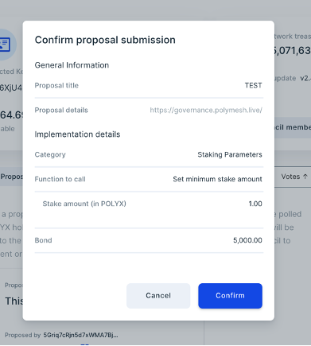

Once you confirm, you will need to sign the proposal submission.

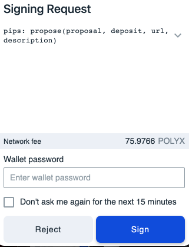

`Sign` the submission and you have just included a new proposal.

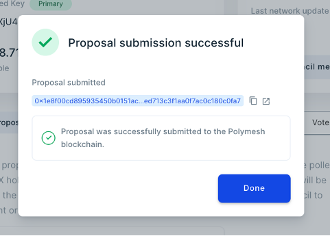

It will be visible under the `Open Proposal` tab.

Congratulations on submitting a proposal!

## Links

- [Polymesh Network: Governance](/polymesh-docs/network/governance)
