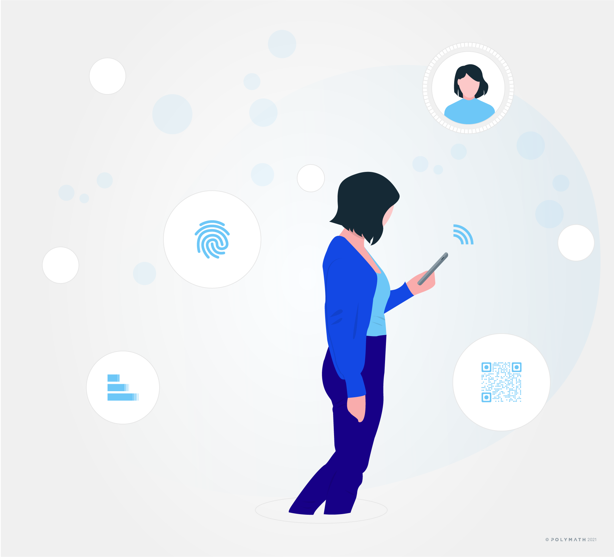
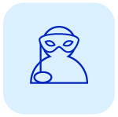
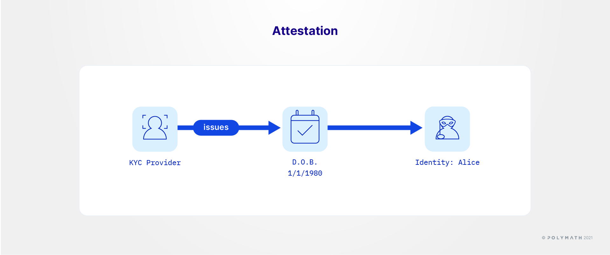
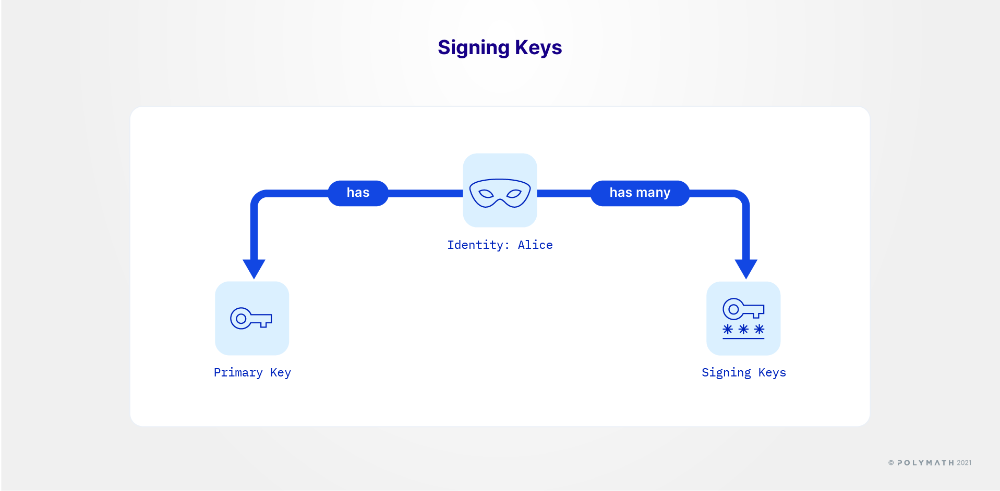
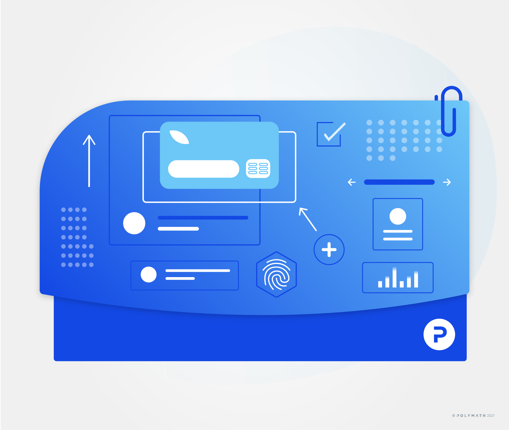
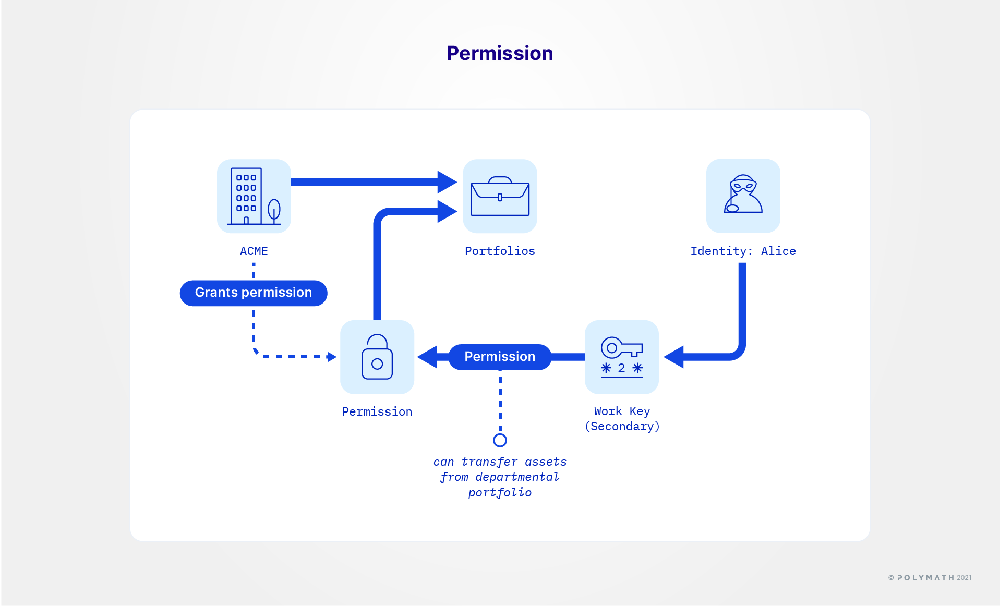
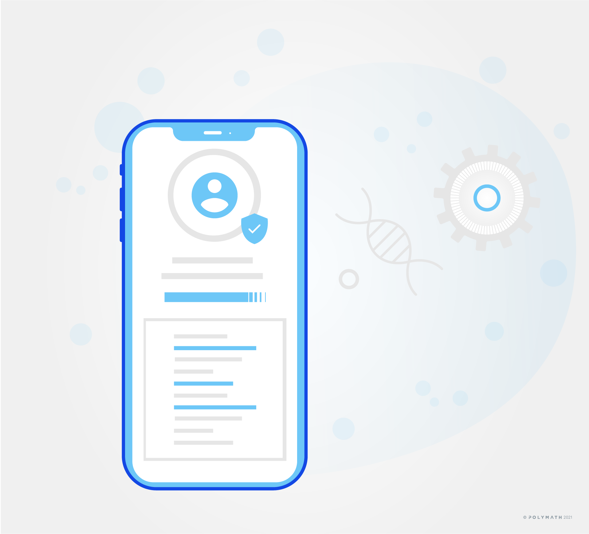

import HighlightBox from "../../src/components/HighlightBox"

Identity is a central concept in all of blockchain technology. As it is one of the main concepts, but also because Polymesh has a very specific way of addressing identity, it is valuable to have a more detailed look at it.

So, let's dive right into it!

## "My name is Alice"

This deceptively simple-sounding statement is among the first sentences children learn to say and it is among the first statements one learns when studying a new language. This concept is second-nature to human beings.

Just as proverbial fish seldom think about water, we seldom find ourselves pondering the meaning of such a statement. But, when we are talking about systems that "prove" certain things, it's important to understand exactly what is being proven, and how it is being proven.

Let's avoid confusion about fundamental concepts by deconstructing what was said, consider the challenge of proving it, and the way Polymesh solves the problem.

## Polymesh uID: "Who are you?"



One of the first challenges we face when unpacking this topic is that some of the common terms are overloaded with too many meanings in different contexts. Let's make the first distinction.

You, dear reader, are the one who is reading this message. You may hear the words in your mind as you absorb their meaning. No matter what you were called, or how many times you change your name, you will always be you. You can do things and you can own things. You can interact with others. You can be accountable for the things you do.

Intuitively, you know that someone wrote the words, possibly a team of people. But you also know that this publication comes from Polymath, and Polymath, the organisation, is responsible for what is written here.

In the legal and corporate world, corporations are "persons" meaning (approximately) that organisations can own things and do things. Thus, organisations and business entities are often referred to as a **juridical person**, a legal entity that is not an individual **natural person**. The people who work for organisations are generally not individually responsible for things the organisation does. They work within the organisation and they usually have limited authority to act on the organisation's behalf. Indeed, given that an organisation is a legal construct, we can surmise that whenever an organisation acts, it is probably executed by one or more people acting on its behalf or possibly an automated system, that is owned by the organisation and operated by the people who work there.

A **Polymesh "uID"** (unique ID) can be an individual or an organisation. 

This brings us to the first important pillar that will support our understanding of Polymesh Identities:

> A **uID** represents an individual or an organisation. A uID may control more than one account but no one should have more than one uID.

## Polymesh account: "What is/are your username(s)?"

You, as a person, already use several online services. These could include email, social networks, banks, etc.. For each of those services, you chose or were assigned a username or account. It might be your first and last names. It might be "petrolhead1980". You might in fact have two distinct usernames on the same platform which you use for different purposes. You are in control of these usernames and they represent you digitally. But they are not you the person.

The corresponding on-chain concept in Polymesh is a **Polymesh "decentralised ID" (DID)**, implemented as a large number and representing an account. You may not choose your DID, but it is sufficiently obfuscated to protect your privacy.

To express these concepts, we thereafter represent a Polymesh account (identified by its DID) as someone coyly hiding behind a party mask.



## Attestations: "Show me your ID"

Discussions of _Identity_ and what it means can be hampered by the various meanings of the phrase "ID" in other contexts. Clearly, your driver's license and passport are not you. They are in your wallet or purse, and you are reading this message. No rational observer would confuse a plastic document for you. When someone asks us to show our ID, this is usually a request for **evidence of identity**.

In social settings, it is usually of no importance to confirm someone's legal name. They may prefer to be called by something else, and that's acceptable in a casual context. We might consider it rude if a new acquaintance challenged our claim about our first name for no apparent reason. In more formal settings, it is important to confirm the facts and we are accustomed to presenting our "ID", more precisely documents we have collected over our lifetimes, in order to demonstrate that our claims are indeed factual.

Can we say that an ID document provides proof of a fact? Are such documents always accurate? Not necessarily so. If one has moved recently. Details like our home address might be out of date for a time. It would be more accurate to say that an **ID document provides evidence**.

Will any document suffice? It would be more accurate to say that only documents that emerge **from known issuers with strict processes** can provide strong evidence. For this reason, government-issued photo IDs are a common method of identification.

If one is presenting a passport as evidence of citizenship, we can say with certainty that the passport office of a certain sovereign state believed, at the time of issuance, that the person's citizenship was as specified in the document and the reason they believed it to be so was because they followed a strict process to arrive at that conclusion. The passport itself is evidence that this took place.

Another property of good ID documents is they should be **difficult to forge**. The more forgery-resistant the document is, the stronger the evidence. This is where cryptography shines since there is no known (practical) method of forging cryptographic signatures. We can always say, with near certainty, that someone with knowledge of a given private key must have produced a given signature. The main caveat is that private keys must be kept confidential.

We might summarise by saying:

> **the strength of the evidence is proportional to the thoroughness of the process, the reputation of the document issuer, and the forgery-resistant nature of the document itself.**



What we know about the origination process and the reputation of the issuer tells us what we need to know to evaluate the strength of the evidence in support of the _claims_ (e.g. date of birth). That assessment is roughly equivalent to the decision to accept or reject an ID document that purports to establish something about the person who is presenting it.

In Polymesh, *descriptive properties of a Polymesh account* are called **attestations**. An attestation is a statement about the Polymesh account and it is always issued by another account. As we will see, know your customer (KYC) and customer due diligence (CDD) providers execute their own internal processes to confirm the facts and then issue attestations. This enables a Polymesh account to prove something about themselves in (approximately) the following cryptographically provable format:

> A known, accountable organisation signed an attestation on a certain day indicating that the account in question represents Alice. This attestation expires on a given date.

Slightly more technically accurate:

```
{
    Subject: Alice’s Account,
    Name: Alice,
    Signed: KYC Provider,
    Date: January 30, 2021,
    Expires: January 29, 2022
}
```

The KYC service provider that contributes the attestation is testifying that they followed their process to reach that conclusion. The attestation is signed in a way that proves it came from someone with knowledge of the KYC service provider's private key. In this way, the existence of the attestation stands as evidence that the process took place, and `Name: Alice` was the result. With this signed attestation in her possession, Alice can present it to anyone at any time. There is no further need to involve the KYC service provider as long as the verifier is satisfied with the attestations Alice can present.

## Signing keys: "Sign here"

This arrangement maps well to an intuitive understanding of the actual material and legal worlds.

Let's consider ACME Corp, an entity with a Polymesh DID. We can know the true legal name of the corporation behind a Polymesh account because a KYC service provider attests that they have reviewed the pertinent documentation, for example, the certificate of incorporation.

The organisation can own things and do things. Let's say that Alice works for ACME Corp. Alice is an individual who can own things and do things for herself (via her Polymesh DID) as well as for ACME Corp, being an employee of the organisation. When she is acting on behalf of ACME Corp, within the limits of her authority, she signs, on behalf of ACME Corp, with one of her signing keys that was associated with, and authorised by, ACME Corp. When she is acting on her own behalf, she uses another one of her signing keys, this time associated with her personal Polymesh DID.

Adding just a little bit of precision to the foregoing description, an entity has its own Polymesh DID, has zero or more secondary keys, and a primary key. Secondary keys have well-defined permissions outlining what they can do on behalf of the account. Secondary keys and permissions are managed by the primary key.



Lastly, both primary and/or secondary signing keys may be one of several types:

* A _simple_ private key, based on private knowledge, like a seed or mnemonic, may be sufficiently secure for Alice's routine duties, or
* A _multi-signature_ key in that it is based on _n_ keys, of which _m_, the quorum, must agree for any action to be validated.

<HighlightBox type="info">
<a href = '/polymesh-docs/network/ledger/'>Ledger signing hardware</a> can be used to safeguard signing keys.
</HighlightBox>

## Portfolios



Polymesh DIDs optionally organise owned assets into **portfolios**. Portfolios are **logical containers** that provide a way to define permission boundaries as well as organise reporting.

For example, Alice might have complete control over the assets in the portfolio she is employed to manage, some control over specific assets in other portfolios or all of the assets in specific portfolios, and no control over other assets beyond her permission boundaries.

<HighlightBox type="info">

Portfolios relate strongly to custody on Polymesh. For a more detailed account, take a look at: [https://developers.polymesh.network/polymesh-docs/primitives/portfolios_custody/](/polymesh-docs/primitives/portfolios-and-custody/).

</HighlightBox>

## Permissions

Polymesh's permission requirements are organised on a method-by-method basis because not all permissions are required in all cases.

<HighlightBox type="tip">

Refer to the reference documentation for details on [permissioned roles](/polymesh-docs/network/permissioned-roles/) and [authorisations](/polymesh-docs/primitives/authorisations/).

</HighlightBox>

In the most stringent case, the allowable actions are the intersection of the **action**, the **portfolio**, and the **asset**. In some cases, one or more of those properties are not relevant to the action to be undertaken so explicit permission is not required.



## Polymesh Unique Identity System (PUIS)

Of particular importance in the world of regulated securities is the repelling of so-called **Sybil attacks**. The name is inspired by the 1976 movie of the same name. The main character in the film is a woman who suffers from a multiple personality disorder. The creation of multiple accounts by a single individual in order to circumvent restrictions is known as a Sybil attack.

An example of a Sybil attack in the realm of regulated securities could be a single entity accumulating a sizeable stake in the security with the use of multiple Polymesh accounts, while avoiding reporting requirements. The **Polymesh Unique Identity System (PUIS)** is designed to repel this type of attack.

There is no prohibition against operating multiple Polymesh accounts with distinct Polymesh DIDs. There are, however, regulatory compliance obligations that fall on investors, depending on jurisdiction. Suffice it say that it is generally not permissible to use multiple accounts to obfuscate reportable holdings of a regulated security. Polymesh provides a mechanism of self-reporting linkage between multiple accounts as well a means of detection.

The PUIS is an off-chain process which allows CDD providers to coordinate and determine a **unique identifier** for each entity (individual or organisation) that is onboarded to Polymesh. This database can only be accessed by CDD providers. CDD providers can insert new customers, or query for existing ones by using so-called identity _fingerprints_ unique to their customer. In this PUIS, the CDD customer's unique identifier, or uID, is a v4 UUID generated once when the customer is onboarded for the first time. It is by this uID that customers are indexed in the PUIS system which is off-chain.

Only a Pedersen (cryptographic hash) commitment of the uID is published on-chain as part of the CDD claim. Polymesh users do know their uID and can use this knowledge to reveal to asset issuers if they, the unique entity are investing in an asset under multiple Polymesh DIDs.

In this way, the PUIS and CDD process lets investors use multiple Polymesh accounts and maintain a high level of confidentiality while supporting compliance for asset issuers that rely on knowing the unique entities that are invested in their asset.



<HighlightBox type="tip">

To take a closer look at how identity and confidentiality play together in Polymesh, this documentation on [confidential identity](/polymesh-docs/primitives/confidential-identity/) includes some more information on PUIS, CDD claims, and the linking of identities.

</HighlightBox>

## Know your customer (KYC)

While efforts are underway to establish a worldwide standard, there is no universally accepted process for identifying and vetting individuals and organisations or representing attestations.

As such, each originator establishes their own policy covering the information they must know about each investor (or counterparty) and how they must know it, i.e. the process.

KYC service providers offer suites of services that implement such policies. Each check has corresponding procedures. For example, individual checks include measures such as consuming/interpreting an image of a passport or driver's license, facial recognition, criminal database checks, etc.. Checks dealing with an organisation include collecting incorporation documents and signing officer signatures. KYC service providers can attest to such matters as investor accreditation, legal name, place of residence, or the legally incorporated status of an organisation.

While each originator sets their own policy, considerable overlap is expected. Attestations associated with an investor's Polymesh account can be re-used in other contexts, provided the attestations have not expired and the attestation the account already has is acceptable in terms of form and source.


Polymesh is designed to welcome existing KYC service providers into the Polymesh network. The SDK integrates easily with existing systems, which allows KYC service providers to **issue on-chain attestations**.

<HighlightBox type="tip">

For more information on this topic, prospective KYC service providers should review the admission process described [here](/kyc/know-your-customer).

</HighlightBox>

## Customer due diligence (CDD)

Customer due diligence, or CDD, is a minimal KYC attestation that entitles a Polymesh account to interact with the Polymesh network. **Functions with material importance** are **restricted** to accounts that have completed a CDD check with an approved CDD service provider.

In this way, it is possible to conduct certain activities with no explicit KYC requirements in a pseudo-anonymous fashion. Even so, it is still true to say that no trading occurs between unidentifiable parties because all accounts must complete customer due diligence before materially important transactions are allowed.

<HighlightBox type="tip">

For a more in-depth look at CDD on Polymesh, dive right into [Polymesh's CDD](/kyc/know-your-customer).

</HighlightBox>


## Links

- [Primitives: Identity](/polymesh-docs/primitives/identity/)
- [Primitives: Confidential Identity](/polymesh-docs/primitives/confidential-identity/)
- [Primitives: Customer due diligence](/polymesh-docs/primitives/cdd/)
- [Primitives: Portfolios and Custody](/polymesh-docs/primitives/portfolios-and-custody/)
- [Primitives: Compliance](/polymesh-docs/primitives/compliance/)
- [Primitives: Authorizations](/polymesh-docs/primitives/authorisations/)
- [Polymesh Network: Permissioned Roles](/polymesh-docs/network/permissioned-roles/)
