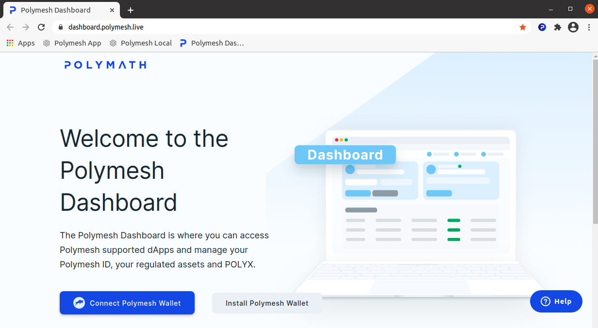
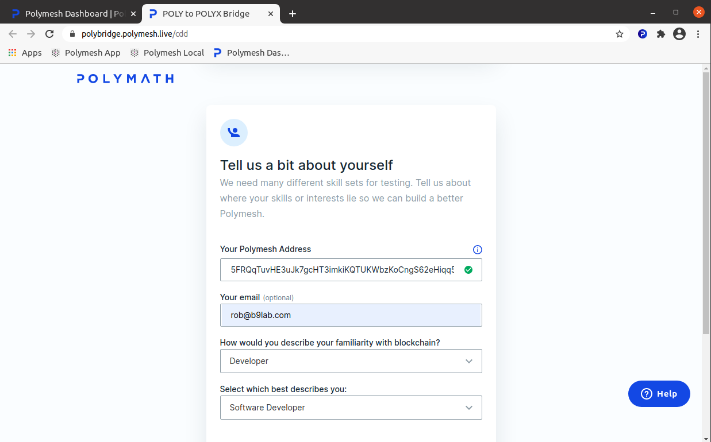
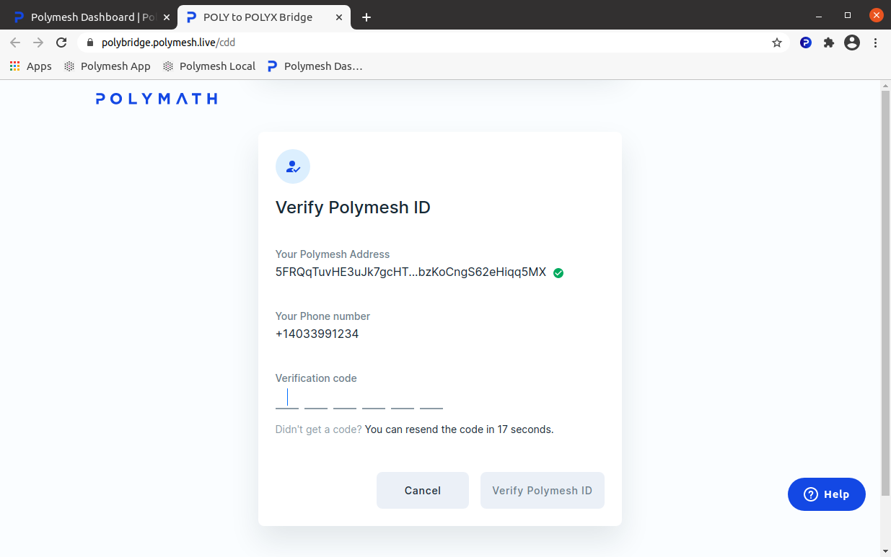
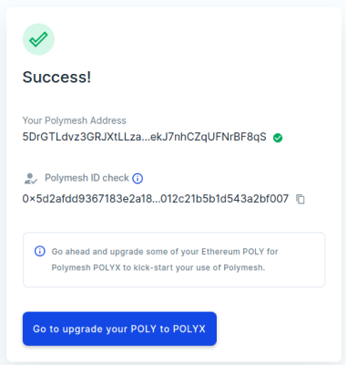

import HighlightBox from "../../src/components/HighlightBox"

Every Polymesh account must pass a **minimal identity verification** before the account is permitted to transact with regulated securities on the network. This minimal verification is called **Customer Due Diligence (CDD)**.

Verifying your identity for CDD purposes means working with a CDD service provider. They will verify the information you send.

## Assign account

The `Assign` button appears when you hover over an unassigned signing key, and it takes you directly to the account context in the [Polymesh Dashboard](https://dashboard.polymesh.live/). Here, you will create a Polymesh account and assign your signing key to the account.

Your consent is required before the web app can communicate with your Polymesh Wallet. Press `Connect Polymesh Wallet`.

This will connect your dashboard with your Polymesh Wallet. The wallet can demand an authorisation to connect with the Polymesh Dashboard.

## Complete Customer Due Diligence on the testnet

The web app detects that you are using an unassigned key and informs you that the setup of your new account is incomplete. Press `Create a Polymesh ID`.

Now, complete the Customer Due Diligence application.

Enter the verification code that arrives by SMS (i.e. text message) to your phone.

It may not be instantaneous, and the Customer Due Diligence process on the mainnet will be more stringent than the one on the testnet, but very soon you will see an indication that your Polymesh account has been verified.

And, you will see this next to your account next time you open your wallet.

**Congratulations! You have completed Customer Due Diligence.**

<HighlightBox type="tip">

Everyone who participates in materially-important transactions on Polymesh must complete Customer Due Diligence (CDD), at a minimum. Asset originators can and usually will augment this minimum requirement with additional KYC requirements but they may not circumvent this minimum requirement.

Since we will use the Alcyone Testnet for exercises as we discover Polymesh, it is recommended that you complete your CDD now.

</HighlightBox>

## Links

- Polymesh Dashboard https://dashboard.polymesh.live/
- Customer Due Diligence [/cdd/landingpage/](/cdd/landingpage)
