import HighlightBox from "../../src/components/HighlightBox"

## Customer Due Diligence (CDD)

Every Polymesh account must pass a **minimal identity verification** before the account is permitted to transact with regulated securities on the network. This minimal verification is called **customer due diligence (CDD)**.

Verifying your identity for CDD purposes means working with a CDD service provider. They will verify the information you send and write an identity claim to the chain for you.

## Assign account

When you first create an account it will show as an unassigned key. This means there is no onchain identity associated with it.

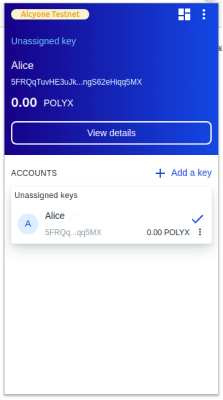

The `Assign` button appears when you hover over an unassigned signing key. The associated link will take you the account context tab in the Polymath [Mainnet Polymesh](https://dashboard.polymath.network/account) or [Testnet Polymesh](https://testnet-dashboard.polymath.network/account) dashboard. From here, you can select `Create Account` to link to the Polymesh onboarding portal.

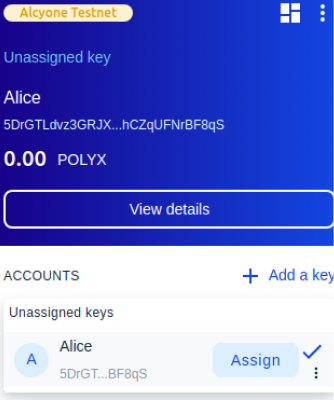

When connecting to Polymath's dashboard for the first time you will be prompted to authorize it to communicate with your Polymesh Wallet. Press `Authorize` in the wallet popup to allow the page to load.

Click the `Create Account` button to bring you to the appropriate onboarding portal.

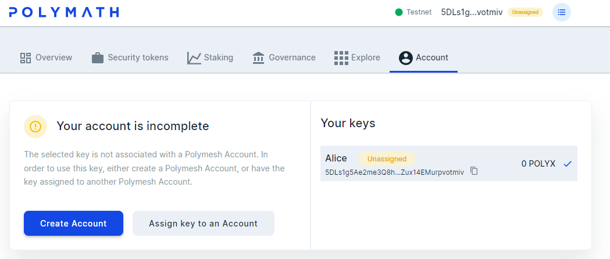

<HighlightBox type='tip'>
You can skip accessing Polymath's dashboard by going directly to either of the following links:
<ul>
    <li style={{margin: '5px 0px 0px 5px'}}><a href="https://onboarding.polymesh.network/">https://onboarding.polymesh.network/</a> for Mainnet</li>
    <li style={{margin: '5px 0px 0px 5px'}}><a href="https://testnet-onboarding.polymesh.live/">https://testnet-onboarding.polymesh.live/</a> for Testnet.</li>
</ul>
</HighlightBox>

## Complete the Customer Due Diligence process

When connecting to the onboarding portal for the first time you will be prompted to authorize it to communicate with your Polymesh Wallet. Press `Authorize` in the wallet popup to allow the page to connect and then click `I've set up my Polymesh Wallet` to start the process.

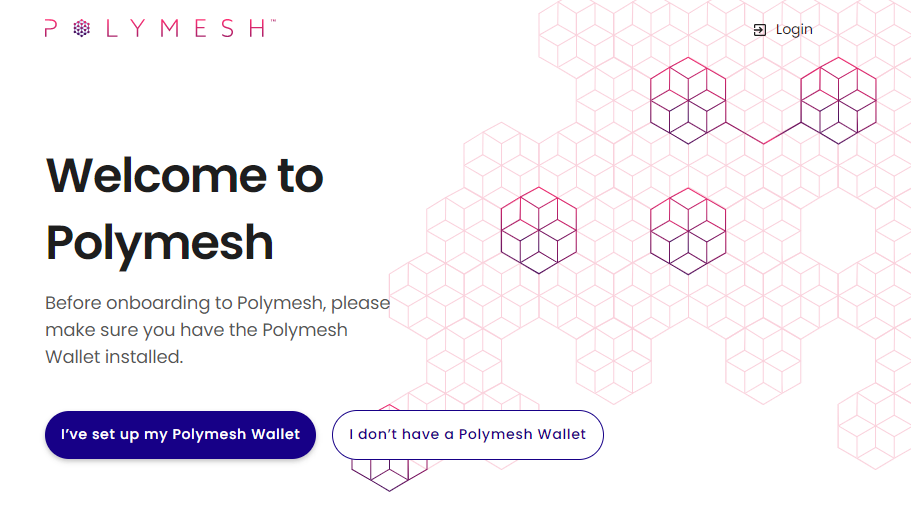

Enter your email address, select the kind of Polymesh user you are, accept the privacy policy and click the "Submit" button.

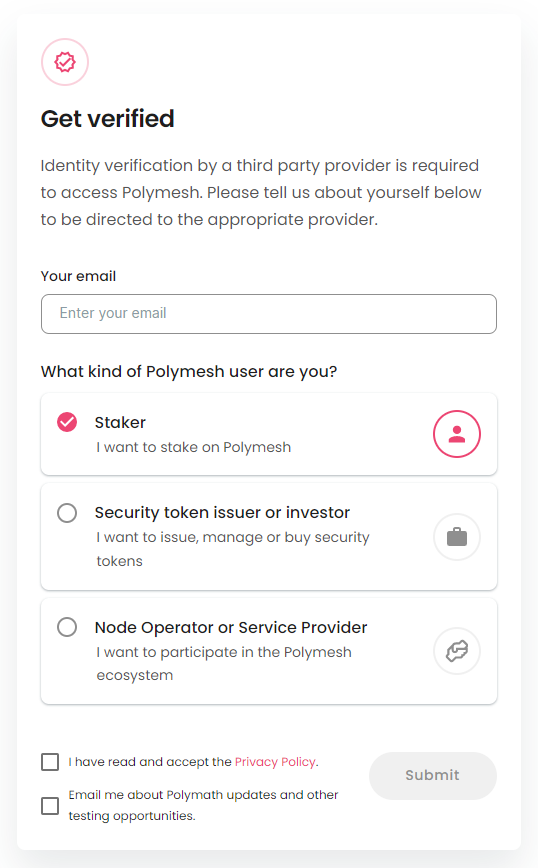

An email will be sent to your email address with a link for you to log in to the onboarding portal. Open your email and follow the link. 

You will be presented with the below screen. Click the `New Application` button.

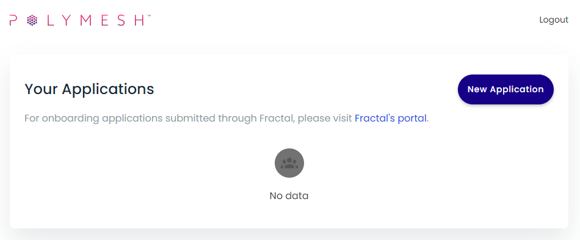
 
### Testnet Mock Customer Due Diligence process

(For Mainnet skip to the next [section](#mainnet-customer-due-diligence-process))

On testnet you will be presented with the below screen, allowing you to select the "Polymath Mock CDD" provider. Review the displayed wallet address and confirm it is the account you wish to onboard. If it is not, open the wallet extension and select the account you want to onboard as the primary key associated with your identity.

When satisfied, select "Polymath Mock CDD" and then "Continue".

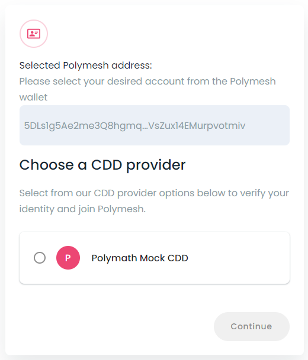

Another email will be sent to the address you logged in with. The email will contain a link allow you log into the the mock CDD portal, linked to the wallet account you provided. Open the link and complete the form.

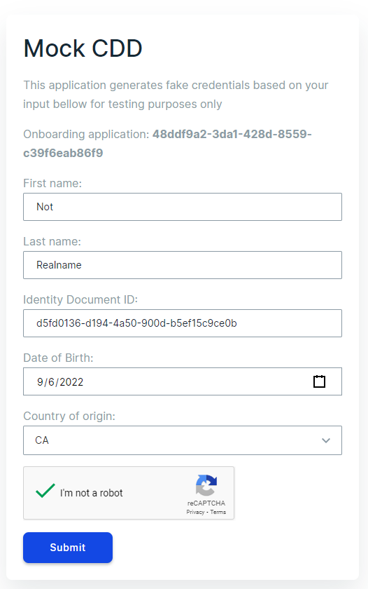

Complete the form with any mock data and click `Submit`. Submitting will initiate onchain actions to add a "decentralized ID" (DID) and a CDD claim to the account. This may take up to a minute to complete.

Continue to the [Success](#success) section.

### Mainnet Customer Due Diligence process

On Mainnet you will be presented with a screen similar to below, allowing you to select your preferred CDD provider. Review the displayed wallet address and confirm it is the account you wish to onboard. If it is not, open the wallet extension and select the account you want to onboard as the primary key associated with your identity.

When satisfied, select your chosen provider and then click "Continue". An email will be sent to your email address with a link to the CDD providers KYC portal. CDD steps will vary from provider to provider. Follow the instructions from the provider to submit your application for review.

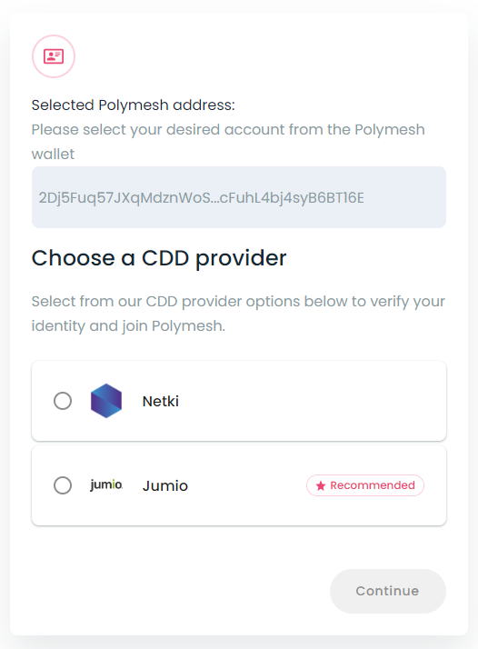

Application processing time may vary depending on multiple factors. Please allow 48 hours for processing. You will receive an email confirming the outcome of the CDD process. You can also review the status of your application by visiting https://onboarding.polymesh.network/login 

**DO NOT SUBMIT APPLICATIONS TO MULTIPLE PROVIDERS AT THE SAME TIME!** 

### Success

When you next open the wallet extension you will see a [DID](../introduction/identity#polymesh-account-what-isare-your-usernames) (long hexadecimal string starting with 0x) associated with your selected account account at the top of your wallet with the word **Verified** next to it.

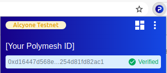

As a bonus, **on testnet**, your account will automatically be credited with POLYX allowing you to start to transact onchain.

### Final Step

After successfully completing the CDD process you will receive an email linking you back to the onboarding portal. From this link you will be able to inject your [unique ID (uID)](../introduction/identity#polymesh-uid-who-are-you) into your wallet. The uID is required when transacting with Assets on Polymesh that have been configured to require holders to have an associated uniqueness claim.

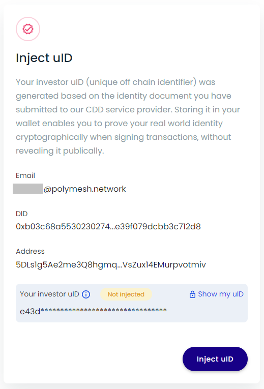

**Congratulations! You have completed customer due diligence.**

<HighlightBox type="tip">

Everyone who participates in materially-important transactions on Polymesh must complete customer due diligence (CDD), at a minimum. Asset originators can and usually will augment this minimum requirement with additional KYC requirements but they may not circumvent this minimum requirement.

Since we will use the Testnet for exercises as we discover Polymesh, it is recommended that you complete your CDD now.

</HighlightBox>

## Links

- [Polymath Dashboard Mainnet](https://dashboard.polymath.network/)
- [Polymath Dashboard Testnet](https://testnet-dashboard.polymath.network/)
- [Onboarding Mainnet](https://onboarding.polymesh.network/)
- [Onboarding Testnet](https://testnet-onboarding.polymesh.live/)
- [Customer due diligence](/kyc/know-your-customer)
