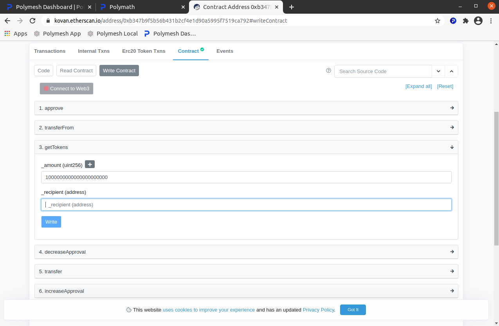
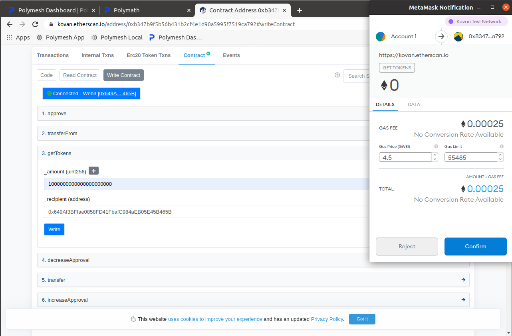
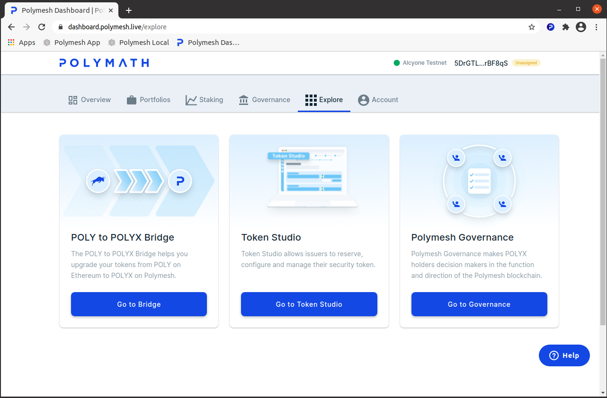
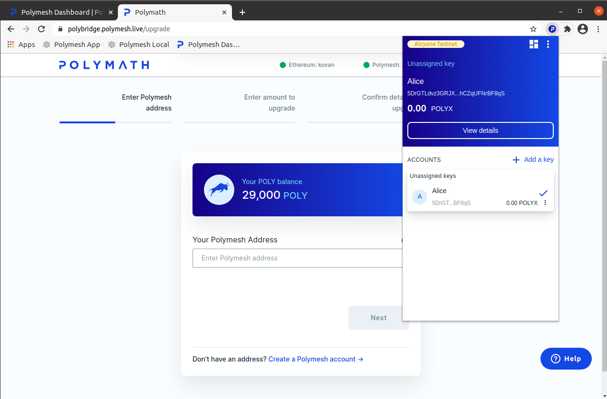
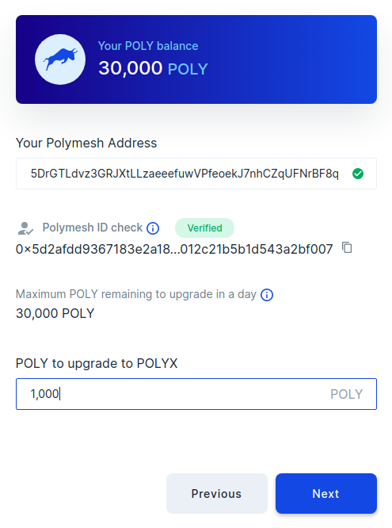
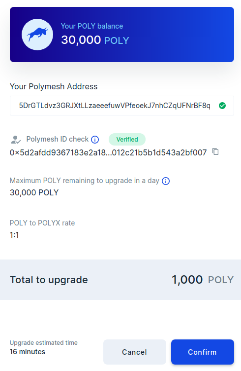

import HighlightBox from "../../src/components/HighlightBox"

POLYX is the network transaction fees token as well as the governance token that helps decentralize network management.

You will need POLYX to complete the exercises.

## Testnet POLYX

Testnet is where you can practice using Polymesh without material consequences. As the name suggests, it is a fully functional Polymesh network. The main differences are 

- the funds and securities on the testnet aren't real and have no material value
- future testnets may be initialized in the future and the present testnet may be retired
- you can acquire testnet POLYX at virtually no cost

Since you will interact with the testnet while you pursue the suggested exercises, let's get some free testnet POLYX to work with. 

## Background and concept

It will be helpful to understand a little bit of history to understand how this process works and why it works the way it does. In summary, the original Polymath network and network token, POLY, was deployed on the Ethereum mainnet. Those POLY tokens do indeed have material value. Consequently, the conversion process is backward-compatible. Owners of POLY can convert their POLY to POLYX at a ratio of 1:1. 

This process works by locking POLY on the Ethereum network, which means sending them to a contract that takes them out of circulation. Without delving too deeply into the smart contract details, suffice it say users send their POLY to the contract, then the POLYX is sent to the PID. 

The technical challenge is that these are separate blockchains. So, the bridge involves an off-chain process that monitors Ethereum for incoming POLY and releases POLYX on Polymesh in response to events observed on Ethereum. Also, since Ethereum and Polymesh use different account schemes, the UI will associate the sending Ethereum address with the receiving Polymesh ID. 

This process is familiar to POLY holders who are already accustomed to Ethereum tokens. And, the testnet implementation helps test and verify the conversion process. In order to get some free POLYX, you will first establish the initial conditions of real POLY holder on Ethereum. This section will take you through the process. 

## MetaMask

MetaMask is popular wallet for Ethereum. You can use any wallet you like. Just extrapolate from the signing instructions to your wallet of choice. 

MetaMask is a browser plug-in. If you don't already have MetaMask, search for in your browser plug-ins area or get it from here: https://metamask.io/

Take your time a follow the on-screen instructures to create one account. Initially, it will have no money, which is fine. 

## Kovan Testnet

It's a good idea to open MetaMask and change to the Kovan Test Network now. Click the icon in the plug-ins tray and click on the network selection box at the top of the applet. Select Kovan Test Network. 

## Testnet ETH

Ethereum uses ETH to pay for transaction fees. Since we cannot complete this process without sending a transactions, we will need some testnet ETH to pay for the transactions. 

Testnet ETH has no value and it is given away. All we have to do is ask. You can ask a friend, or use a faucet which is an automated or semi-automated system that gives it away. Automated systems tend to have anti-spam/anti-abuse mechanisms to help ensure everyone will receive enough to move forward. 

- ETH Faucet: Visit this web site which uses your Github account to authenticate users:  https://faucet.kovan.network/
- Gitter Chat: Visit this web site and post your Ethereum address. Funds are on the way.  https://gitter.im/kovan-testnet/faucet 

You may be asked for your Ethereum address. Open MetaMask, hover over your address and click on the clipboard icon that appears. 

Your ETH balance will increase after you request the funds and the transaction confirms. You can see that in MetaMask. Congratulations! You have some money. 

## Testnet POLY

As you may have already guessed, Polymath has published a contract on Ethereum that gives away free testnet POLY. That is what need to proceed across the bridge and convert it to POLYX on Polymesh. 

Point your browser to the contract: https://kovan.etherscan.io/address/0xb347b9f5b56b431b2cf4e1d90a5995f7519ca792#writeContract

If you see "Connect to Web3", press it. This will open MetaMask so you can confirm you wish it to talk to this web site. Select the account you wish to use. Choose the account that has testnet ETH. It should say "Connected - Web3" and your account. 

Now, scroll down to `getTokens` and expand it. Fill in the `_amount` with the number of POLY you would like. This uses 18 decimal places with no period (de facto standard for Ethereum tokens), so 1,000 POLY is `1000000000000000000000`.

The `_recipient` is you. Copy your address from MetaMask by opening the applet, hovering over your account and clicking the clipboard. Paste your address and press `write` to send this transaction to the contract. 

MetaMask tells you the web page is trying to do something with your funds and asks you to confirm. Press `Confirm`.

## Onward to the Bridge

Now that you have testnet POLY and a way to pay for transactions on the Ethereum network, you can proceed to the Polymesh Bridge to convert your POLY to POLYX. 

Point your browser to the dashboard explorer and select POLY to POLYX Bridge: https://dashboard.polymesh.live/explore)

Or go directly to: https://polybridge.polymesh.live/

MetaMask will not talk to this website unless you authorize it, so click `Connect with MetaMask` to link your account. 

## Link your Polymesh ID

The process begins by asking for your Polymesh ID.

Open your Polymesh Wallet and copy your ID, then paste it into `Your Polymesh ID`. This account will receive the POLYX. 

If you completed [CDD](/02-quickstart/quickstart-cdd) (you should), then the site will indicate that your Polymesh ID is verified. If not, then you will be directed to Customer Due Diligence. 

Enter an amount of your POLY to convert. You cannot convert more than is in your wallet. 

When everything is ready, the site will confirm your intentions. 

Press `Confirm`. 

MetaMask will, again, ask you to confirm that you intend to send the specified amount of POLY to the Polymesh bridge. Confirm this tansactions. 

Now, you will see two stages of the process unfold. First, Ethereum will process the transaction where you sent POLY to the bridge. This is the "Locking" transaction. Then, Polymesh will observe this event on Ethereum and send you an equal amount of POLYX. 

When everything confirms, you will have POLYX in your wallet. 

Congratulations! You have POLYX in your verified account which means you are ready to follow the exercises. Why not start by [creating a security token](/originate/landingpage)?

## Links

- POLY to POLYX Bridge: https://developers.polymesh.live/bridge/ 
- A Simple Guide for Getting Kovan Testnet POLY: https://blog.polymath.network/a-simple-guide-for-getting-kovan-testnet-poly-27ddeb1149cb
- Kovan POLY Faucet: https://kovan.etherscan.io/address/0xb347b9f5b56b431b2cf4e1d90a5995f7519ca792#writeContract
- Kovan ETH Faucet: https://faucet.kovan.network/
- Kovan Gitter Faucet:  https://gitter.im/kovan-testnet/faucet 
- Metamask: https://metamask.io/ 
