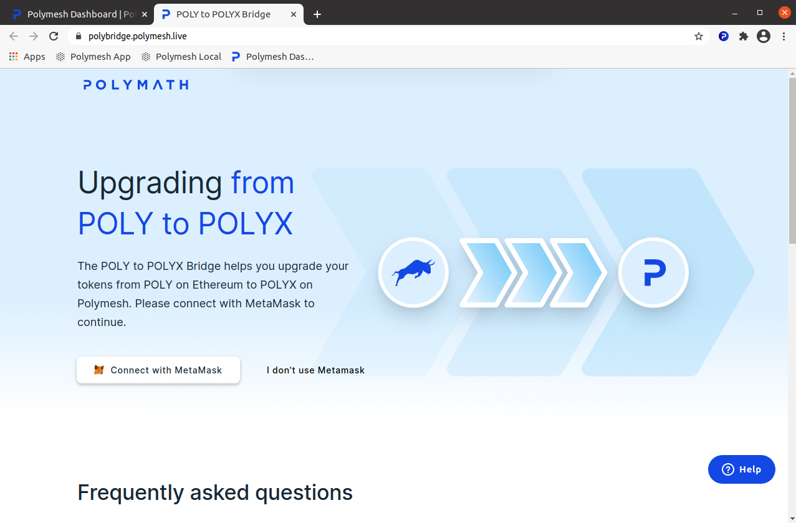
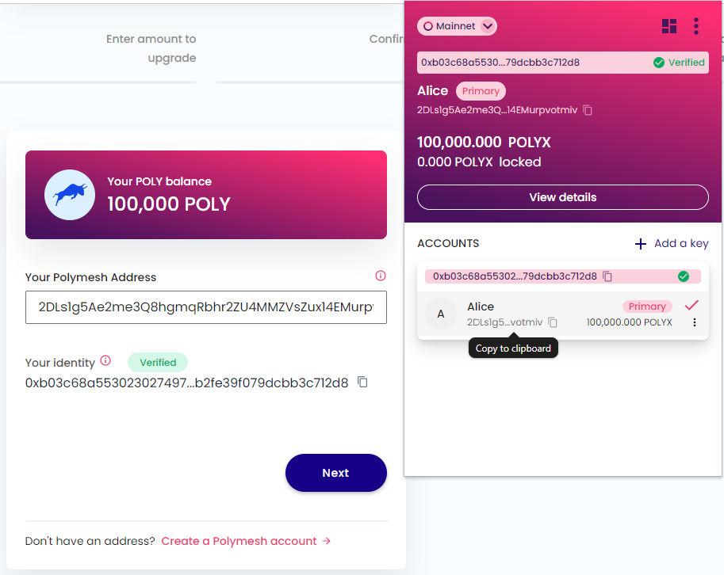
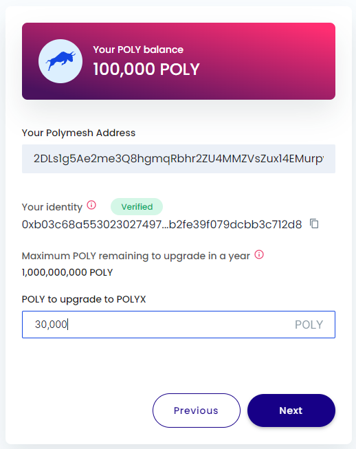
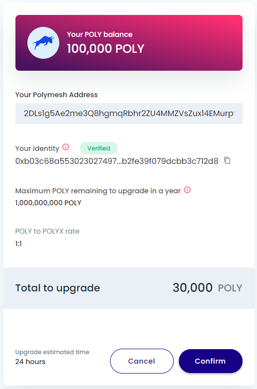
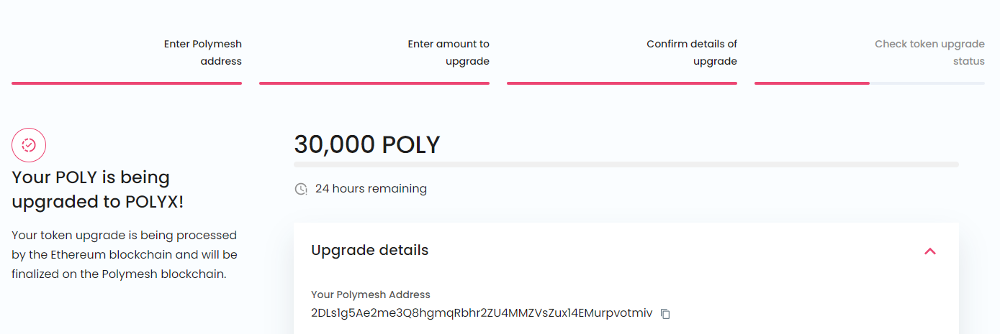
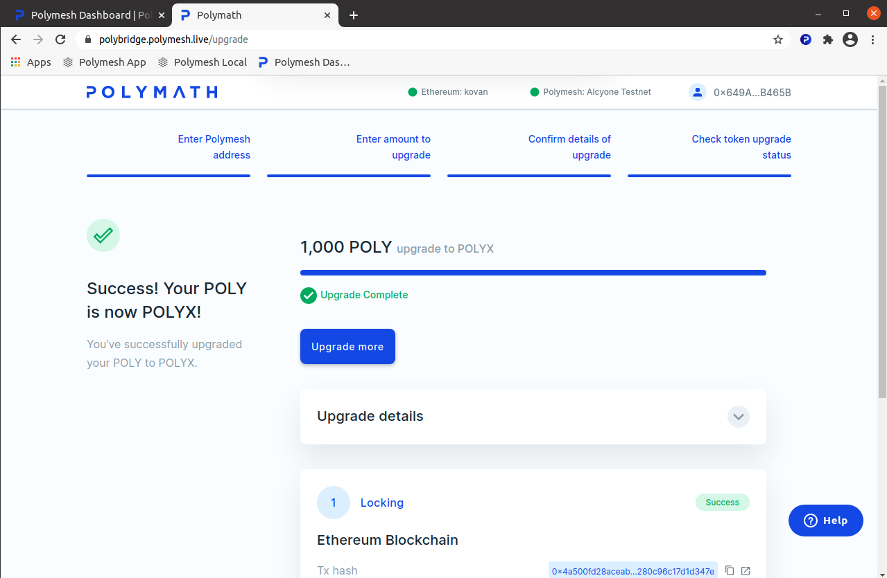
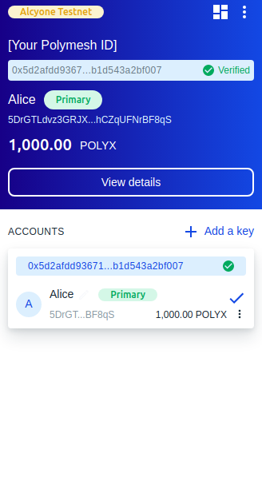

import HighlightBox from "../../src/components/HighlightBox"

## POLYX

POLYX is the native utility token for Polymesh. POLYX serves three primary purposes:

- Payment of onchain transaction fees
- Network governance, allowing network participants to vote on-chain upgrades and other exceptional events.
- Staking, securing the network by aligning the economic incentives of node operators and stakers to the correct operation of the chain.

For more information on the POLYX token see https://polymesh.network/polyx

## Testnet POLYX

If you are completing the exercises contained in the various sections of this site you will require Testnet POLYX. 

<HighlightBox type='tip'>
Getting testnet POLYX couldn't be simpler. If you have already <a href='wallet'>set up your wallet</a> and completed the testnet <a href='verification-with-cdd'>mock certified due diligence process</a>, you will automatically have been credited with Testnet POLYX.
</HighlightBox>

The Testnet is where you can practice using Polymesh without material consequences. As the name suggests, it is a fully functional Polymesh network. The main differences are:

- The funds and securities on the Testnet aren't real and have no material value;
- You can acquire testnet POLYX at no cost;
- The testnet is not guaranteed to remain in operation and may be retired and replaced with an alternate testnet in the future.

## Mainnet POLYX

Before you can receive POLYX tokens you must first; [create a Polymesh account](wallet), and second; Onboard your account through the [CDD process](verification-with-cdd). Once those steps are complete your account is ready to receive POLYX tokens. 

There are two primary ways to get your first POLYX tokens:
1. Purchase from an exchange that lists the Polymesh POLYX token.
2. Convert ERC20 POLY tokens from Ethereum to POLYX on Polymesh via the token bridge.

### Buying POLYX from an exchange

Possibly the simplest way to get POLYX tokens is to purchase them from an exchange, that lists the POLYX token for trading, and withdraw the tokens to your Polymesh wallet. Refer to [CoinGecko](https://www.coingecko.com/en/coins/polymesh#markets) or [CoinMarketCap](https://coinmarketcap.com/currencies/polymesh/markets/) for lists of exchanges that list the POLYX token. 

### Getting POLYX via the Bridge

**Background and concept**

Polymath, the company that originally built the Polymesh blockchain, created the POLY token on the Ethereum blockchain. POLY was intended to be used with their smart contracts used for the issuance of security tokens on the ethereum blockchain. When they built Polymesh it was decided that, instead of having a token generation event, POLYX tokens would be given to POLY token holder who choose to upgrade their tokens. Owners of POLY can upgrade their POLY to POLYX at a ratio of 1:1 through a bridge mechanism.

The bridge process works by locking POLY on the Ethereum network using a smart contract that permanently takes them out of circulation. This contract is monitored by the Polymesh bridge and when a locking transaction is identified creates a transaction to issue POLYX tokens to the users specified POLYX address on the Polymesh.

The bridge is a one way process. It is not possible to convert POLYX tokens to POLY tokens.

Upon launch the Polymesh Association committed to operate the bridge for a minimum of one year, to give POLY token holders the opportunity to convert their tokens, should they wish to.

**Requirements**

To use the POLY to POLYX bridge your require the following:
1. The Polymesh [wallet](wallet) extension;
2. An account with a verified onchain [identity](verification-with-cdd);
4. The [Metamask](https://metamask.io/) wallet browser extension;
3. ERC20 [POLY Tokens](https://etherscan.io/token/0x9992ec3cf6a55b00978cddf2b27bc6882d88d1ec) on the Ethereum blockchain in your Metamask wallet;
5. ETH tokens for payment of transaction fees on the Ethereum Blockchain in your Metamask wallet

The following guide assumes you have already satisfied the above 5 requirements.

### Using the Bridge

To access the bridge go to https://polybridge.polymesh.network/

MetaMask will not connect to this website unless you authorise it. Click `Connect with MetaMask`. The metamask browser extension will popup asking you to sign in and authorise the bridge dApp to connect to your wallet. Sign in and approve the request.

The first step of the bridge process is to enter you Polymesh address. Open your wallet, copy the address that you wish to receive POLYX and paste it into the window as shown below. (Note: On mainnet Polymesh addresses start with a **2**)

Your address will be checked and below the input field it should indicate that your Polymesh account identity is verified. If not, you need to complete the [customer due diligence process](/quickstart/verification-with-cdd) before continuing.

Click `Next` and then enter the amount of POLY you wish to bridge. You can enter any amount with up to 6 decimal places, provided you have sufficient POLY in your ethereum wallet to bridge. Once you have entered the amount you wish to bridge click `Next` again.

Review the transaction details and when you are ready to proceed click `Confirm`.

Upon clicking confirm the Metamask browser extension will open and present a transaction for signing. 

This first transaction calls the `Increase Approval` method on the POLY token contract and takes two parameters. 1. The "spender" we are approving i.e. the PolyLocker (bridge) contract address. 2. The amount of POLY tokens you are approving to be Locked. These values will have been automatically been populated by the bridge dApp. Review the transaction details and click `Confirm` to approve.

Following successful completion of the first transaction you will be presented with a second transaction for signing. This second transaction calls the `Limit Lock` method on the PolyLocker contract and takes two parameters. 1. The Polymesh address you are bridging tokens to. 2. The amount of POLY tokens you will bridge. Again, review the transaction details and click `Confirm` to approve. 

Following successful completion of the second transaction click "Done". You will return to the bridge dashboard where you will now be presented with the status of you bridge transaction including a count down to completion. The POLY to POLYX Polymesh bridge has an approximately 24 hour delay between when Polymesh registers a bridge transaction on Ethereum and minting the tokens on Polymesh. This is to minimise risk of the bridge being attacked or compromised.  

You can now safely close the bridge dApp while the transaction counts down.

After the 24 hours have elapsed the bridge dApp will tell you that your upgrade has successfully complete. You will now have POLYX in your wallet.

**Congratulations! You have POLYX in your verified account and are ready to transact on chain.**

## Testnet Bridge

A testnet bridge is also available should you require additional test POLYX or wish to test the bridging process. The testnet bridge uses the Goerli ethereum testnet and is accessible at https://testnet-polybridge.polymesh.live/

The testnet bridge functions identically to the [mainnet bridge](#using-the-bridge) but with a reduced waiting time to complete the upgrade. To use it you must set your metamask wallet to the Goerli testnet, have Goerli test ETH and have Goerli test ERC-20 POLY tokens. Goerli POLY tokens are available from the Goerli [POLY faucet contract](https://goerli.etherscan.io/address/0x9e32c0eff886b6ccae99350fd5e7002dced55f15#writeContract) by connecting to the contract with your metamask wallet and calling the `getTokens` method.

## Links

- [POLY to POLYX Bridge Overview](/polymesh-docs/network/bridge/)
- [Mainnet Bridge dApp](https://polybridge.polymesh.network/)
- [Metamask](https://metamask.io/)
- [Ethereum POLY Token Contract](https://etherscan.io/address/0x9992ec3cf6a55b00978cddf2b27bc6882d88d1ec)
- [PolyLocker Bridge Contract](https://etherscan.io/address/0x5c60610ee8e502d8ce830ba189c075b5f39472df#tokentxns)

