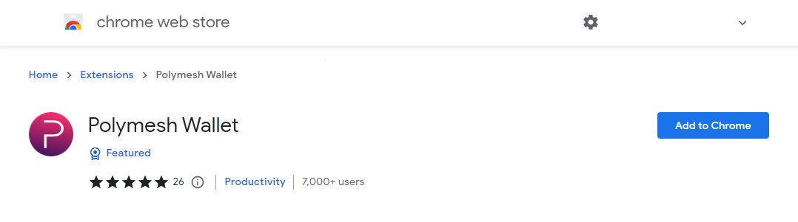
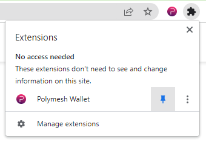
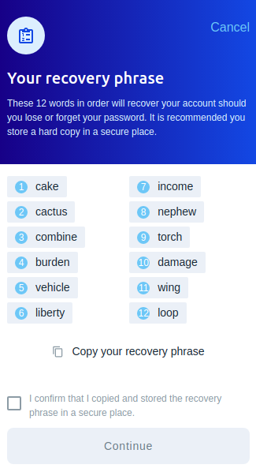
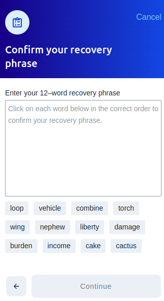
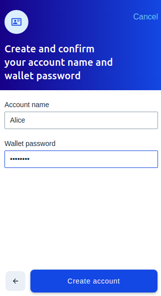
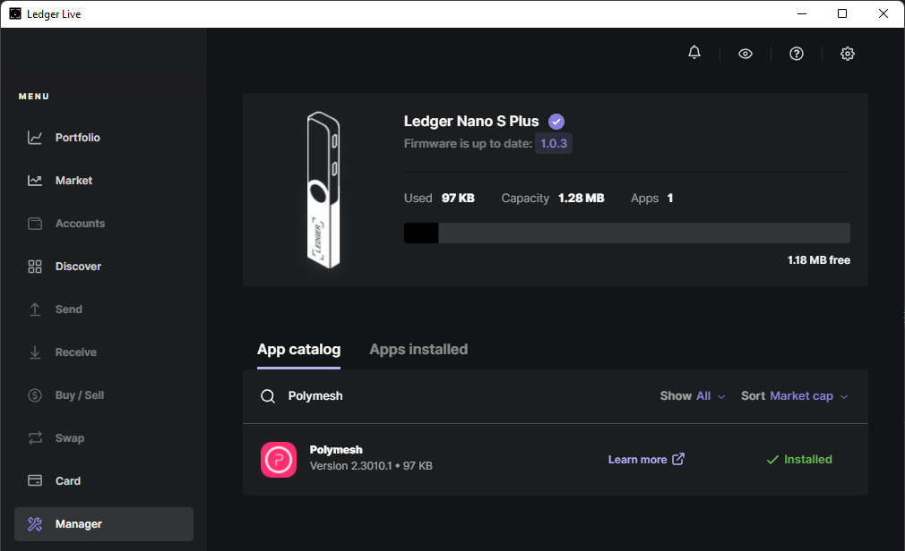
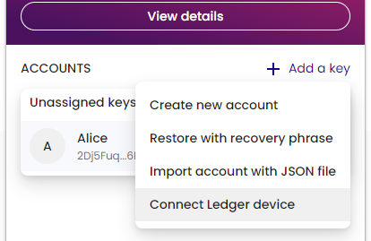

import HighlightBox from "../../src/components/HighlightBox"

## Get the Wallet

The **Polymesh Wallet** is a **Google Chrome extension** that holds local copies of account information and confidential signing keys. The Polymesh Wallet enables you to manage your Polymesh accounts and interact with Polymesh and Polymesh decentralized apps (dApps).

Currently, the Polymesh Wallet is available as a Google Chrome extension and supports Google Chrome as well as Chromium based browsers (such as Brave and Microsoft Edge).

Get the Polymesh Wallet extension [here](https://chrome.google.com/webstore/detail/polymesh-wallet/jojhfeoedkpkglbfimdfabpdfjaoolaf) or search for "Polymesh Wallet" in the chrome store and then click "Add to Chrome".

Once installed locate the Polymesh icon in the plugins tray. It may be under the plug-in icon if it is not pinned. Click it to launch the "welcome screen".

## Create a new Account

Accept the Privacy Policy and Terms of Use, then click `Create new account`.

You will be presented with a 12-word mnemonic. This is a recovery phrase that can be used to regenerate the private signing key stored in the wallet. You should copy this, and store it in a safe and confidential location.

On the next screen, you have to enter the words **_in the correct order_** to confirm that you do indeed have access to original list.

Check the box to confirm you have a copy of the recovery phrase, press `Continue`, and select the words in the right order.

Give your account a name and set a password. The password helps prevent others from using your account and encrypts your keys in the local storage.

Your new account is created with one unassigned key.

Notice, at the top of the window, that it informs you which network it is connected to by default. Here, we are connected to Testnet.

<HighlightBox type='tip'>
When connected to Mainnet addresses will start with a 2, When connected to Testnet addresses will start with a 5
</HighlightBox>

## Connect a Ledger Hardware wallet

As an alternative to storing your password encrypted private key in the browser wallet extension itself you may prefer to use a hardware wallet to manage your private key and always keep it offline. The Polymesh wallet extension supports signing with [Ledger Hardware wallets](https://support.ledger.com/hc/en-us/articles/4641803176221-Polymesh-POLYX-?docs=true). You can search for the Polymesh ledger app in the Manager, App catalogue section of Ledger Live and install it on your device.

Once installed enter the Polymesh App on your ledger device.

<HighlightBox type='tip'>
If you do not first enter the Polymesh ledger app you will be presented with a screen saying "Your Ledger is not connected".
</HighlightBox>

Once installed, instead of selecting `Create new account`, as described above you can select `Connect your Ledger`, if setting up your first wallet, or click `+ Add a key` and then `Connect Ledger device` if you have previously set up an account.

If prompted by a browser popup select your hardware wallet and click connect.

You can then name your ledger account and select `Continue` to import it to your wallet. The Advanced settings on the import screen allow you to select an alternate derivation path. This allows you to have multiple accounts on the same ledger device. The default for the first account import is Account type 0, Address index 0 - think of it like a formula from which child accounts are generated.

Now when signing transactions you must first connect your Ledger, open the Polymesh app and you will be prompted to sign the transaction with the Ledger device. 

<HighlightBox type='info'>
Due to the limited storage available on the Nano S not all transaction types are available. See the README.md at <a href="https://github.com/LedgerHQ/app-polymesh">https://github.com/LedgerHQ/app-polymesh</a> for details of available transaction in the "Light" app.
</HighlightBox>

<HighlightBox type='info'>
When imported, Ledger accounts are assigned the genesis hash of the chain selected in the wallet at the time of import i.e. Mainnet or Testnet. It is not good practice to share accounts across mainnet and testnet and some dApps may not show accounts imported for testnet on a mainnet instance and vice versa.
</HighlightBox>

## Links

- Polymesh Wallet https://chrome.google.com/webstore/detail/polymesh-wallet/jojhfeoedkpkglbfimdfabpdfjaoolaf
- Polymesh Dashboard https://dashboard.polymath.network/
- Ledger Polymesh App Github https://github.com/LedgerHQ/app-polymesh
- Ledger Polymesh App support page https://support.ledger.com/hc/en-us/articles/4641803176221-Polymesh-POLYX