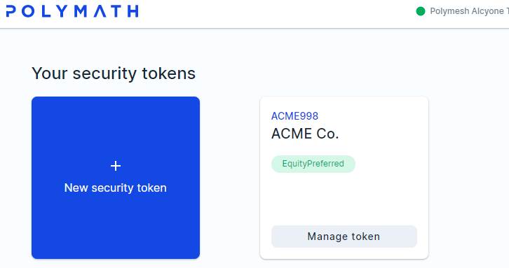
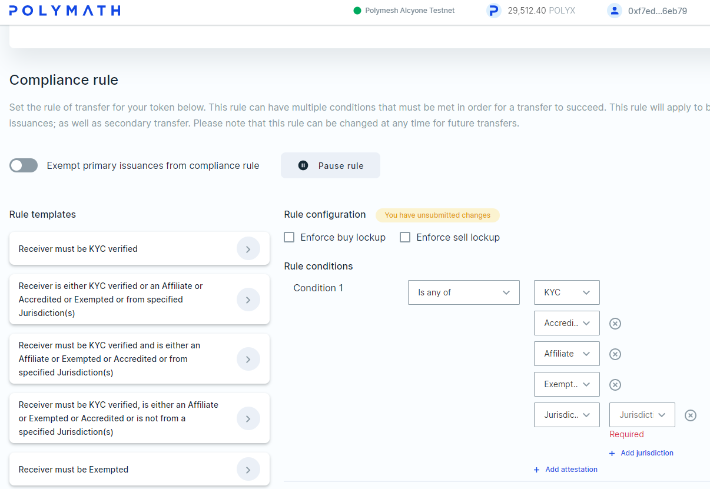
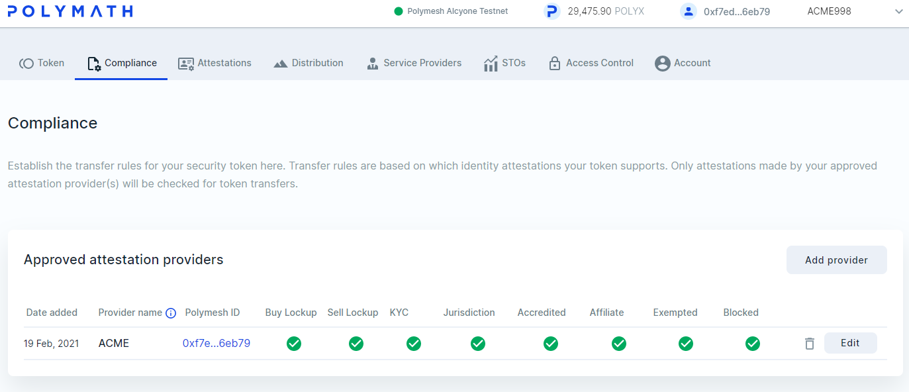
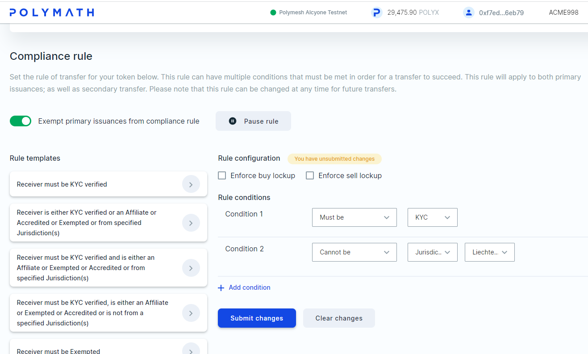

## Compliance

We can see ACME's token on the Token Studio's `Your security tokens` panel. Click on `Manage token` and then the `Compliance` tab.

This is where ACME defines the **rules of ownership**.

Polymesh will ensure that no transfers complete unless these conditions are met. A holder can transfer assets to another account that is non-compliant, but the transaction will remain in a pending state until the compliance requirements are met or the sender cancels the transfer.

Take a moment to explore the options. There are rules for lock-ups and KYC service providers. The rules can be constructed with comparators (is, is not, is one of, is none of) and these can be combined with jurisdictions and other conditions. This flexible rule-driven system means distinct compliance rules and service providers can apply within each jurisdiction. More than one rule can apply.

To keep this simple, we will let ACME be the KYC service provider. Click `Add provider`. The Add new attestation provider panel appears. From there, click `Add my own Polymesh ID`. Accept the defaults, click `Add and sign`.

We can see that ACME is an approved attestation provider for the ACME preferred equity token.

Let's suppose that ACME wishes to exempt primary issuances and to create two compliance rules. The rules will be that all token owners must have attestations from the KYC service provider and that they must not be located in Liechtenstein.

Delete what is not needed and add rules until your screen looks like this:

Submit the changes and sign as ACME.

**Congratulations! You have defined regulatory compliance rules.**

## Summary

Compliance rules are defined at the **token level** and are enforced by the Polymesh network.
