import HighlightBox from '../../src/components/HighlightBox';
import YoutubePlayer from '../../src/components/YoutubePlayer';

<YoutubePlayer videoId='-dxy9XN98Vs' />

## Exercise

Let's explore the asset origination process using the Polymesh Wallet, a browser and the Polymesh Token Studio. It will be helpful to consider a hypothetical real-world situation.

Let's suppose that ACME Corp (ACME) is being incorporated and its founders wish to create a security for its stock on Polymesh from the start.

- The security will represent **equity** in the firm;
- It will need a **ticker symbol**. The founders chose ACME.

At a later stage, the company founders plan to issue an IPO, another event involving the stock, but we are not there yet.

## Compliance

ACME will create the securities on the Polymesh blockchain. Since ACME is required to ensure compliance, it will first make some important business decisions.

- Choosing and engaging a **KYC service provider**. ACME chose EzKyc;
- Defining the **KYC requirements** and establishing an agreed process that the KYC service provider will provide;
- Defining **jurisdictional properties**. ACME chose anyone that is not a resident of Liechtenstein.

<HighlightBox type="info">

Since this action is materially significant, Alice will have to first complete [customer due diligence](/quickstart/verification-with-cdd). You will also need POLYX to pay network transaction fees. If you don't have any, or don't have enough, [get some free Testnet POLYX](/quickstart/quickstart-polyx).

</HighlightBox>

<!-- Internal link for CDD will change, edit accordingly -->

## 1. Open the dashboard

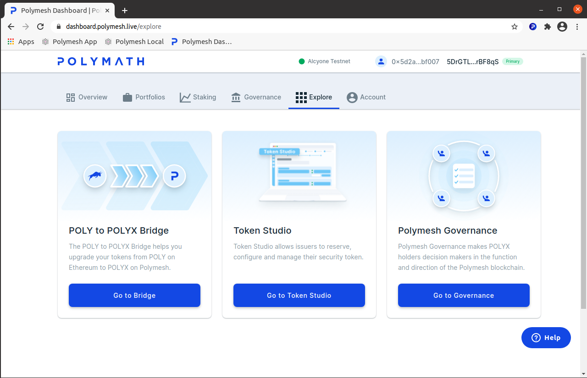

## 2. Navigate to origination

Choose `Token Studio` or navigate directly to https://tokenstudio.polymath.network/.

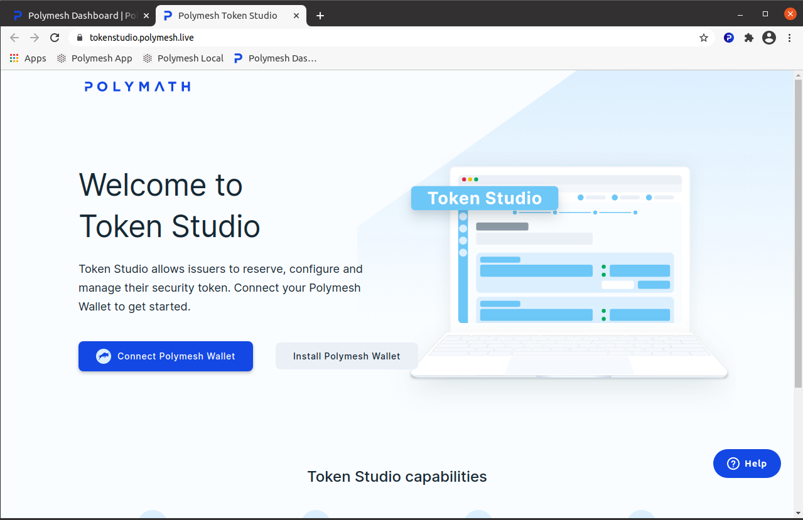

The dashboard and the Token Studio may ask you to authorise. This allows the sites to inspect your keys, which lets the site personalise the presentation.

The site wants to confirm you have access to the private key but cannot authorise signed transactions without further consent, so go ahead and authorise if the wallet prompts you.

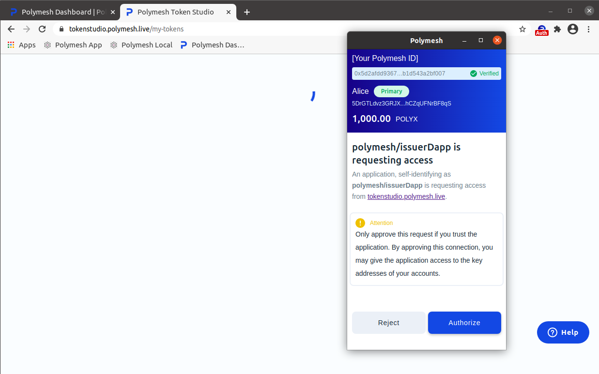

## 3. Register for Token Studio

You might be wondering why Token Studio is asking for your name when it is clearly displayed in your wallet.

Recall that network participants have completed [customer due diligence](/quickstart/verification-with-cdd) but this doesn't reveal who they are to other network members. It is the same with Token Studio, which can see the account (when the wallet is authorised) but cannot know the name stored in the wallet (for your own reference) or the information that was provided to the customer due diligence service provider.

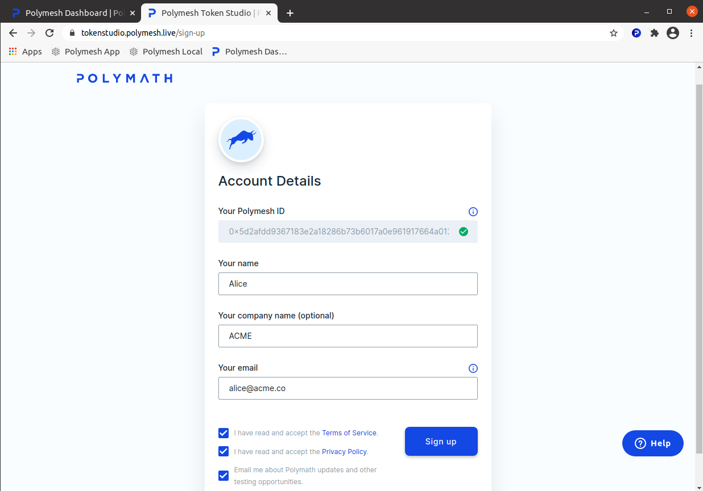

Sign the transaction.

## 4. My tokens

The dashboard shows your tokens. Nothing has been created yet.

Click on `New Security Token`.

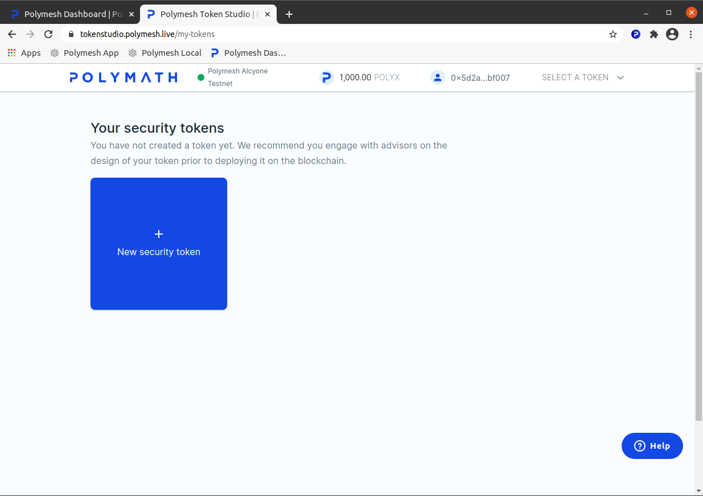

The service provider marketplace is where you will choose your KYC service provider.

For now, let's just reserve the symbol.

Enter the symbol you want to reserve.

<HighlightBox type="info">

Symbol reservations are held for 60 days to allow ample time to attend to the security tokens details before finalising origination. Symbol reservations ensure no duplicate trading symbols on the network and issuers can proceed in confidence that another organisation will not seize the desired symbol before everything is ready.

</HighlightBox>

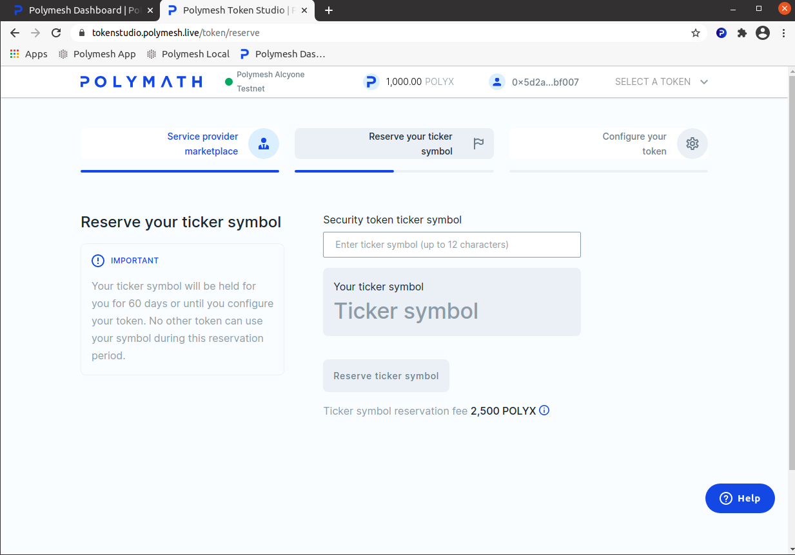

**Wait!** There is problem. If you are following along, chances are another user has already reserved the ACME symbol.

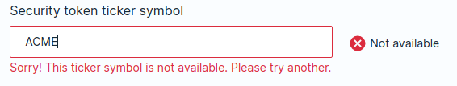

You will have to get creative and enter a symbol no one else has reserved.

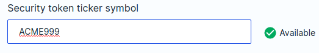

## 5. Send the reservation

It will cost 2,500 POLYX to reserve the symbol on the blockchain.

<HighlightBox type="tip">

If you are low on POLYX, [get some free Testnet POLYX](/quickstart/quickstart-polyx).

</HighlightBox>

This will confirm that it is your intention to reserve the symbol and pay for the transaction with your funds.

When you click `Confirm` the site will inform the wallet that a signature is needed. Even though the site is authorised to explore the public information held in the wallet, it _always_ asks for your approval before signing transactions.

Since we expected this and we trust this site, click `sign`.

In a few moments, the symbol is reserved.

## 6. Security token details

You can now proceed to specifying the details of the security this token represents.

In practice, not all important business decisions will be finalised at this point. That's okay. You can return any time in the next 60 days while the reservation remains in effect.

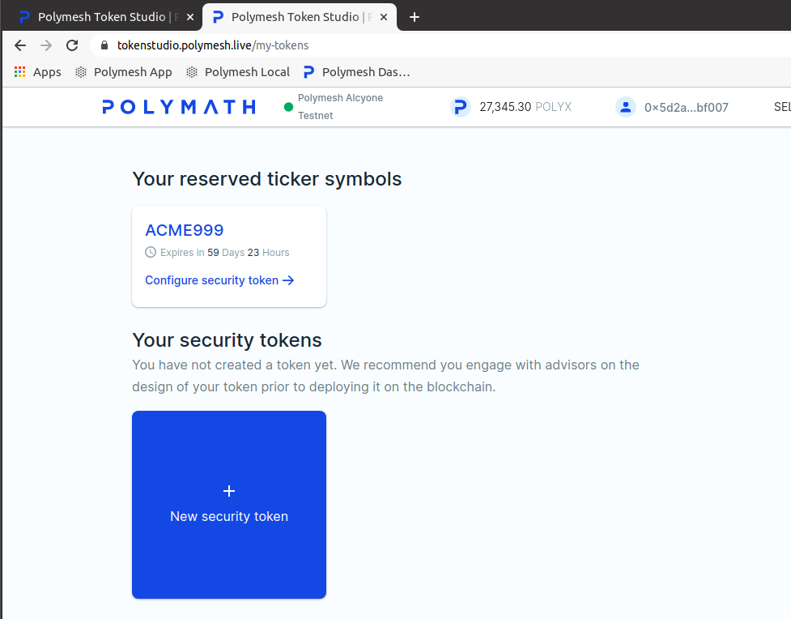

Let's proceed with a **simple configuration**.

Take a moment to explore the options. This will help you understand the breadth of security tokens that can be created this way. To keep matters simple, enter just a company name, select "Equity Preferred", and leave the rest of the defaults as they are.

Token Studio confirms your intentions before asking the wallet to prepare a signed transaction.

The wallet will ask you to sign the transaction.

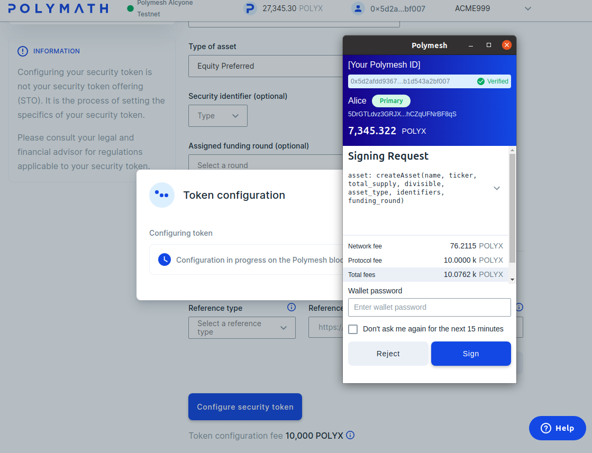

In a few moments, success! **Your token has been created.**

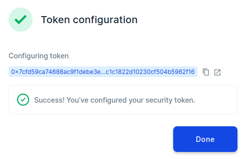

Your token will be on your dashboard where you can edit properties from time to time. Take a moment to explore how you can amend and extend the configuration over time.

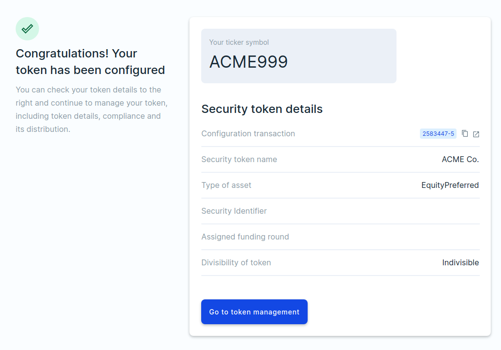

## Links

- Token Studio: https://tokenstudio.polymath.network/
