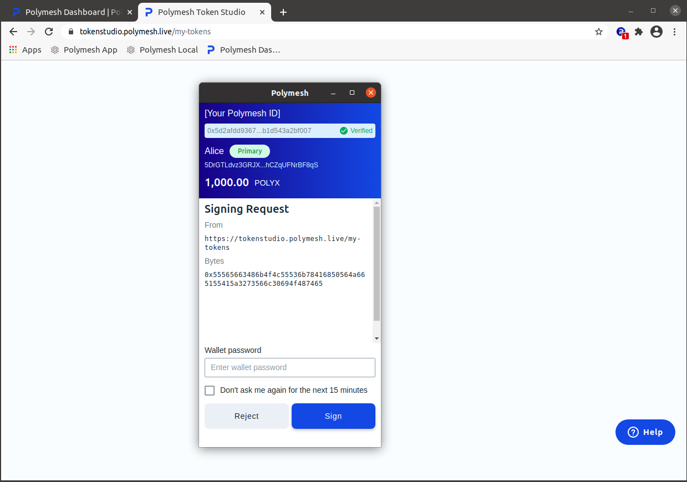
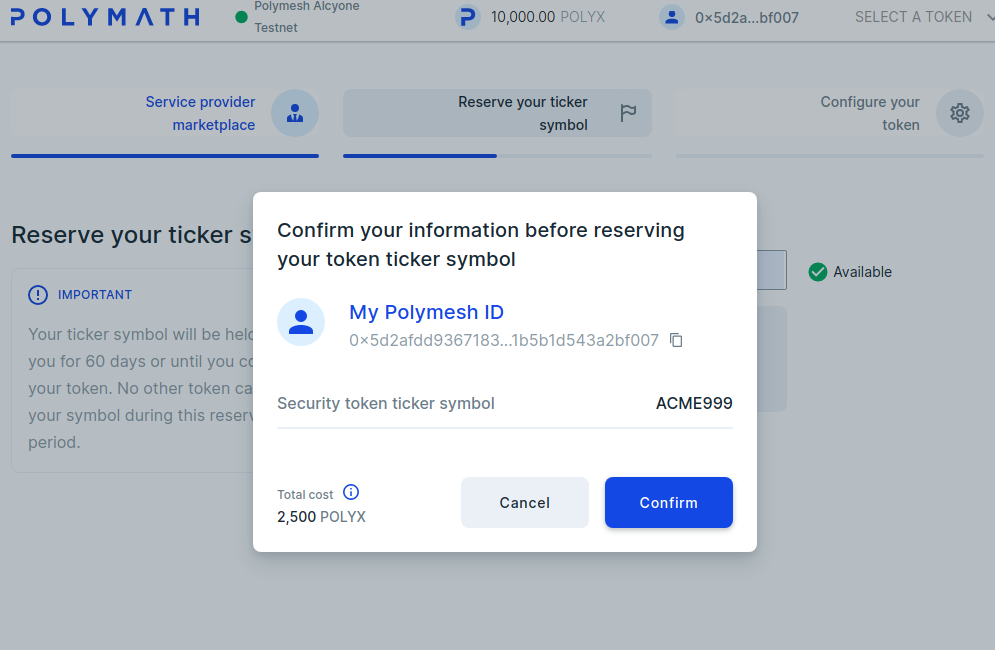
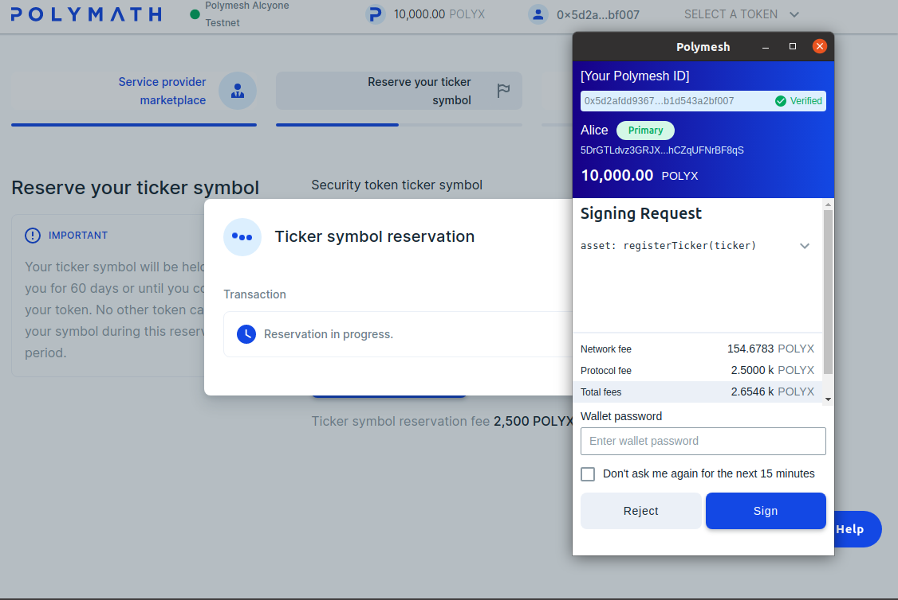
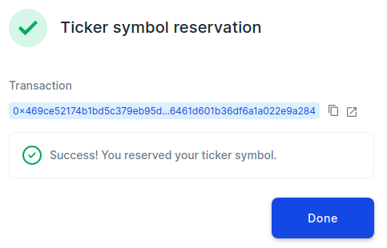

## Exercise

Let us explore the asset origination process using the Polymesh Wallet, a browser and the Polymesh Token Studio. It will be helpful to consider a hypothetical real-world situation. Let us suppose that ACME Co. (ACME) is being incorporated and its founders wish to create a security for its stock on Polymesh from the start.

- The security will represent equity in the firm.
- It will need a ticker symbol. The founders chose ACME.

At a later stage, the company founders hope to issue an IPO, another event involving the stock, but we are not there yet.

## Compliance

 ACME will create the securities on the Polymesh blockchain. Since ACME is required to ensure compliance, it will first make important business decisions.

 - Choosing and engaging a KYC Service Provider. ACME chose EzKyc.
 - Defining the KYC requirements and establishing an agreed process that the KYC Service Provider will provide.
 - Defining jurisdictional properties. ACME chose anyone not a resident of Liechtenstein.

Since this action is materially significant, Alice will have to first complete [customer due diligence](/quickstart/quickstart-cdd). You will also need POLYX to pay network transaction fees. If you don't have any, or don't have enough, [get some free testnet POLYX](/quickstart/quickstart-polyx). 

## Open the Dashboard

## Navigate to Origination

Choose `Token Studio` or navigate directly to https://tokenstudio.polymesh.live/. 

The dashboard and the token studio may ask you to authorize. This allows the sites to inspect your keys which let's the site personalize the presentation. The sites cannot authorize signed transactions without further consent, so go ahead and authorize if the wallets prompts you. 

## Register for Token Studio

You might be wondering why token studio is asking for your name when it is clearly displayed in your wallet. Recall that network participants have completed customer due diligence](/quickstart/quickstart-cdd) but this does not reveal who they are to other network members. Is the same with token studio, which can see the identity (when the wallet is authorized) but can't know the name stored in the wallet (for your own reference) or the information that was provided to the Customer Due Diligence Service Provider. 

To assist with user support, let us know how to reach you. 

Sign the transaction. 

## My Tokens 

The dashboard shows your tokens. Nothing has been created yet. 

Click on `Create Security Token`. 

The service provider marketplace is where you will choose your KYC Service Provider. For now, let us just reserve the symbol. 

Enter the symbol you want to reserve. Symbol reservations are held for 60 days to allow ample time to attend to the security tokens details before finalizing origination. Symbol reservations ensure no duplicate trading symbols on the network and issuers can proceed in confidence that another organization will not sieze the desired symbol before everything is ready. 

Wait! There is problem. If you are following along, changes are another user has already reserved the ACME symbol. 

You will have to get creative and enter a symbol no one else has reserved. 

## Send the Reservation

It will cost 2,500 POLYX to reserve the symbol on the blockchain. If you are low on POLYX, [get some free testnet POLYX](/quickstart/quickstart-polyx). This will confirm that it is your intention to reserve the symbol and pay for the transaction with your funds. 

When you click `Confirm` the site will inform the wallet that a signature is needed. Even though the site is authorized to explore the public information held in the wallet, it _always_ asks for your approval before signing transactions. Since we expected this and we trust this site, click `sign`. 

In few moments, the symbol is reserved. 

## Specify Service Providers

## Enter Parameters

## Review Origination Transaction

## Send Origination Transaction

## Confirm Success

## Links
