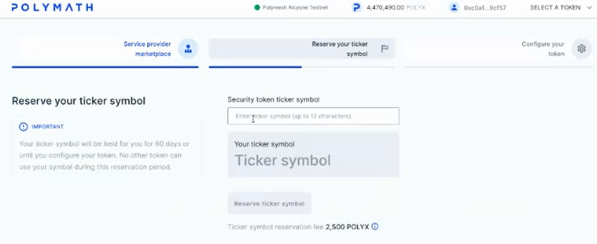
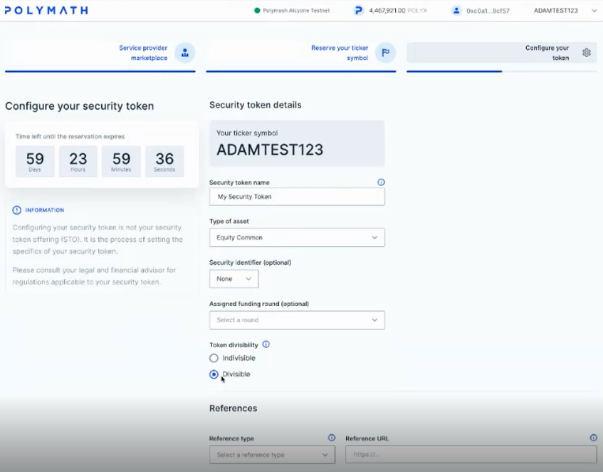

## Exercise

Let us walk through the asset origination process using the Polymesh Wallet, a browser and the Polymesh Token Studio. It will be helpful to consider a hypothetical real-world situation. Although Polymesh offers options to address many edge cases, this is a very simple example. Let us suppose that ACME Inc. (ACME) is being incorporated and its founders wish to create a security for its stock on Polymesh from the start.

- The security will represent equity in the firm.
- It will need a ticker symbol. The founders chose ACME.
- Alice is one of the founders and will be the acting agent for ticker creation and asset issuance.
- 100,000 authorised shares will be created and given to its founders, including 20,000 to Alice.

At a later stage, the company founders hope to reach an IPO, another event involving the stock, but we are not there yet.

## Compliance

 ACME will create the securities on the Polymesh blockchain. Since ACME is required to ensure compliance, it will first make important business decisions.

 - Choosing and engaging a KYC Service Provider. ACME chose EzKyc.
 - Defining the KYC requirements and establishing an agreed process that the KYC Service Provider will provide.
 - Defining jurisdictional properties. ACME chose anyone not a resident of Liechtenstein.

- We will originate the asset described in the overview =>
- If you do you already have a Polymesh Wallet you should install it now =>
- You will need some POLYX to pay for network resources as you send transactions. If you do not have any POLYX then you should get some free POLYX for the Testnet =>
- Everyone on Polymesh who sends a materially significant transaction must, at a minimum, complete the Customer Due Diligence (CDD) process. If you have not already done so, complete CDD now. =>

## Open the Dashboard

## Navigate to Origination

## Specify Service Providers

## Enter Parameters

## Review Origination Transaction

## Send Origination Transaction

## Confirm Success

## Links
