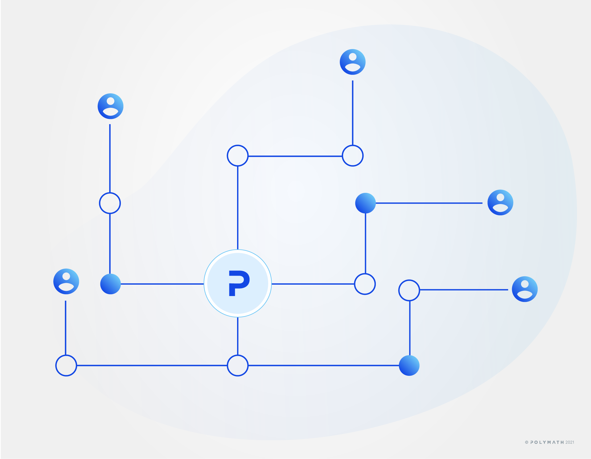

import HighlightBox from "../../src/components/HighlightBox"

import OverviewVideoBox from "../../src/components/OverviewVideoBox"

<OverviewVideoBox title="Originating an asset" videoId="Wyp6ljYhm4w">

Watch this webcast episode on the process of originating an asset. How Polymesh is built for security token issuance and what you need to do when working with securities. Adam and Nick explain how assets are originated on Polymesh and discuss the technical and business challenges Polymesh solves.

You can watch [the whole talk](/resources/polymath-webcast) in one go or pick the parts related to each section of the portal.
</OverviewVideoBox>

Polymesh makes it exceptionally simple to originate a regulated security. There is more than one way to execute the process and your implementation decisions will usually be based on scale.

For example, a business may only occasionally issue new securities, in which case the intuitive manual approach will be sufficient. Service providers who routinely issue securities for their clients may wish to eliminate repetition. In this case, create an integration with internal systems and automate the process. The Token Studio found in the Polymesh Dashboard is an example of an integration created with the SDK.

Before we go through a simple practical exercise, let's explore the overall asset representation and the origination process.

## Security token design

### The token type

The type of a security token asset is represented on Polymesh by its **ticker** registration. This is a 12 character-long, and unique, identifier.  If the name reminds you of a ticker as found on a stockmarket, this is intentional. It is expected that certain names are more valuable than others, in the same way that `.com` domains are. Therefore, Polymesh implements an optional reservation mechanism, whereby one can reserve a ticker name for 60 days, as of the time of writing. At any time during these 60 days, the owner of this ticker reservation can cancel the reservation or create the token proper, i.e. **originate** it.

At origination, there are some considerations available, among others:

* the asset type,
* attached **documentation** and other metadata,
* **extra compliance requirements** of eventual asset owners, and
* whether the represented **asset** can be sub-divided, or not, think one company share.

For added flexibility and cross-referencing, an asset can also be identified by **external identifiers**. Such are ISINs, CUSIPs, CINs, LEIs, and DTIs, on top of the ticker.

### The token lifecycle

The token reservation and origination are not the only available operations for security tokens. Here is a non-exhaustive **list of other operations** in the token's lifecycle:

* Update the token information;
* Token ownership transfer;
* Issuance of assets;
* Initial distribution of assets;
* Exchange of assets;
* Corporate actions related to the asset such as dividend payments, capital distributions, and corporate ballots.

All these can be **managed through the asset base layer logic in Polymesh**. Of note is that the documentation content, although referenced on the blockchain by link or by content hash, is not actually stored on-chain.

### The token owner

The originator of a token is, quite naturally, the token's initial owner by default and they are assigned permissions for full control over the token. Eventually, because of the importance of this ownership role, it is expected that:

* The token owner will be held by a multi-signature account.
* The token owner will be called upon for rare and higher-level tasks, typically to appoint and revoke or modify permissions for external agents.

Polymesh was built with such a vision in mind. A multi-signature account could, for instance, be the expression of a quorum of the board of directors of a company.

### The token external agents

Given the scope of possible operations that affect a token over its lifecycle, and to limit the need to use the token owner with full permissions, it is only natural to delegate responsibilities to specialized parties that act on behalf of the token owner, a.k.a. external agents. Each external agent is entrusted with, and restricted to, certain specific operations. Well-defined responsibilities assigned to external agents map to real world roles, such as primary issuance agent (PIA) or corporate actions agent (CAA). Polymesh lets you tailor agents' responsibilities and permissions through [external agent permission groups](../settlement/settlement-agents).

There is a special permission group for external agents that gives all rights over a token. It helps discussion to call those assigned those permission the token owner.  As previously discussed the originator of a token is the default owner. It is possible to assign full permissions to additional identities and also to remove those permissions for the originator. To avoid a case of _orphan_ tokens, there must always be at least one token owner.

## The underlying asset

To help you develop a sense of the permissions, we shall peek ahead at what lies beyond origination.

As seen above, the token represents the type of the asset, and is _owned_ by its originator, or by whomever else they granted full rights on the token to. By contrast, the asset it represents is owned by individual investors' accounts according to token holdings.

### Ownership of the asset

Two elements determine **ownership** of a token's underlying asset:

* The sum of balances of an individual investor's account(s) of said asset. The **numerator** if you will;
* The total supply of tokens representing ownership of said asset. i.e. the **denominator**.

When the total supply of tokens increases, it is called **issuance**. The account responsible for issuance is commonly called the **primary issuance agent (PIA)**. The owner of the token itself can act as a PIA, but this role can be delegated by the owner to an external agent.

As with so many actions in Polymesh, the targeted external agent account needs to accept the role delegation for it to become effective.

<HighlightBox type="info">

Whether an asset can be transferred, or owned at all, is called **compliance** and is automatically enforced on-chain by Polymesh. In effect, for an action to take place, all involved accounts must have attestations that satisfy the rules defined by the token originator for that action. Skip ahead to the section about [Compliance](compliance) for details about this.

</HighlightBox>

### The asset lifecycle

We have seen that the token has a lifecycle. The **underlying asset has a lifecycle of its own**. Here is the typical list of operations:

* Issuance to the PIA, or minting, i.e. changing the total supply;
* Transfer from the PIA to other accounts;
* Transfer between accounts, i.e. changing the distribution of the supply.

Those too are managed through the asset base layer logic in Polymesh.

Other actions address rare cases such as the forcible return of the asset to the primary issuance agent. For the avoidance of doubt, issuance to the PIA bypasses the compliance step.

## Conclusion

You know that a ticker can be reserved before the token is created with finalized parameters.

Let's see how this looks in the Token Studio exercise where you originate your very own ACME token.

## Links

* [Asset Documentation](/polymesh-docs/primitives/assets/)
* For developers, the [asset pallet documentation](https://docs.polymesh.live/pallet_asset/index.html)
