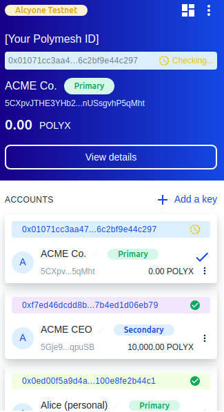
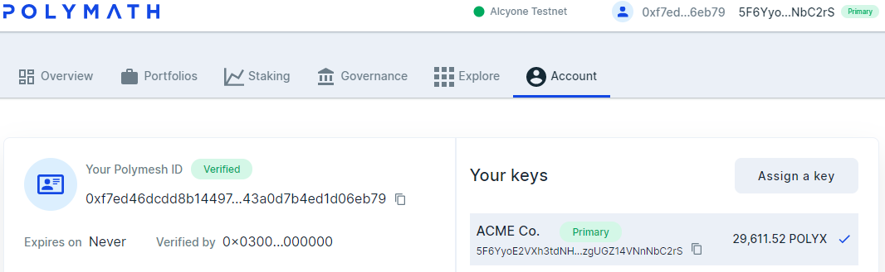
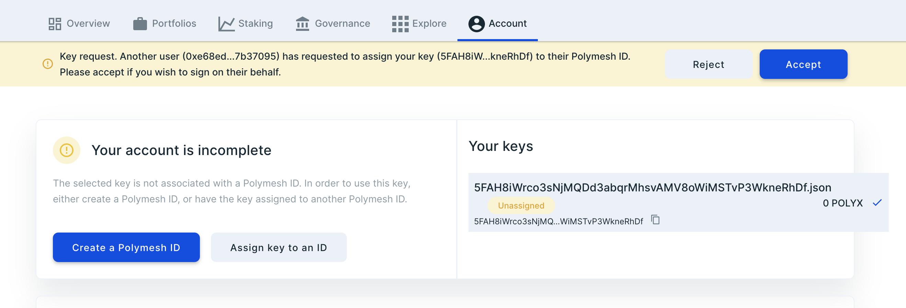
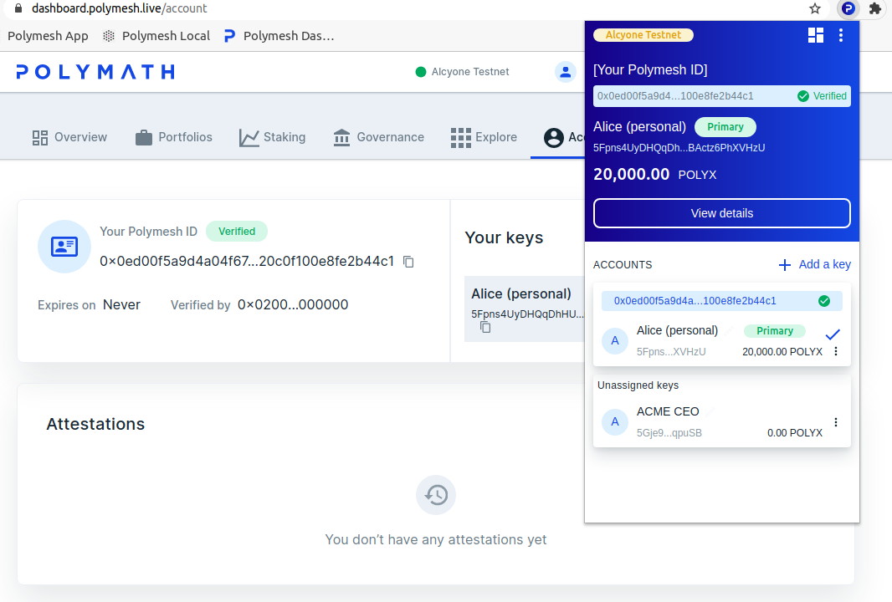
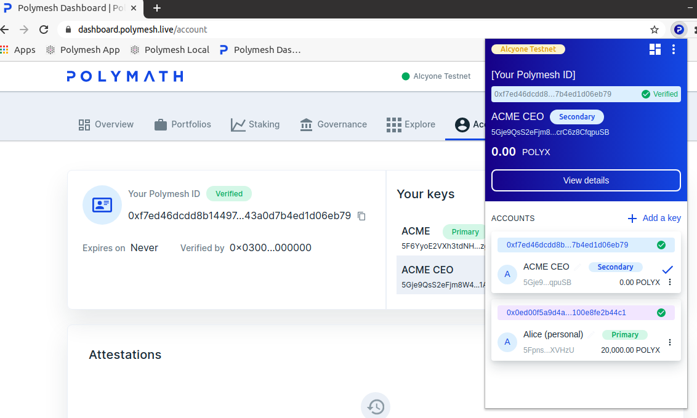
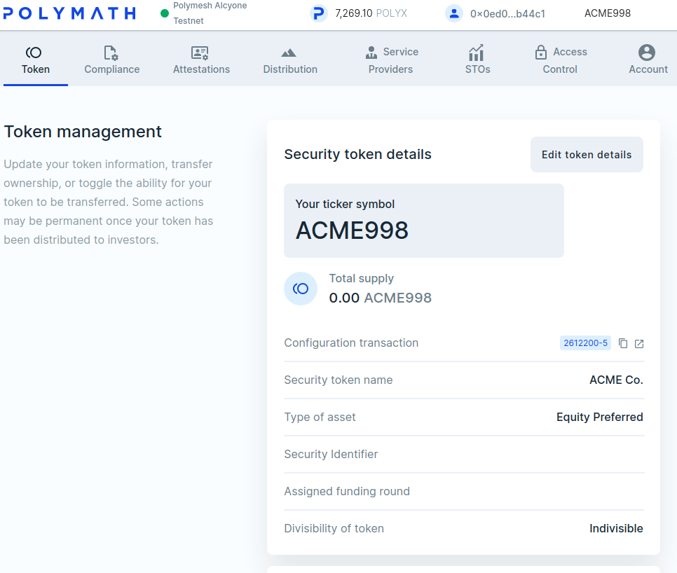
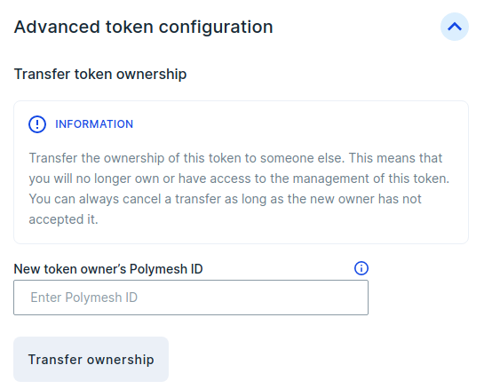
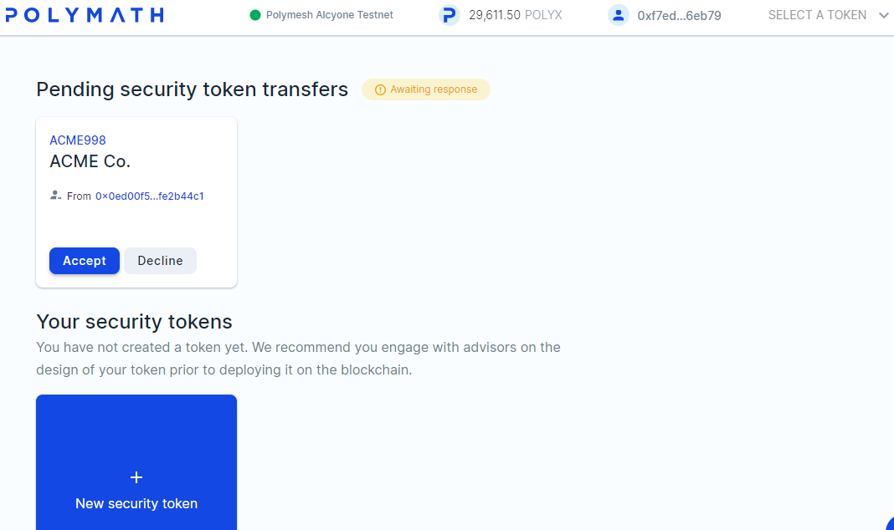

## ACME Corporation

So far we have seen that obtaining the wallet software, verifying your ID and issuing a security token are surprisingly simple. However, the examples given were somewhat simplistic to avoid complicating matters with adjacent concerns. Now, we will transition to a somewhat more realistic example.

You may have noticed that Alice originated a security token. In all probability this is not precisely what she wants to do. She is possibly doing the work, but it is her company and not herself that would originate a security. In other words, Alice does the work but the token should be issued by ACME and not Alice, personally.

Let us resolve this.

## Secondary Keys

The goal is that ACME should be an identified organisation that has passed customer due diligence and Alice has, in addition to her personal wallet, a signing key to use when she represents ACME in her capacity as CEO.

There is more than one way to do this. Alice, can, for example, create another key for ACME. With that key in focus (click the blue circle to the left of the unassigned key), complete [customer due diligence](/quickstart/quickstart-cdd). This will create a new primary key and a new identity. Then, create a secondary key for the CEO and assign it to the new identity.

Why would you do that? Key management policy is unique to each organisation but it is anticipated that organisations will not want to use their primary keys for ordinary operations even for the CEO. That is to say, the CEO should be a secondary key known only to the CEO, and not the primary key that can assign and unassign secondary keys to the identity and set permissions.

Alice could dismiss the preceding suggestion and do it all from one wallet, i.e. wearing all of the hats and the end result would look approximately like the illustration below, which is perfectly acceptable for practice and learning. Alice has primary keys for herself, for ACME Co., and a CEO key she would use for most ACME-related activities.

Let us instead proceed as though ACME and Alice are indeed separate entities. Possibly ACME existed before Alice became CEO and ACME's keys are managed by separate personnel. How would that work?

## Use Another Computer or Browser

Let us suppose that the ACME PID is managed by someone other than Alice. We can simulate by using a different computer. This procedure closely matches a real-world scenario where these activities would indeed occur separately.

1. Create a [wallet](/quickstart/quickstart-wallet) and PID for ACME
2. Complete [customer due diligence](/quickstart/quickstart-cdd)
3. [Get some POLYX](/quickstart/quickstart-polyx) (ACME will need some, too)

Below, ACME has been verified and has some POLYX.

## Create a Secondary Key

ACME can assign a key but Alice will have to supply it to them. More precisely, Alice will provide the public information but not the private signing key, which means that ACME cannot sign on her behalf. ACME can determine the scope of the CEO's (Alice) permission within ACME but only Alice can actually sign as CEO.

Returning to Alice's wallet, simply click <kbd>Add a key</kbd> and follow the usual procedure. Give the key a namme that will help Alice remember what the key is for, e.g. ACME CEO. The result will be that Alice has a second, unassigned key. **Do not** assign this key. There is nothing Alice can do to associate the key she just made with ACME, a PID she does not control. Instead, let us say that Alice provides the public key to ACME through an off-chain communication channel and ACME adds it to _their identity_ on their own authority.

<HighlightBox type="tip">

You can create the ACME primary in the same wallet Alice uses. Add a key, and **do not** assign the key to Alice's Polymesh DID. Instead, bring the new key into focus, proceed to the dashboard and create a new identity.

</HighlightBox>

In case that is unclear, the flow would be:

1. ACME exists and is managed by ACME personnel
2. Alice is appointed CEO
3. As part of ACME's onboarding process, ACME asks Alice for a key
4. Alice generates a key (pair) for this purpose and gives the address to ACME
5. ACME adds the address to their PID. They would also manage permissions.

As we will see below, Alice's consent will be required for step 5 in the business process.

Now that ACME has the key Alice provided, return to ACME's wallet and dashboard, navigate to the <kbd>Account</kbd> tab and press <kbd>Assign a key</kbd>. You will see that the UI permits the operator to paste _any_ Polymesh key into the form. Paste Alice's key there, give the account a nickname, e.g. Alice (our CEO), and verify the transaction.

Of course, ACME cannot do that without Alice's consent. After all, it is Alice's key.

Back to Alice's wallet, dashboard and <kbd>Accounts</kbd> tab, see that Alice is informed that ACME wants to assign _her key_ to _their identity_.

<HighlightBox type="tip">

Press the icon to the left of Alice's secondary key to bring the correct account into focus. This is how Alice chooses the key to use for signing at any given time. The header information in the wallet changes to reflect this and the web UI senses the change and refreshes to display the new context.

</HighlightBox>

Since Alice is the CEO and gave ACME her key for this purpose, she expects this and, after checking the identity, approves the assignment.

Alice's wallet will now have two signing keys, one for her personal concerns and one to use in her capacity as CEO. The wallet will change as she switches between these roles. Here, her personal signing key is in focus. The header and the Accounts page on the dashboard reflect this context - this is Alice's personal account.

She can change context by clicking on the little blue circle to the left of ACME CEO. This brings the CEO signing key into focus. Notice that the header region of the wallet updates to reflect this, and the Accounts website refeshes immediately to show the ACME Identity where she is a signer.

## Transfer Token Ownership

Alice and ACME are established as separate identities and Alice's wallet gives her access to her personal accounts as well as the key she uses to sign as ACME's CEO when she needs to. Now would be a good time for her to issue the security as ACME's CEO.

Of course, if you've been following along then Alice herself already originated an asset which is purportedly preferred equity in ACME. This situation could easily happen in reality. For example, founders might enthusiastically create a token and then later realize that the token was originated by the wrong entity - an individual rather than the new company. Indeed, individuals might want to reserve symbols before the legal inception of the new company.

Alice's token is not fully configured and no shares have been distributed so the solution is as simple as transferring ownership to ACME. ACME will take over from here.

Navigate to Token Management, Security Token Details and scroll down to Advanced Token Management.

Paste ACME's PID into the new owner field and click Transfer ownership. The PID is the Identity Alice's key signs for, not Alice's key. It's starts with 0x. In the wallet, it will be highlighted with a light background color and you can copy it to the keyboard without switching signing accounts. Remember that the signer must be the current owner, Alice.

When you click transfer, the site will explain that ACME's consent is required before the transfer will be executed. Confirm the transaction and sign, as Alice, in the usual way. After a few moments the option will change to Cancel ownership transfer which you can still do until ACME accepts the transfer. The pending status is indicated.

## ACME Accepts Ownership

Use the computer with ACME's Primary Key and navigate to the Token Studio.

ACME can either accept or reject this incoming ownership transfer. Accept, of course.

Permission to accept or reject such proposals is something ACME can delegate to secondary accounts. The permission system is granular and organized around logical containers and functional concerns. To keep it simple for now, we used ACME's primary key which surely has sufficient permission.

<HighlightBox type="tip">

ACME will need some POLYX to pay transaction fees. If they don't already have some, they should [get some free testnet POLYX](quickstart/quickstart-polyx).

</HighlightBox>

Congratulations! You have transferred ownership of the token management to ACME.

## Summary

Identities can delegate authority to other users using secondary keys. Users can generate secondary keys for each area of responsibility and safely provide others with the public-facing identifiers. Users can assign keys that belong to other users to their own identity, but only if the owners of those keys (who exclusively have the private keys) consent to the assignment.
