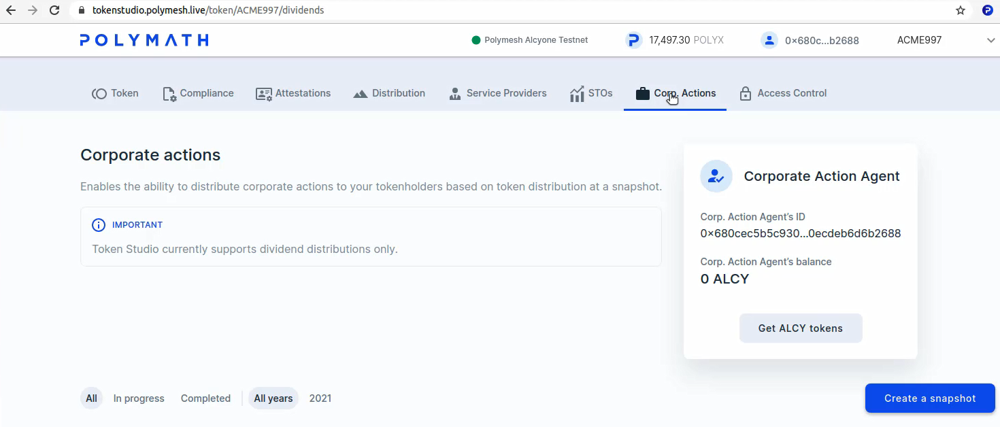
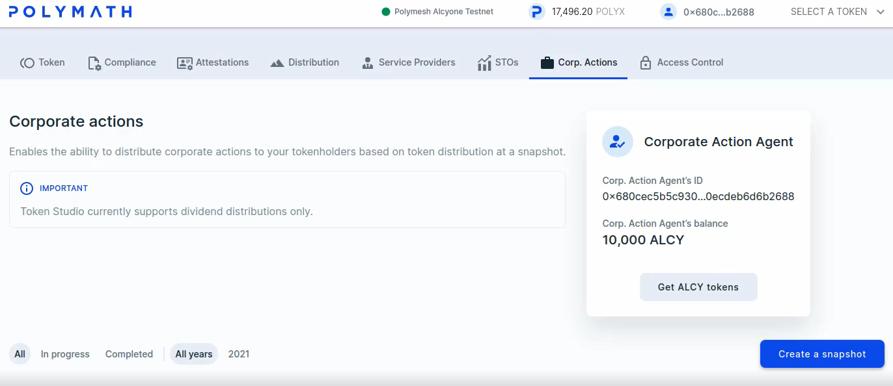
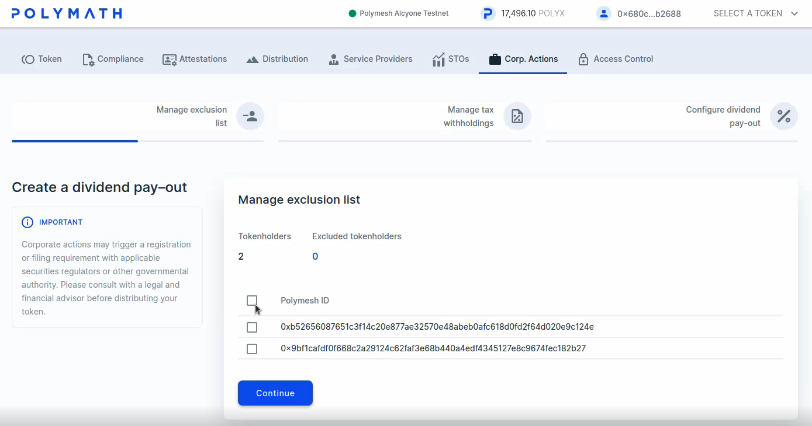
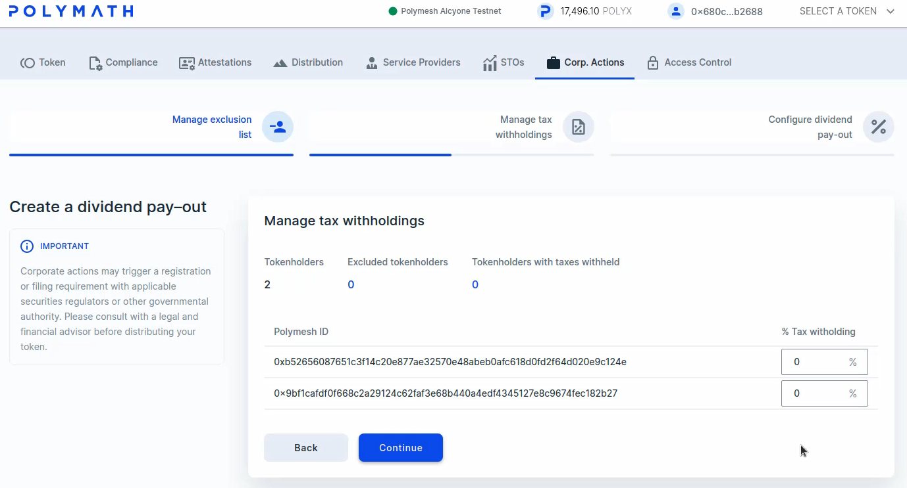
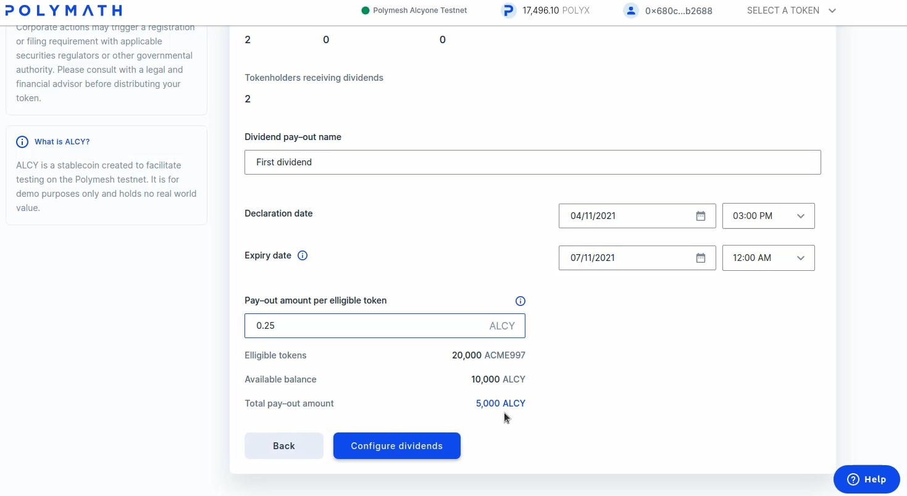
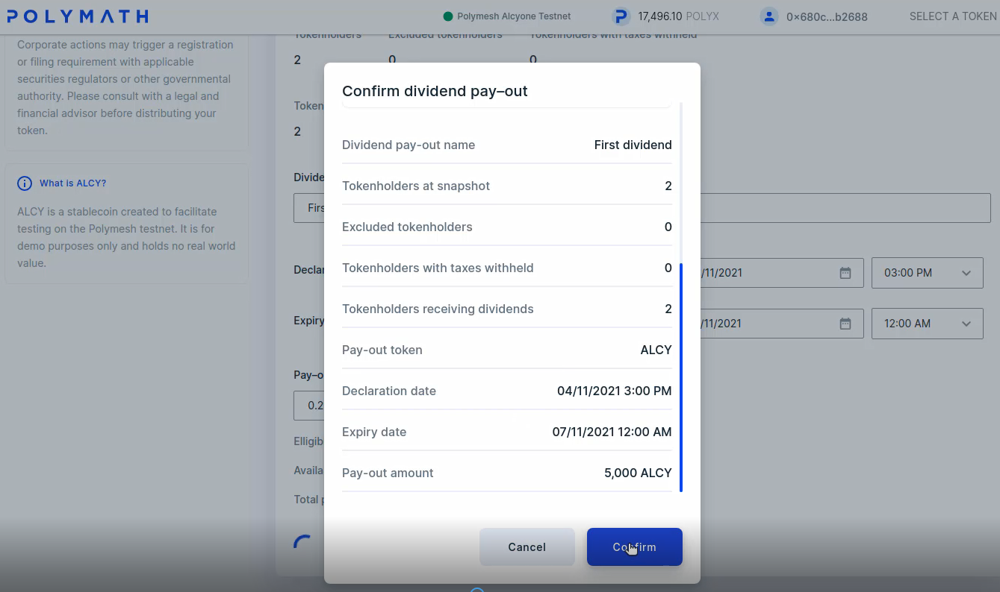
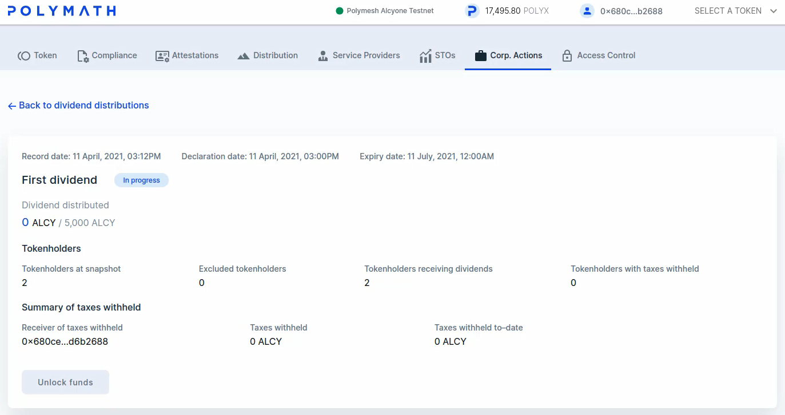
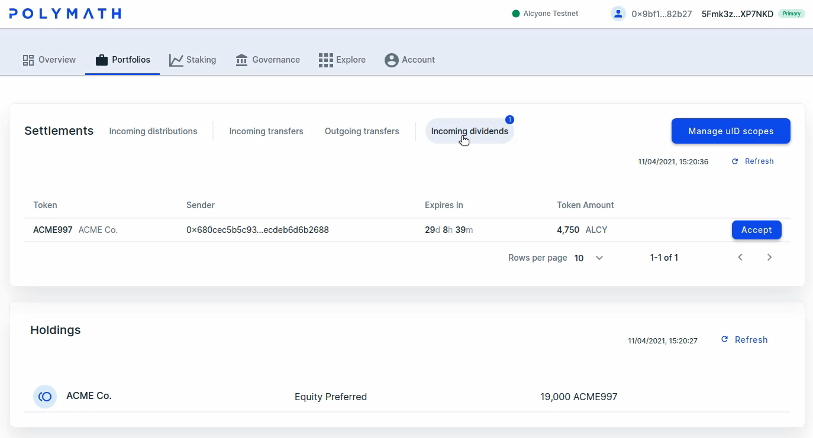

import HighlightBox from "../../src/components/HighlightBox"
import YoutubePlayer from "../../src/components/YoutubePlayer"

<YoutubePlayer videoId="UJRbuDOe8aU"/>

## Execute a distribution

The ACME token has been trading for a while, and the company has had a very good quarter. The board has decided to distribute a dividend of \$5,000. Each shareholder will be entitled to receive a portion of the dividend in proportion to the number of shares they own. Since ACME distributed 20,000 tokens, this is US \$0.25 per token. ACME will use Polymesh to execute the distribution.

## Permission

Corporate actions (CA) can be initiated by the token owner itself, or by an appointed corporate action agent (CAA). Only the token owner can appoint the CAA. Doing so allows ACME to outsource the implementation of their corporate actions if they want to.

By default, ACME, the token owner is a corporate actions agent for the ACME equity tokens and therefore has permission to execute corporate actions.

## On-Chain execution

**An on-chain distribution requires an on-chain asset.** We can envision an on-chain stable token that is strongly pegged to a fiat currency such as the US Dollar. Such a token is described as a stable token with value pegged to the fiat currency it represents.

Such a token does not presently exist on the Polymesh Mainnet. ACME could create such a token for the purpose of their near-term dividend distribution. On the Testnet, the STBL stable token lets us proceed as though a widely-accepted stable token is already a part of the Polymesh ecosystem.

We will begin our discovery of corporate actions by acquiring some free STBL tokens to distribute.

As ACME, or ACME's corporate actions agent, proceed to the `token studio`, select the `Corp. Actions` tab.

Click `Get STBL tokens`.

You will be offered 10,000 STBL tokens at no cost. This faucet gives them away because STBL tokens are valueless. **Two signatures** are needed to create the uID scope and to receive the tokens.

In a moment, the tokens appear in ACME's account.

## Set up the action

In practice, ACME would appoint someone with authority, possibly the CFO or a service provider to actually administrate their capital distribution. **Granular controls** are available to address, for example, tax withholdings that may apply depending on each investor's jurisdiction.

<HighlightBox type="info">

Everything we do in Token Studio can be executed through the API, enabling automations of concerns such as conditional tax withholdings. This is one reason why ACME might opt to appoint a distribution agent to assist, instead of performing the action themselves. For this example, we will set that concern aside, but keep in mind that precise, scaleable controls exist.

</HighlightBox>

Click on the `New dividend payout` card. This will open a dialog to create a dividend corporate action. The first panel enables exclusion of specific token holders who will not receive the dividend.

Feel free to experiment with that, or click `Continue`.

The next panel enables tax witholding for individual investors. Again, feel free to experiment with that feature, or click `Continue`.

The final panel is where we define the dividend.

Experiment with the form, or complete it as follows:

1. Name the `dividend event` for reference purposes.
2. Select a `declaration date and time` close to `now` but a few minutes in the future so you can complete this process and then see the distribution take effect.
3. Set an `expiry date` further into the future. The expiry date allows ACME to recover funds that are allocated to the distribution. It also means shareholders forfeit the on-chain distribution. For this reason, the expiry date would usually be well in the future.
4. `Pay-out amount per eligible token` should be 0.25 which is 5,000 STBL distributed to each holder of ACME's 20,000 tokens.

Press `Configure dividends`.

Confirm the corporate action configuration and sign the corporate action transaction. Then, confirm the distribution and sign that transaction.

Notice that ACME's balance is reduced by 5,000 STBL tokens that were committed to the distribution. If ACME is using a corporate actions agent, they might provide just enough capital to support the corporate action. ACME's relationship and financial dealings with the corporate action agent are an external concern, but the corporate action agent must have sufficient funds to support the distribution. This is necessary as the funds are committed in this step and remain so until either the token holder accepts the distribution or the expiration date passes.

A summary appears. It recaps the tokens distributed so far and the taxes witheld.

Now, switch to Alice's `dashboard`.

Alice should have one incoming distribution. If this does not appear within a few moments, it is likely the scheduled distribution time hasn't arrived yet. Consider the declaration date you specified when you created the distribution.

The dividend distribution requires Alice's consent. "When she accepts the dividend transfer, she will first create a uID scope for STBL (the first time she receives a dividend), and then accept the dividend distribution.

Press `Accept` and sign the transaction to create the uID scope.

Press `Accept` again and sign the transaction to receive the funds in the default portfolio.

<HighlightBox type="info">

Alice's actual dividend amount depends on her balance at the time. Your amount may vary if you have experimented with transfers and otherwise set up different initial conditions.

</HighlightBox>

## Summary

Polymesh supports on-chain execution of corporate actions that address such concerns as capital distributions and voting. The flexible permission system accommodates outsourcing the execution of corporate actions to service providers, if desired. Corporate actions can be integrated into internal systems as will be unfolded in the following section. Dividends can also be executed in a no-code manner using Token Studio.

## Links

* [Token Studio](https://tokenstudio.polymath.network)
* [Dashboard](https://dashboard.polymath.network)
* [Corporate Actions](/polymesh-docs/primitives/corporate-actions/)
* [Corporate action pallet distribution](https://docs.polymesh.live/pallet_corporate_actions/distribution/index.html)
