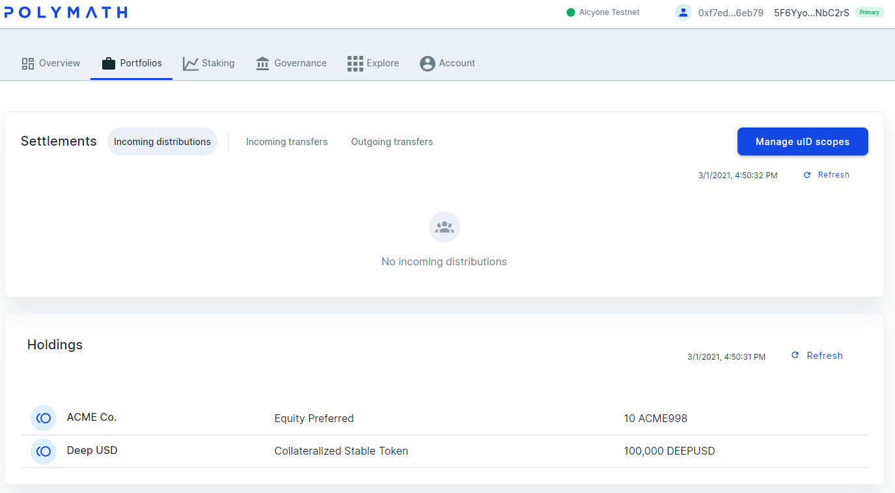
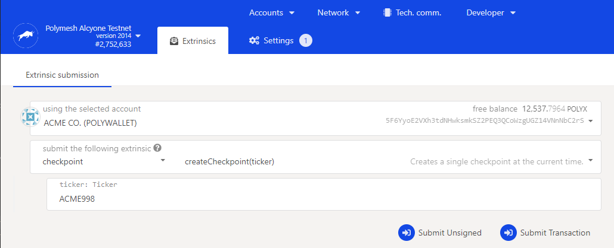
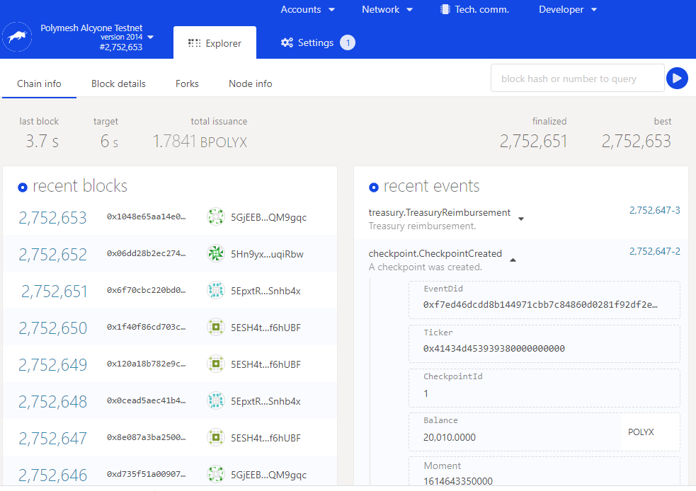
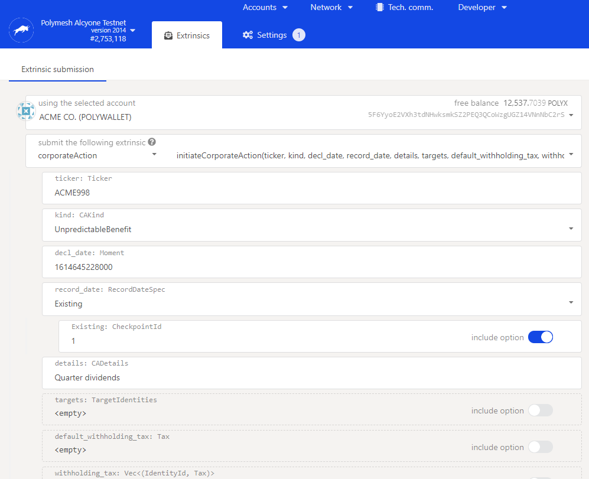
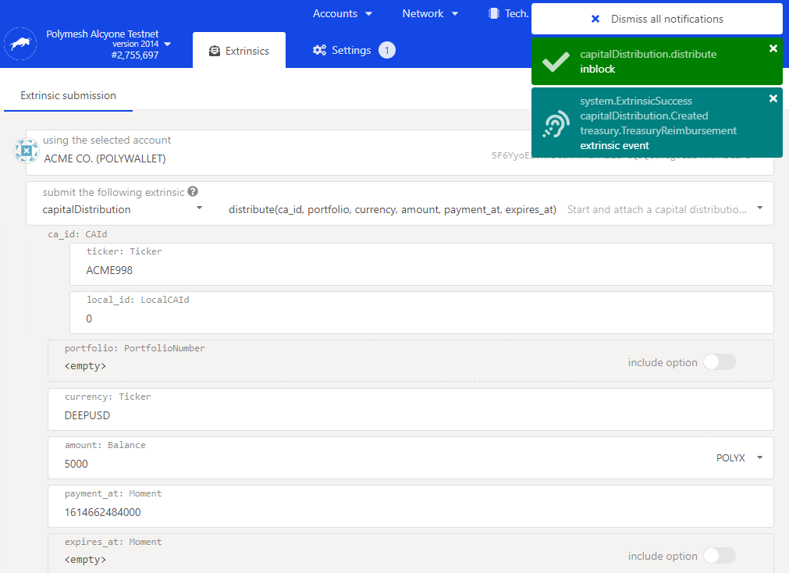
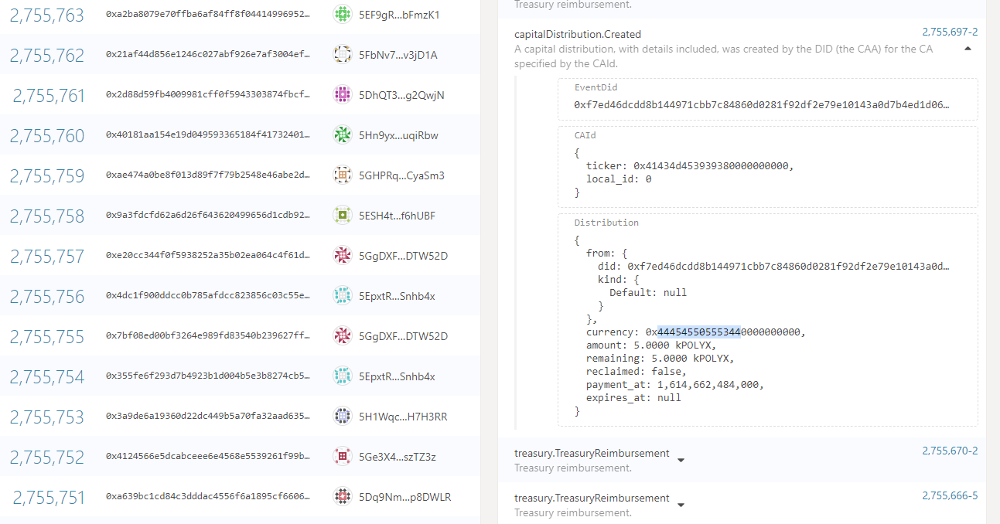

import HighlightBox from "../../src/components/HighlightBox"

## Execute a distribution

The ACME token has been trading for a while, and the company has had a very good quarter. The board has decided to distribute a dividend of US $5,000. Each shareholder will be entitled to receive a portion of the dividend in proportion to the number of shares they own. ACME will use Polymesh to execute the distribution.

## Permission

Corporate actions (CA) can be initiated by the token owner itself, or by an appointed corporate action agent, or CAA. Only the token owner can appoint the CAA. Doing so allows ACME to outsource the implementation of their corporate actions if they want to. By default, ACME, the token owner is a corporate actions agent for the ACME equity tokens and therefore has permission to execute corporate actions.

## On-Chain execution

An on-chain distribution requires an on-chain asset. We can envisage a future in which a well-established token created by another party maintains a strong peg to the US dollar, has cleared regulatory hurdles and is widely used as a proxy for US dollars. ACME would require sufficient units of that asset in order to fund the distribution for the simple reason that one cannot spend funds that one doesn't have. Those funds would be allocated to the distribution so that it can proceed in an automated fashion.

For the purpose of this exercise we will set some legitimate concerns aside to create a simple example. ACME (or Alice, the CEO) will create a pegged stable token called DEEPUSD and issue 5,000 of them to ACME's default portfolio. We will not dwell on regulatory concerns or the mechanism that maintains the peg. Instead, let us simply say that there is a credible redemption process, ample collateral and the market prices these tokens with no discount - the market agrees they are equivalent to US $1.

- Return to the token studio as ACME.
- Create DEEPUSD. Choose a unique symbol to use whenever DEEPUSD is mentioned, since DEEPUSD is probably already taken.
- Mint at least 5,000 tokens. You might want to mint considerably more so you have extra money to practice with.

Newly minted tokens are always allocated to the distribution agent, which is the token owner, ACME, by default. So, ACME will have a supply of DEEPUSD to work with in the next step.

Return to the [Token Studio Dashboard](/originate/dashboard) example in the Originate Asset section for a detailed explanation of the origination process.

## Checkpoint

> Each shareholder will be entitled to receive a portion of the dividend in proportion to the number of shares they own.

This deceptively simple statement hides the fact that holdings change over time. A decision has to be made as to what point in time is the relevant one. A checkpoint snapshots user balances at a point in time so they can be used to calculate benefits and voting power in corporate actions.

As ACME, proceed to the Polymesh Substrate App: https://app.polymesh.live

1. In `Developer`, `Extrinsics`, select the `checkpoint` group, and `createCheckpoint(ticker)` on the right.
2. Enter your ACME token symbol in the ticker field.

The checkpoint you created has an id we will need later. You can use chain state queries to find this in the future. For our purposes, it should suffice to go to `Network`, `Explorer` to observe the recent transaction with the type `checkpoint.CheckpointCreated`. Expanding that reveals the checkpoint ID, which is `1` in this case.

We will need to know the checkpoint for the next step, so locate your checkpoint creation transaction and note the ID that the network assigned.

In practice, the checkpoint may have been made earlier as the first decision of the board, before they even decided the dividend distribution, the idea being to avoid opportunistic price moves, and / or insider trading.

<HighlightBox type="tip">

If you are unsure about _which_ checkpoint transaction is yours (in case there are many), the ticker field should disambiguate it for you. The format is Hexadecimal. "ACME998" in ASCII is "0x41434d453939380000000000" in Hexadecimal. An [online Hex to ASCII converter](https://onlinehextools.com/convert-hex-to-ascii) can help you be sure.

Tools like https://www.epochconverter.com/ can help convert the Moment shown into a human-readable time. Note that Polymesh times are in milliseconds, so truncate three digits from the end to make a time in seconds. You should see a time just a few minutes ago when your checkpoint was created.

</HighlightBox>

## Set up the action

In practice, ACME would appoint someone with authority, possibly the CFO and possibly a service provider to actually administrate execution of their capital distribution. Granular controls are available to address, for example, tax withholdings that may apply depending on each investor's jurisdiction. This is one reason why ACME might opt to appoint a distribution agent to assist instead of performing the action themselves. For this example, we will set that concern aside except to mention that it is solved.

Use an account with authority, for instance a CFO secondary key. In `Extrinsics`, select the `corporateAction` group, and `initiateCorporateAction(...)` on the right. Then complete the fields as follows:

<HighlightBox type="tip">

We have not created a CFO secondary key or assigned permission. While it would not be good security practice to rely on ACME's primary key for routine operations, it is a valid choice for this exercise.

</HighlightBox>

* ticker: "ACME" (Your symbol)
* kind: "UnpredictableBenefit"
* decl_date: Put the same time as the checkpoint Moment. This is Unix time which are seconds past a certain time in the past. Tools like this https://www.epochconverter.com/ can help convert. You need to specify the time in milliseconds, so append 000 because each second is 1,000 milliseconds.
* record_date: click for option, choose Existing <!-- try for creating a new one on the fly -->
    * Existing: CheckpointId: enter the id of the checkpoint created earlier.
* details: quarter dividends

Note that there are options to include a list of targets and apply withholding tax. These options support the distribution agent's work when applying different withholding tax to lists of specific investors. Leave those options disabled. This will apply the distribution to all investors with no withholding tax. This approach will help keep this example simple, while we note that distribution agents have granular control that supports multi-jurisdictional tax withholding.

And `Submit transaction`. **Note the id of the Corporate Action**. Copy it and keep it handy.

<HighlightBox type="tip">

How can you find the id of the corporate action? The id is recorded in the transaction. You can use `Network`, `Explorer` to spot the recent transaction. What if it is not recent? Chain state queries can help you or automated processes find relevant information.

</HighlightBox>

The corporate action created with local id 0:

## Prepare the dividend

This is a separate action from the record of the decision. In essence, we are providing the funding to support execution of the decision.

Go to `Extrinsics`, `capitalDistribution`, `distribute(ca_id...)`.

* ca_id:
    * ticker: "ACME" (Your symbol)
    * local_id: The corporate action id you saved earlier
* portfolio: leave empty
* currency: DEEPUSD (Your symbol)
* balance: 5,000. It says POLYX at the right, but it is just an artefact of the "Balance" type that always thinks it is POLYX.
* payment_at: make it a minute in the future, so that it is after the corporate action. This is also in milliseconds.

If you need to recall the details, `Network`, `Explorer` or `Developer`, `Chain state`.

## Funds locked

The funds in ACME's portfolio are now locked. As ACME, return to the dashboard, `Portfolios` tab to see that the funds are locked. This is reversible, within limits. In a slightly more sophisticated (and realistic) scenario, ACME would include an expiry date in the `capitalDistribution`, afterwhich they would be able repatriate unclaimed dividends. This is useful in the case that a shareholder is unable to claim their dividends in the next step (extenuating circumstances such as losing their wallet keys) as it provides an avenue for eventual resolution.

You can see that in ACME's portfolio there are 5k locked DEEPUSD in default portfolio.

## Beneficiary claims

Now, Alice will receive her dividend. This uses a "pull" pattern rather than "push". Alice will draw from the capital distribution.

As Alice, navigate to `Developer`, `Extrinsics`, `capitalDistribution`, `claim(ca_id)`.

* ca_id:
    * ticker: "ACME" (Your symbol)
    * local_id: the capital distribution id you saved earlier

Astute readers will note that is an asset transfer. Therefore, it does not occur without Alice's consent. Also, any compliance rules attached to DEEPUSD apply. We did not define any compliance rules for DEEPUSD and Alice's consent is implied since she is explicitly requesting the dividend.

There are no other possible obstacles so we expect Alice's dividend in her portfolio. We also expect that the funds have indeed left ACME's portfolio.

## Confirm the transfer

As ACME, navigate to the `Dashboard`, `Portfolio` tab and see that ____* locked DEEPUSD remain. As Alice, see that ____ DEEPUSD have arrived.

Of course, you can also use the Polymesh Substrate App to discover this information through the SDK methods.

Navigate to `Developer`, `Chain State`, `portfolio`, `portfolioLockedAssets()` and provide ACME's DID.

You can see that in ACME's portfolio there are ______ locked DEEPUSD in default portfolio

Navigate to `portfolio`, `portfolioAssetBalances` and provide Alice's DID.

There are ____ unlocked USD. That's if she sent 200 shares to Bob if I am correct.

<HighlightBox type="info">

Alice's actual dividend amount depends on her balance at the time. Your amount may vary if you have experimented with transfers and otherwise set up different initial conditions.

</HighlightBox>

## Summary

Polymesh supports on-chain execution of corporate actions that address such concerns as capital distributions and voting. The flexible permission system accomodates outsourcing the execution of corporate actions to service providers, if desired. Corporate actions can be integrated into internal systems as will be unfolded in the following section, but they can also be executed in a no-code manner. Compliance rules apply to capital distributions.

## Links

* Polymesh Substrate App https://app.polymesh.live
* Dashboard https://dashboard.polymesh.live
* Checkpoints: https://github.com/PolymathNetwork/polymesh_docs/blob/master/Polymesh/docs/assets.md#checkpoints
* Corporate Actions: https://developers.polymesh.live/corporate_actions/
* Corporate action pallet distribution: https://docs.polymesh.live/pallet_corporate_actions/distribution/index.html
