As a developer, you have now discovered a good chunk of the Polymesh Typescript SDK. If you wanted to create your own Token Studio, you are now equipped for that. Of course the Token Studio already exists and is usable. However if you wanted to design another one, what would you need to do? This is the purpose of this chapter. We have a bare-bone example of such a manager.

## How it works

It is a single-page Web app without any server component. Or rather the only server component is a Polymesh node accessed via the Polymesh Wallet.

At the top of the page, you enter the ticker you want to manage. This activates the other parts:

* Ticker reservation: reserve / view / transfer ownership / create asset
* Asset: transfer ownership / change primary issuance agent / issue / redeem
* Compliance requirements:
    * add / remove requirements, then for each requirement: add / remove conditions, and so on for all parameters.
    * Pause / resume compliance.
    * Check possibility of settlement.
* Checkpoints: list / create / create scheduled / check balance of any account.

Additionally, the page lets you handle secondary concerns:

* Authorisations: list / accept / reject them. Both incoming and outgoing from your account.
* Attestations: list yours / list those of another account / revoke / publish new.
* Portfolios: list yours / list your custodied portfolios / list portfolios of another account.

## Review

### Ticker

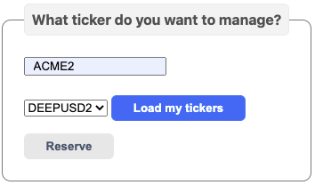

You can type either a known ticker, or a new one that does not exist. Alternatively, you can [load those whose reservation or token you own](https://github.com/PolymathNetwork/technical-content-examples/blob/802f9ddb8a4843717eefec2149fd97b97497a1b4/token_manager/pages/index.tsx#L98-L107).

If the ticker reservation does not exist, you can [reserve it](https://github.com/PolymathNetwork/technical-content-examples/blob/802f9ddb8a4843717eefec2149fd97b97497a1b4/token_manager/pages/index.tsx#L129-L135).

### Reservation

If your ticker is only reserved:

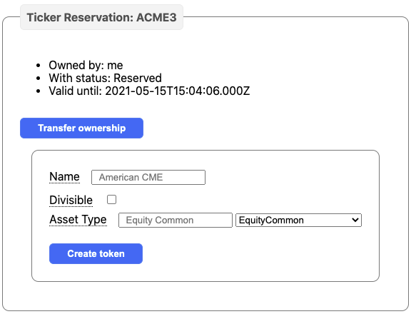

When the feature is implemented, you will be able to transfer the ownership. As of now, you can create the token proper with the parameters of your choice.

If your ticker is already created:

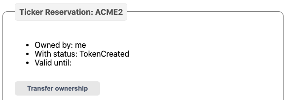

### Security token

When you have created the token, it [loads](https://github.com/PolymathNetwork/technical-content-examples/blob/802f9ddb8a4843717eefec2149fd97b97497a1b4/token_manager/pages/index.tsx#L186-L199) and shows as:

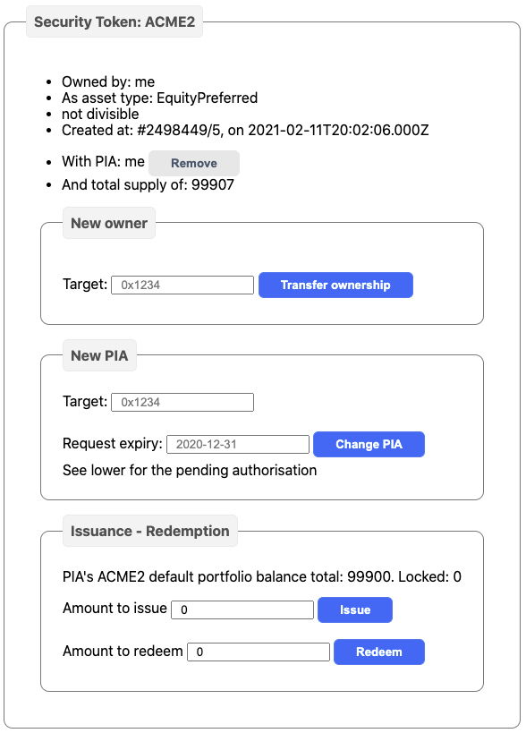

You can [transfer the ownership](https://github.com/PolymathNetwork/technical-content-examples/blob/802f9ddb8a4843717eefec2149fd97b97497a1b4/token_manager/pages/index.tsx#L233-L241), change the [primary issuance agent](https://github.com/PolymathNetwork/technical-content-examples/blob/802f9ddb8a4843717eefec2149fd97b97497a1b4/token_manager/pages/index.tsx#L243-L248), or [remove it](https://github.com/PolymathNetwork/technical-content-examples/blob/802f9ddb8a4843717eefec2149fd97b97497a1b4/token_manager/pages/index.tsx#L250-L255). And if you are the PIA, you can [issue](https://github.com/PolymathNetwork/technical-content-examples/blob/802f9ddb8a4843717eefec2149fd97b97497a1b4/token_manager/pages/index.tsx#L257-L264) or [redeem](https://github.com/PolymathNetwork/technical-content-examples/blob/802f9ddb8a4843717eefec2149fd97b97497a1b4/token_manager/pages/index.tsx#L266-L271) tokens in your default portfolio.

### Compliance requirements

If the token exists, they are [loaded](https://github.com/PolymathNetwork/technical-content-examples/blob/802f9ddb8a4843717eefec2149fd97b97497a1b4/token_manager/pages/index.tsx#L273-L280) and show as:

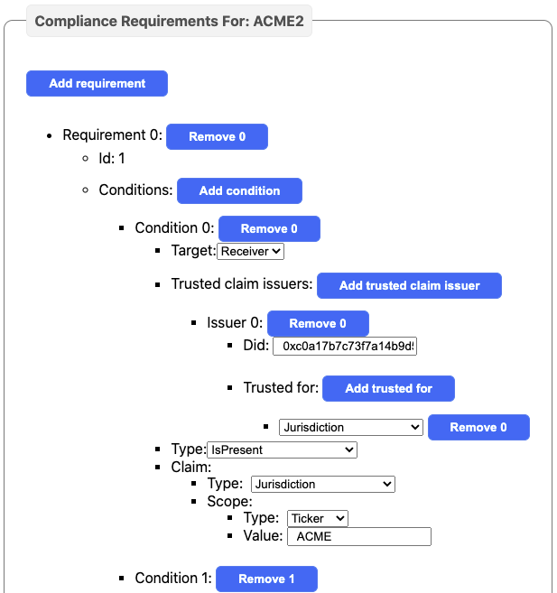

The list can be long...

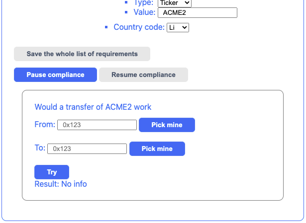

If you own the token and [change any of the requirements](https://github.com/PolymathNetwork/technical-content-examples/blob/802f9ddb8a4843717eefec2149fd97b97497a1b4/token_manager/pages/index.tsx#L304-L519), conditions, types and so on, you can [save the whole list](https://github.com/PolymathNetwork/technical-content-examples/blob/802f9ddb8a4843717eefec2149fd97b97497a1b4/token_manager/pages/index.tsx#L521-L527). You can also [pause compliance](https://github.com/PolymathNetwork/technical-content-examples/blob/802f9ddb8a4843717eefec2149fd97b97497a1b4/token_manager/pages/index.tsx#L529-L533) and [resume it](https://github.com/PolymathNetwork/technical-content-examples/blob/802f9ddb8a4843717eefec2149fd97b97497a1b4/token_manager/pages/index.tsx#L535-L539). And to assist users, you can [simulate whether a transfer](https://github.com/PolymathNetwork/technical-content-examples/blob/802f9ddb8a4843717eefec2149fd97b97497a1b4/token_manager/pages/index.tsx#L541-L548) would complete.

### Pending authorisations

If you have sent an authorisation out, for instance to change the PIA on your token, you can [load](https://github.com/PolymathNetwork/technical-content-examples/blob/802f9ddb8a4843717eefec2149fd97b97497a1b4/token_manager/pages/index.tsx#L550-L559) that:

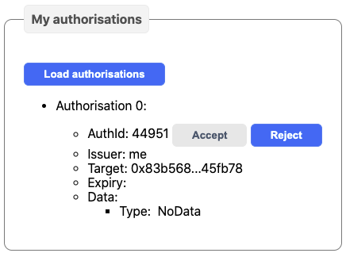

Which you can [reject](https://github.com/PolymathNetwork/technical-content-examples/blob/802f9ddb8a4843717eefec2149fd97b97497a1b4/token_manager/pages/index.tsx#L647-L653).

Now, if you are the recipient, the same pending authorisation will appear, although with a possibility to [accept](https://github.com/PolymathNetwork/technical-content-examples/blob/802f9ddb8a4843717eefec2149fd97b97497a1b4/token_manager/pages/index.tsx#L639-L645).

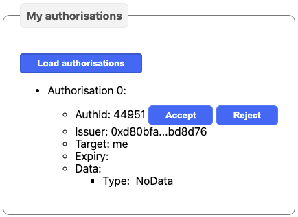

### Attestations

Here, you can [load your own](https://github.com/PolymathNetwork/technical-content-examples/blob/802f9ddb8a4843717eefec2149fd97b97497a1b4/token_manager/pages/index.tsx#L655-L662), or those of [someone else](https://github.com/PolymathNetwork/technical-content-examples/blob/802f9ddb8a4843717eefec2149fd97b97497a1b4/token_manager/pages/index.tsx#L664-L670), for instance if you are the KYC provider and want to see what you already issued.

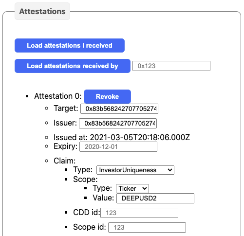

And if you are the issuer, then you can [revoke it](https://github.com/PolymathNetwork/technical-content-examples/blob/802f9ddb8a4843717eefec2149fd97b97497a1b4/token_manager/pages/index.tsx#L757-L763).

To [add an attestation](https://github.com/PolymathNetwork/technical-content-examples/blob/802f9ddb8a4843717eefec2149fd97b97497a1b4/token_manager/pages/index.tsx#L765-L771), just enter the right parameters:

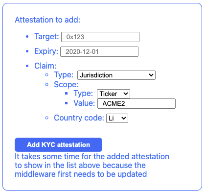

The [investor uniqueness attestation](https://github.com/PolymathNetwork/technical-content-examples/blob/802f9ddb8a4843717eefec2149fd97b97497a1b4/token_manager/pages/index.tsx#L773-L796) is different and requires a special treatment. Also, at the moment, for the Testnet, it relies on a [mocked uID](https://github.com/PolymathNetwork/technical-content-examples/blob/802f9ddb8a4843717eefec2149fd97b97497a1b4/token_manager/pages/index.tsx#L783) that may cause issues. Also note how `@polymathnetwork/confidential-identity` are [loaded asynchronously](https://github.com/PolymathNetwork/technical-content-examples/blob/802f9ddb8a4843717eefec2149fd97b97497a1b4/token_manager/pages/index.tsx#L779). This is necessary because it contains WebAssembly modules.

### Portfolios

You can [load your own](https://github.com/PolymathNetwork/technical-content-examples/blob/802f9ddb8a4843717eefec2149fd97b97497a1b4/token_manager/pages/index.tsx#L798-L817), or that of someone else. The list includes your portfolios which have a custodian. If you want to make someone your custodian, you can enter a new value and [do it](https://github.com/PolymathNetwork/technical-content-examples/blob/802f9ddb8a4843717eefec2149fd97b97497a1b4/token_manager/pages/index.tsx#L841-L846).

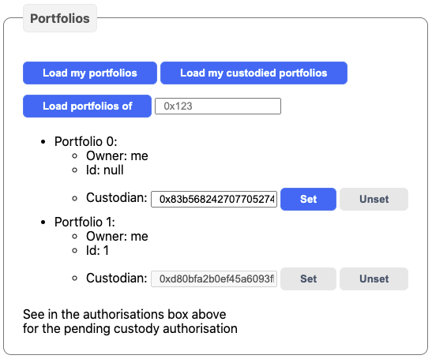

You can also load the portfolios for which [you are the custodian](https://github.com/PolymathNetwork/technical-content-examples/blob/802f9ddb8a4843717eefec2149fd97b97497a1b4/token_manager/pages/index.tsx#L819-L827). If you are the custodian of a portfolio, you are the only one who can [relinquish custody](https://github.com/PolymathNetwork/technical-content-examples/blob/802f9ddb8a4843717eefec2149fd97b97497a1b4/token_manager/pages/index.tsx#L848-L853).

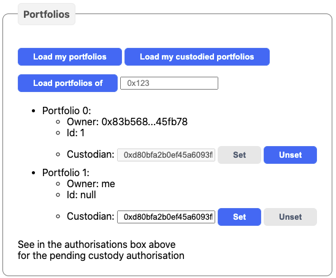

### Checkpoints

When choosing a ticker, the existing checkpoints [will load](https://github.com/PolymathNetwork/technical-content-examples/blob/802f9ddb8a4843717eefec2149fd97b97497a1b4/token_manager/pages/index.tsx#L884-L889). In each, you can [check the balance](https://github.com/PolymathNetwork/technical-content-examples/blob/802f9ddb8a4843717eefec2149fd97b97497a1b4/token_manager/pages/index.tsx#L920-L924) of any account.

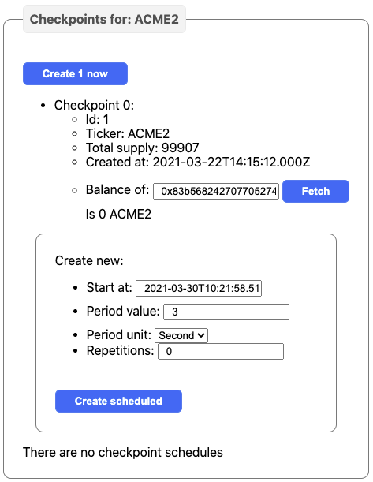

Of course, you can also create one [immediately](https://github.com/PolymathNetwork/technical-content-examples/blob/802f9ddb8a4843717eefec2149fd97b97497a1b4/token_manager/pages/index.tsx#L914-L918), or create [a schedule](https://github.com/PolymathNetwork/technical-content-examples/blob/802f9ddb8a4843717eefec2149fd97b97497a1b4/token_manager/pages/index.tsx#L926-L930).

### Conclusion

This token manager does not pretend to have a good interface, but it shows you how you could start when building your own.

Keep posted for updates when the SDK changes.
