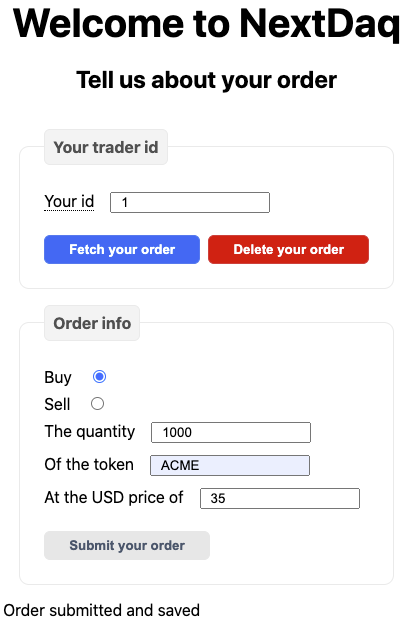
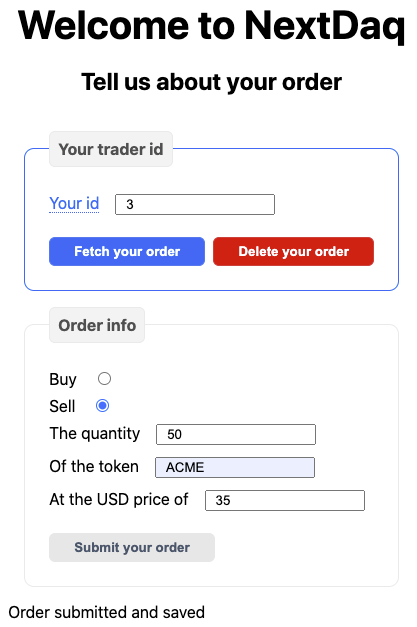
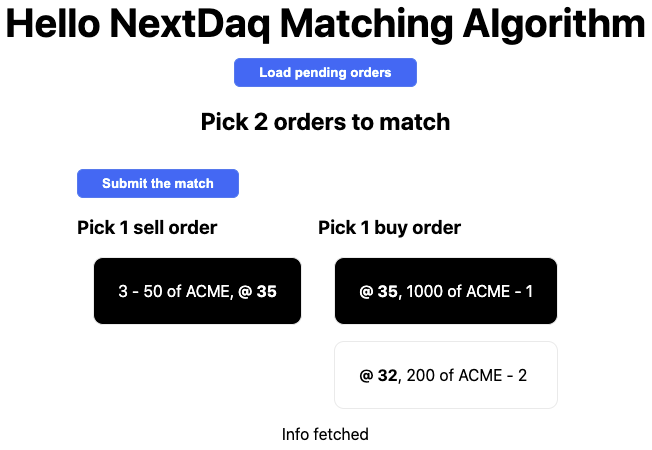
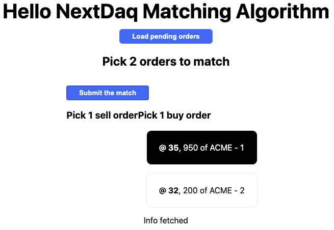
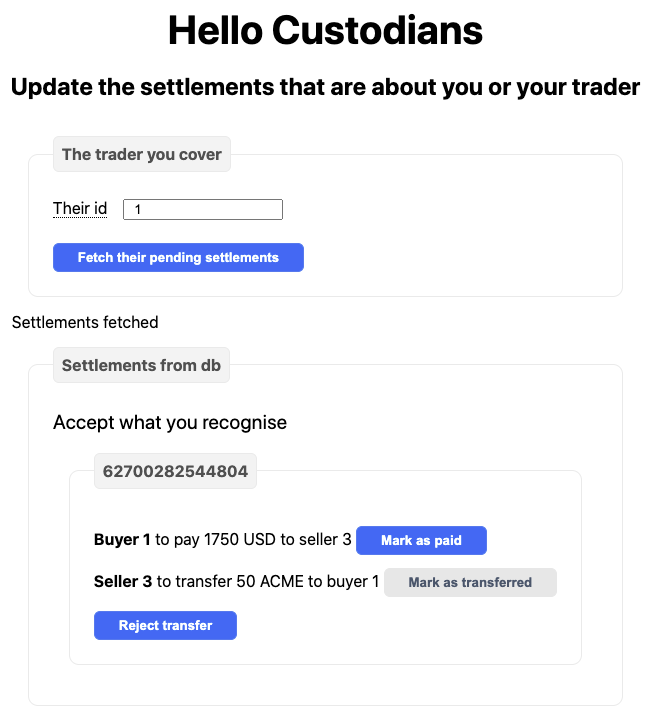
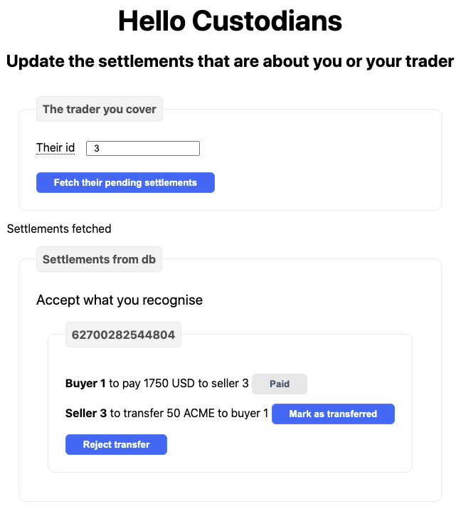
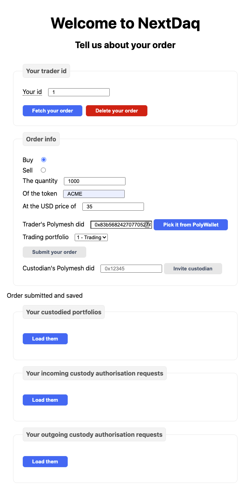
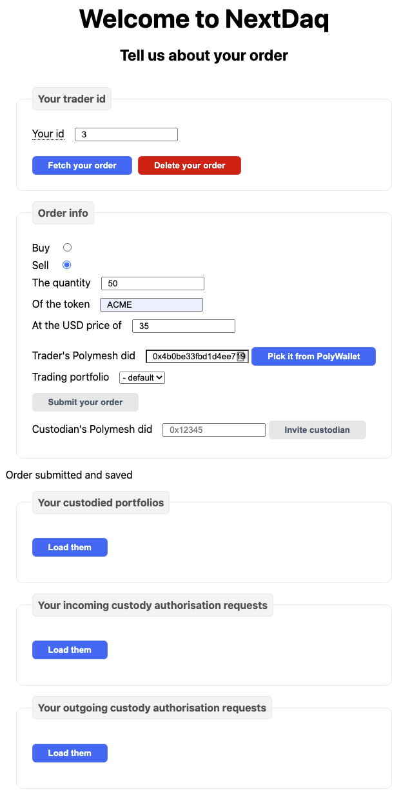
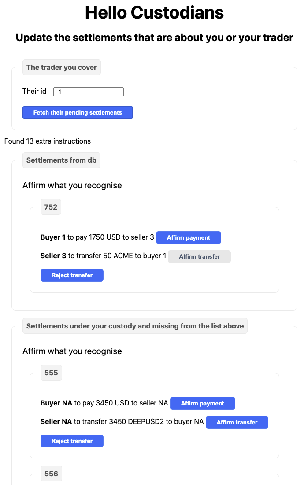

After learning about the SDK elements that work for settlement and custodianship, let's have a look at a simplified example of what it would take to integrate an existing system with Polymesh. For this example, we will consider the case of a stock exchange onto which brokers place orders for their customers. To simplify, and not overburden the reader with elements not relevant to learning about Polymesh, we did not add any authentication nor authorisation mechanism. Nor did we implement any sophisticated order matching algorithm.

## Pre Polymesh

Let's describe the simple exchange system before we integrate it with Polymesh.

### The setup

**4 pages** are served:

* `index.tsx`, a [page to link](https://github.com/PolymathNetwork/technical-content-examples/blob/e39d5f7ccb7518eef82c347d24a2efcb287dfd53/settlement_provider/pages/index.tsx) to the 3 others.
* `trader.tsx`, a [page for traders and custodians](https://github.com/PolymathNetwork/technical-content-examples/blob/e39d5f7ccb7518eef82c347d24a2efcb287dfd53/settlement_provider/pages/trader.tsx) to see, put and delete orders.
* `exchange.tsx`, a [page for the exchange "manager"](https://github.com/PolymathNetwork/technical-content-examples/blob/e39d5f7ccb7518eef82c347d24a2efcb287dfd53/settlement_provider/pages/exchange.tsx) to see all orders in 2 columns, and match 1 sell order with 1 buy order and thereby create 1 trade.
* `custodian.tsx`, a [page for the traders and custodians](https://github.com/PolymathNetwork/technical-content-examples/blob/e39d5f7ccb7518eef82c347d24a2efcb287dfd53/settlement_provider/pages/custodian.tsx) to see their trades' pending settlements and indicate the actions they have taken.

There is a rudimentary server that exposes a **simple API**:

* `api/trader/[id].ts`, an [end point](https://github.com/PolymathNetwork/technical-content-examples/blob/e39d5f7ccb7518eef82c347d24a2efcb287dfd53/settlement_provider/pages/api/trader/%5Bid%5D.ts) for traders and custodians to get, put and delete orders. Orders are identified by their [`id`](https://github.com/PolymathNetwork/technical-content-examples/blob/e39d5f7ccb7518eef82c347d24a2efcb287dfd53/settlement_provider/pages/api/trader/%5Bid%5D.ts#L18), and no restriction is enforced here. Anyone can use any `id`, including _someone else's_.
* `api/trades.ts`, an [end point](https://github.com/PolymathNetwork/technical-content-examples/blob/e39d5f7ccb7518eef82c347d24a2efcb287dfd53/settlement_provider/pages/api/trades.ts) for anyone to retrieve all trades. This is used by the `exchange.tsx` page to be able to present the buy and sell orders.
* `api/settlements.ts`, an [end point](https://github.com/PolymathNetwork/technical-content-examples/blob/e39d5f7ccb7518eef82c347d24a2efcb287dfd53/settlement_provider/pages/api/settlements.ts) for:
    * the exchange to post matching orders, thereby creating a pending settlement.
    * the traders and custodians to get all relevant pending settlements.
* `api/settlement/[id].ts`, an [end point](https://github.com/PolymathNetwork/technical-content-examples/blob/e39d5f7ccb7518eef82c347d24a2efcb287dfd53/settlement_provider/pages/api/settlement/%5Bid%5D.ts) place for traders and custodians to get, patch and delete settlements. Settlements are identified by their [`id`](https://github.com/PolymathNetwork/technical-content-examples/blob/e39d5f7ccb7518eef82c347d24a2efcb287dfd53/settlement_provider/pages/api/settlement/%5Bid%5D.ts#L19), which is decided by the exchange server. When traders and custodians _patch_ a settlement, that is to indicate whether they have paid / transferred their end of the bargain. Yes, there is no verification, it is based on trust...

On the server, basic **services** are running:

* `exchangeDbFs.ts`, a [service](https://github.com/PolymathNetwork/technical-content-examples/blob/e39d5f7ccb7518eef82c347d24a2efcb287dfd53/settlement_provider/src/exchangeDbFs.ts) to store orders from traders and custodians on disk in a large JSON file, instead of a proper database, for simplicity's stake.
* `settlementDbFs.ts`, a similar [service](https://github.com/PolymathNetwork/technical-content-examples/blob/e39d5f7ccb7518eef82c347d24a2efcb287dfd53/settlement_provider/src/settlementDbFs.ts), this time to store pending trade settlements, on disk in a large JSON file.

The system describes its **information** in terms of:

* `OrderInfo`, an [object](https://github.com/PolymathNetwork/technical-content-examples/blob/e39d5f7ccb7518eef82c347d24a2efcb287dfd53/settlement_provider/src/orderInfo.ts) to describe an order information.
* `AssignedOrderInfo`, [the same](https://github.com/PolymathNetwork/technical-content-examples/blob/e39d5f7ccb7518eef82c347d24a2efcb287dfd53/settlement_provider/src/orderInfo.ts#L71) but with an `id`. Note that this `id` serves as the identifier of the order. At the same time, because we do not have identifiers for traders, this `id` serves as an identifier for traders too, as can be seen in `SettlementParty` below. Of course, an entity can create multiple orders, just by picking an available `id`.
* `SettlementParty`, an [object](https://github.com/PolymathNetwork/technical-content-examples/blob/e39d5f7ccb7518eef82c347d24a2efcb287dfd53/settlement_provider/src/settlementInfo.ts#L55) to describe a party involved in a trade. In effect, the `id` of the order / trader.
* `SettlementInfo`, an [object](https://github.com/PolymathNetwork/technical-content-examples/blob/e39d5f7ccb7518eef82c347d24a2efcb287dfd53/settlement_provider/src/settlementInfo.ts#L70) to describe the result of matched orders.
* `FullSettlementInfo`, [the same](https://github.com/PolymathNetwork/technical-content-examples/blob/e39d5f7ccb7518eef82c347d24a2efcb287dfd53/settlement_provider/src/settlementInfo.ts#L123) but with an `id`.

There are a couple of extra **functions** to note:

* a `createByMatchingOrders` [function](https://github.com/PolymathNetwork/technical-content-examples/blob/e39d5f7ccb7518eef82c347d24a2efcb287dfd53/settlement_provider/src/settlementInfo.ts#L141) to assist in creating a `SettlementInfo` out of 2 matching `OrderInfo`.
* a more complex `matchOrders` [function](https://github.com/PolymathNetwork/technical-content-examples/blob/e39d5f7ccb7518eef82c347d24a2efcb287dfd53/settlement_provider/pages/api/settlements.ts#L46) that assists in saving the created settlement into the server, and updating or deleting the orders.

### How it looks

Let's say that trader 1 puts a buy order and trader 3 puts a sell order:

Then, when the exchange looks at the current orders:

Then after clicking <kbd>Submit the match</kbd>:

So 50 shares of ACME have been traded for 35 USD apiece. It is time to see this settlement from the point of view of the trader 1, or its custodian:

Trader 1 was the buyer, so it needs to click <kbd>Mark as paid</kbd> when it has been done. Since the trade is about 2 parties, the seller also needs to accept, so let's look at it from the seller's point of view:

After clicking <kbd>Mark as transferred</kbd>, the trade is considered complete. Of course it is possible for either party to reject it.

## Post Polymesh

Time to integrate with Polymesh. What needs to be done?

### The setup

Let's go from the bottom up.

On the **configuration**:

* Some [basic information](https://github.com/PolymathNetwork/technical-content-examples/pull/1/files?file-filters%5B%5D=.js&file-filters%5B%5D=.json&file-filters%5B%5D=.sample#diff-c02f974584446105260153bd0ce8441ad09837cd11da994487935e8855dd4660R2) is added about the exchange server's Polymesh account mnemonic, and the default settlement venue of the exchange.
* A [CLI tool](https://github.com/PolymathNetwork/technical-content-examples/pull/1/files?file-filters%5B%5D=.js&file-filters%5B%5D=.json&file-filters%5B%5D=.sample&file-filters%5B%5D=.ts#diff-c4e3b091eb7f86c0e60297f2f061ae3855a16a0f58fee93f83efbd0feadc1b9dR66) is added to handle the setup in a more pleasant way.

On **objects**:

* in `OrderInfo`, we [add information](https://github.com/PolymathNetwork/technical-content-examples/pull/1/files?file-filters%5B%5D=.js&file-filters%5B%5D=.json&file-filters%5B%5D=.sample&file-filters%5B%5D=.ts#diff-139262810d921a125869827f871972dbdaffa7d018d28628ce220bfa431ff97dR47) about the trader's trading portfolio.
* in `SettlementParty`, we [add the same information](https://github.com/PolymathNetwork/technical-content-examples/pull/1/files?file-filters%5B%5D=.js&file-filters%5B%5D=.json&file-filters%5B%5D=.sample&file-filters%5B%5D=.ts#diff-5321a5cd63f4b879cfed01d486209d7578a49bb86db4962f29533b011466b5a1R81) about the trader.
* In `SettlementInfo`, we [add a way to reference](https://github.com/PolymathNetwork/technical-content-examples/pull/1/files?file-filters%5B%5D=.js&file-filters%5B%5D=.json&file-filters%5B%5D=.sample&file-filters%5B%5D=.ts#diff-5321a5cd63f4b879cfed01d486209d7578a49bb86db4962f29533b011466b5a1R173) a settlement instruction.

On **services**:

* in `exchangeDbFs`, we [add a way to check](https://github.com/PolymathNetwork/technical-content-examples/pull/1/files?file-filters%5B%5D=.js&file-filters%5B%5D=.json&file-filters%5B%5D=.sample&file-filters%5B%5D=.ts#diff-2be3b086a47575a9f2740491f2f04fa2f3062144edc06c048697c5ab83d9dfd4R60-R71) that the Polymesh information is valid.
* which means the `exchangeDbFactory` needs to be [adjusted to prepare](https://github.com/PolymathNetwork/technical-content-examples/pull/1/files?file-filters%5B%5D=.js&file-filters%5B%5D=.json&file-filters%5B%5D=.sample&file-filters%5B%5D=.ts#diff-4b54886f30e846be914baa6778d2764108ac257ed442141033ada85893132477R30-R33) the Polymesh API.
* we also add a new service `SettlementEnginePoly`, which handles the [publication of the settlement instruction](https://github.com/PolymathNetwork/technical-content-examples/pull/1/files?file-filters%5B%5D=.js&file-filters%5B%5D=.json&file-filters%5B%5D=.sample&file-filters%5B%5D=.ts#diff-24961064d7f42bad3e6fa973ebcae0e74232d8a0719fe6b1a6e5778e863c6252R21) on Polymesh.

On **API end points**:

* No real changes other than using the right types and exceptions.

On **pages**:

* We add a [helper](https://github.com/PolymathNetwork/technical-content-examples/pull/1/files?file-filters%5B%5D=.js&file-filters%5B%5D=.json&file-filters%5B%5D=.sample&file-filters%5B%5D=.ts#diff-85febf1f1ae8f654850ed7c8b0b2be73b0dac205622a3cd1ead6496dcec3fb51R5) to get the Polywallet.
* On the trader page, we make it possible to also [pick custodied portfolios](https://github.com/PolymathNetwork/technical-content-examples/pull/1/files?file-filters%5B%5D=.js&file-filters%5B%5D=.json&file-filters%5B%5D=.sample&file-filters%5B%5D=.tsx#diff-2cad680e168ccf5ac7a8167930436c212eea1f0d3ca879fcf365ba6141fda451R28-R40), so that custodians can choose them.
* We also make it possible for the trader to [set a custodian](https://github.com/PolymathNetwork/technical-content-examples/pull/1/files?file-filters%5B%5D=.js&file-filters%5B%5D=.json&file-filters%5B%5D=.sample&file-filters%5B%5D=.tsx#diff-2cad680e168ccf5ac7a8167930436c212eea1f0d3ca879fcf365ba6141fda451R259) on a given portfolio.
* Because of that, we also add a way to [show the incoming requests](https://github.com/PolymathNetwork/technical-content-examples/pull/1/files?file-filters%5B%5D=.js&file-filters%5B%5D=.json&file-filters%5B%5D=.sample&file-filters%5B%5D=.tsx#diff-2cad680e168ccf5ac7a8167930436c212eea1f0d3ca879fcf365ba6141fda451R370).
* The exchange page does [not really change](https://github.com/PolymathNetwork/technical-content-examples/pull/1/files?file-filters%5B%5D=.js&file-filters%5B%5D=.json&file-filters%5B%5D=.sample&file-filters%5B%5D=.tsx#diff-c4a93796c437e7b23414b654abb3b87a80b1508cf9a0236c7968c20d855cb6d4R65).
* The custodian settlement page adds a way to [load instructions](https://github.com/PolymathNetwork/technical-content-examples/pull/1/files?file-filters%5B%5D=.js&file-filters%5B%5D=.json&file-filters%5B%5D=.sample&file-filters%5B%5D=.tsx#diff-dd0746cede6c07a074e2e78bb5be1b1b45e7927ce3a1269822c4057e0af03923R163) that are in the exchange venue but are not part of what the exchange knows about.
* Additionally, the custodian page [affirms the relevant legs](https://github.com/PolymathNetwork/technical-content-examples/pull/1/files?file-filters%5B%5D=.js&file-filters%5B%5D=.json&file-filters%5B%5D=.sample&file-filters%5B%5D=.tsx#diff-dd0746cede6c07a074e2e78bb5be1b1b45e7927ce3a1269822c4057e0af03923R215), before informing the exchange server that a trade side has been paid or transferred.
* Of course, the custodian page needs to check the identity found in the Polywallet and activate the buttons only when the affirmation is possible.

### How it looks

There is more information to provide when submitting a buy order:

And a sell order:

The exchange page did not change. The custodian settlement page has more too:

## Conclusion

That's what it takes.

* Make your server able to access Polymesh.
* Store a bit more information in your database.
* Make your Web pages a bit more decentralised by having them:
    * trust the exchange server but verify.
    * do some actions that do not involve the exchange server.
