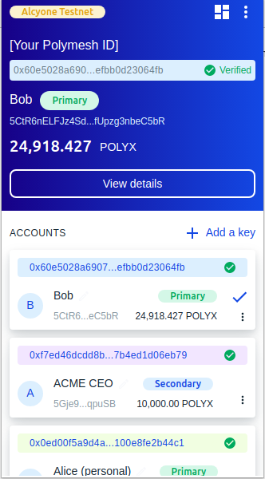
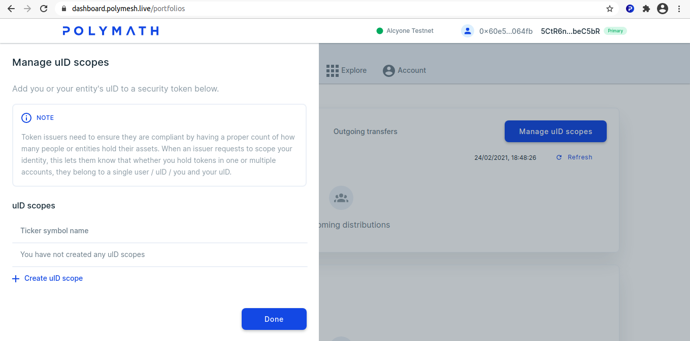
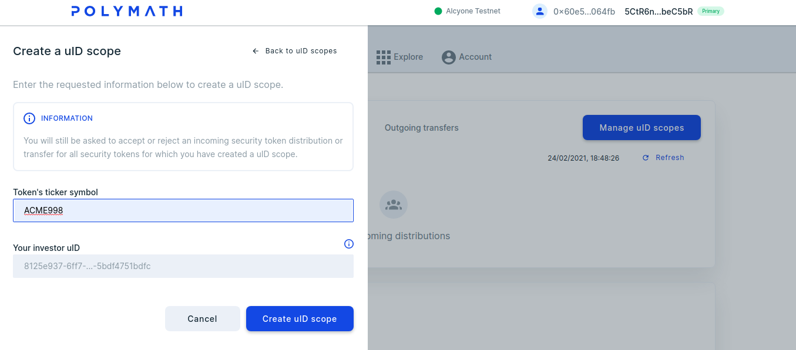
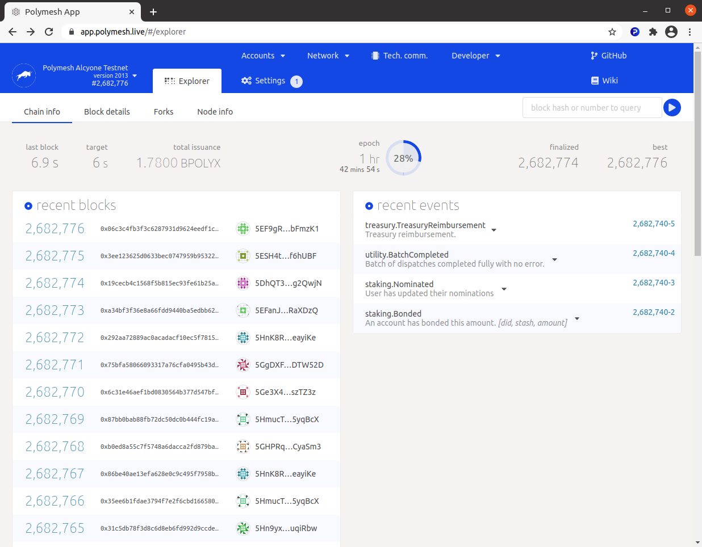
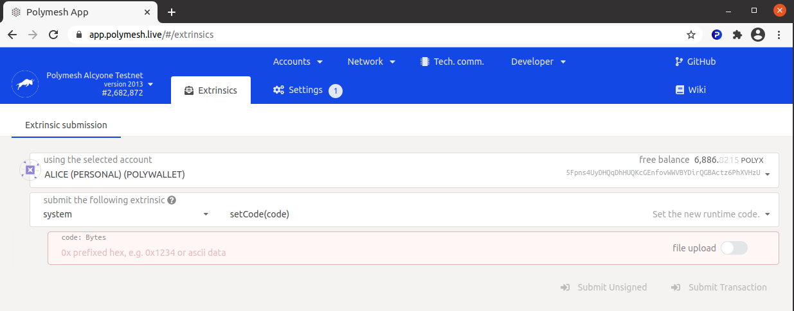
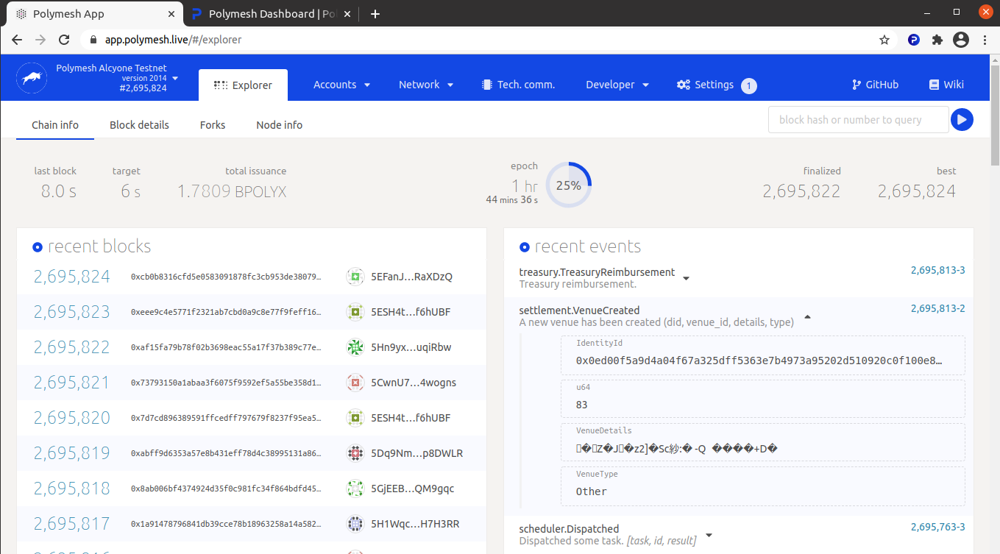
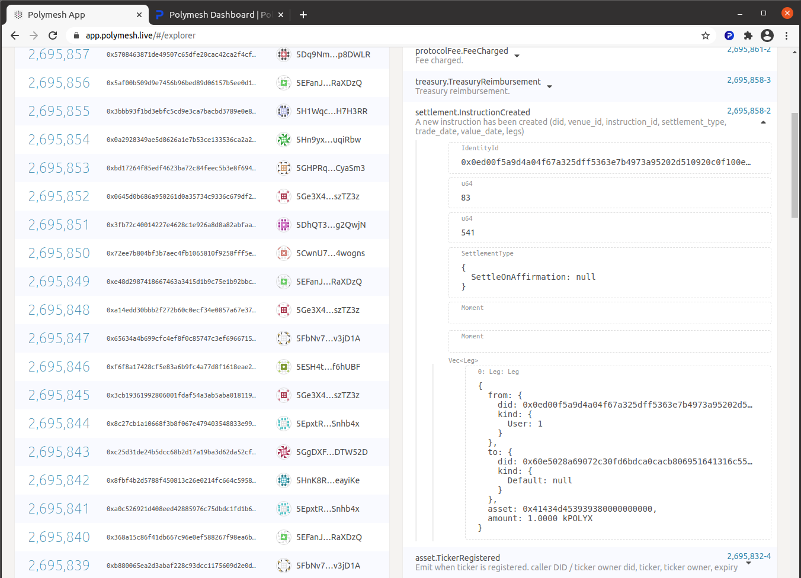
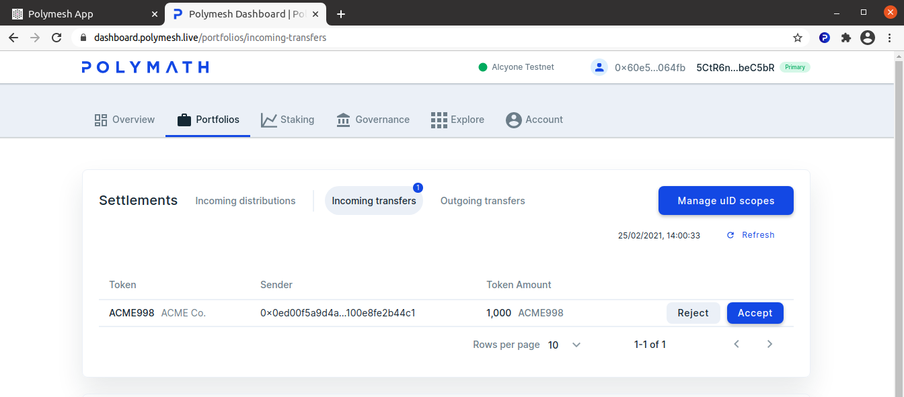

import HighlightBox from "../../src/components/HighlightBox"
import YoutubePlayer from "../../src/components/YoutubePlayer"

<YoutubePlayer videoId="l0-3sgxnQk0"/>'

## Use case

If you have been following along up to this point, you have already seen an example of settlement in practice. ACME's distribution agent (also ACME) sent shares and Alice accepted the transfer.

<HighlightBox type="tip">

If you want to refresh your memory, just give the [Token Studio exercise on distributing assets](/distribute/token-dashboard) another peek.

</HighlightBox>

Behind the scenes, the transfer was an instruction with one leg and Alice was required to affirm the instruction. The dashboard portfolio GUI presents the `send` and `accept` process. Behind the scenes, it works with the API through the SDK to create the instructions and affirmations that users sign to make it happen.

Polymesh is designed to **integrate with existing systems** that the counterparties operate in-house. Let's consider a deceptively simple-sounding example of an online exchange to highlight the many organisations and processes that _could be_ involved.

Suppose Alice wishes to sell 1000 shares for $5/share. To accomplish this, she opens an account with her broker of choice, SafeHands, which has access to the exchange, NextDaq. She plans to instruct SafeHands to list her shares for sale.

SafeHands wants to protect their own reputation with the NextDaq exchange, so they need to be sure Alice will execute any agreed trade before they would be willing to list her shares on NextDaq. There is more than one way to satisfy this requirement. SafeHands could be satisfied by Alice's credit, other collateral, or possibly by taking custody of the shares Alice wants to sell for as long as the sell order remains open. This concern is something that Alice and SafeHands work out between themselves.

With the execution risk managed, SafeHands will be ready to accept Alice's sell order and open a corresponding order on NextDaq.

When NextDaq matches Alice's sell order with Bob's buy order, the buyer, the seller, and two brokers will be legally obliged to execute the trade. Additionally, custodians may be required to transfer shares and Bob will be required to send funds to pay for his purchase. Once again, we see that there is no precise business process that would be satisfactory to all participants in all markets. Polymesh provides **granular control and a high degree of flexibility** within an overarching structure that provides **assurances about transaction finality and regulatory compliance**.

## Off-chain and on-chain legs

Let's consider the funds.

Alice's broker needs to confirm receipt of the funds but there are many ways to accomplish this. If Alice and Bob are both SafeHands customers, possibly the order was matched in-house and was never even sent to NextDaq. The transfer of funds could be a simple, internal ledger entry. Or the payment could rely on an existing agreement between the brokerages and their familiar settlement process. Or the payment could be through an on-chain 1-to-1 fiat currency token representing the funds.

While it is conceivable that one day many fund transfers will be settled entirely on-chain using fiat currency tokens, it is important today to ensure that there is no requirement that all legs of all instructions have to be settled with on-chain transfers. When Alice's broker affirms the instruction, including the fund transfer leg, they are effectively _affirming their confidence that they have been or will be paid._ This affords everyone the flexibility of continuing to rely on their existing business processes to the extent that they want to. In the case that fiat tokens clear regulatory hurdles and become a common method of transferring funds, then the network will, of course, attend to the transfer of funds as an on-chain instruction leg. Even so, affirmation of the payment leg will still be important since it prescribes the _amount_ and _currency_ that will be transferred. The receiver will affirm that this information is correct before agreeing to it.

## Importance of integration

It is expected that brokers, custodians, transfer agents, and other parties will integrate their existing systems with Polymesh. Alice and Bob don't generally have any contact with the trade settlement process beyond funding their accounts and managing their orders, so they wouldn't generally have contact with the settlement process other than brief encounters like [when Alice accepted the shares from ACME](/distribute/token-dashboard).

Each organisation that integrates with the system will have a unique blend of concerns depending on the services offered, existing business processes, and existing systems. For this reason, the dashboard and Token Studio don't model a specific way of approaching this process at this time. Rather, the SDK provides granular methods for participants like SafeHands to create bespoke, in-house integrations. The end result is automation of the processes that let Alice and Bob **trade security tokens through familiar customer-facing user interfaces**, and **B2B processes that support efficient settlement**. This facilitates acceptance of security tokens and delivery of related services with minimal disruption of existing business, technical, and legal processes.

## Preliminary steps

### Pause compliance rules

Before we proceed too far, we must remove an obstacle. When we originated the ACME shares, we created a basic compliance regime as would normally be the case. We designated ACME themselves as the KYC service provider, meaning that they would attend to verifying information about their shareholders internally. We did not, however, explore how they perform this function or how the users complete the process. So, compliance rules are in effect and Alice hasn't met the requirements. She will be unable to trade, and you will see that the network prevents a non-compliant transfer at a deep level if you attempt this exercise while skipping this step.

<HighlightBox type="info">

KYC is explained in detail in the [KYC section](/kyc/).

</HighlightBox>

To keep this settlement exercise as simple as possible, let's remove the obstacle by relaxing the rules. Return to the Token Studio, as ACME, navigate to `Compliance` and `Pause Rule`.

Confirm and sign, of course.

### Create Bob

Alice will transfer some of her shares to another user. For this to work, we will need another user, so create a user with a new identity, Bob, complete [customer due diligence](/quickstart/verification-with-cdd) and [get some POLYX](/quickstart/quickstart-polyx) because Bob will need to sign some transactions:

 - `+ Add a key`;
 - **don't** assign the key to Alice or ACME;
 - Proceed to the dashboard and create a new identity, Bob;
 - Complete [customer due diligence](/quickstart/verification-with-cdd), as Bob;
 - [Get some POLYX](/quickstart/quickstart-polyx) for Bob.

<!--- Not sure this is needed because Bob should be able to create the necessary uID when he affirms the incoming transfer.

### Create a uID scope

Every user must have a uID scope for the securities in their portfolios. As Bob, navigate to `Portfolios` on the Dashboard and click `Manage uID scopes`.

Create a uID scope Bob and ACME, using the symbol you chose for your ACME shares.

We will need some information from the blockchain.

--->

## Polymesh Substrate App

Recall that [Polymesh is built with Substrate](/introduction/tech-stack), which is a set of modules for creating a blockchain. Substrate provides tools that offer low-level access to everything that happens on a Substrate network and these tools work with Polymesh.

The **[Polymesh Substrate App](https://app.polymesh.live)** is such a tool. Blockchain enthusiasts will recognise that it is similar to block explorers found in other settings. One can use it to explore the blockchain and transactions in depth.

_The methods that define what Polymesh does and how it does it_ are called **extrinsics** in the Substrate lexicon. This tool facilitates direct interaction with the extrinsics, i.e. creating, signing and sending transactions. Consequently, this tool is an avenue to interact with any Polymesh method directly and witness the result.

Open the Polymesh Substrate App at https://app.polymesh.live. It opens on the `Explorer` tab and displays recent blocks and events.

Peruse recent blocks and see that the extrinsics **describe the methods and parameters that were signed and the results of the transactions**, but don't be alarmed if it seems technical. This information is of interest to developers who create automated systems and user-friendly interfaces.

<!--- Discover ACME's venue. Alice will create one, instead.

### Reveal the venue number

Every settlement takes place within a venue. When we created the ACME token and performed the distribution, the Token Studio created a default venue for us, so we weren't burdened with this step. Now, we will need the venue number. What is it? How can we find out?

As you might imagine, every fact is recorded on the blockchain so we only need to know where to look. Navigate to `Developers`, `Chain State`.

- Under `selected query state` choose `settlement`;
- To the right, select `userVenues(Identityid): Vec<u64>`;
- Press entirely.

Here, the system responded, `78`. You will need the number that applies to _your token_.

-->

## Create a venue

Navigate to `Extrinsics` on the `Developer` menu.

If you don't see Alice's personal "POLYWALLET", open the wallet and select Alice's personal primary key to set the context. The page will refresh.

Transfers in Polymesh don't occur in a void. Each transfer occurs in a venue, which is an organised trading facility (OTF), regulated market (RMs), or multilateral trading facility (MTF) that receives instructions from counter-parties for the purpose of matching, i.e. to convert separate orders into executed trades.

In summary, **venues** are _logical groups of instructions and settlements_. The creator of a venue controls permission, meaning who is allowed to create settlements within the venue. When ACME transferred shares to Alice, the token studio created a venue for ACME. By default, only ACME has permission to trade there. We can safely assume that Alice doesn't have permission at this time.

Alice cannot create a settlement outside of a venue, so Alice needs a venue. Alice can create her own venue where she has permission to trade.

1. Be sure Alice's personal account is in focus, in the wallet;
2. Navigate to `Developer`, `Extrinsics`;
3. Select `Settlement` under `submit the following extrinsic`. Choosing this category updates the related extrinsics to the right;
5. Select `createVenue(details, signers, venue, type)`. Notice the human-readable explanation of what it does, "Registers a new venue" and the list of arguments it accepts, "details, signers, venue and type";
6. Under `details: VenueDetails` paste Alice's Polymesh DID. She will have permission to create settlements in this venue;
7. Leave the venue type set to `Other`;
8. `Submit Transaction`.

## Venue number

You should receive a positive response after the above transaction is confirmed, signed, and sent. In just a moment, you will see your transaction in the blockchain. Navigate to `Network`, `Explore` and look for `settlement.VenueCreated`. Expand the transaction. Your venue number will be unique, so take note of it. In the example below, the system assigned venue number 83.

At this moment, it suffices for us to spot our recent transaction in the list. There are many ways to query the blockchain to find such a detail in the future.

<HighlightBox type="tip">

See if you can discover on your own how to use `Developer`/`Chain state` to query the venues where Alice is _allowed_ to create a settlement. Hint: The query is about settlements and user venues.

</HighlightBox>

## Settlement instruction

Next, Alice will create a settlement.

Return to Navigate to `Developer`, `Extrinsics`.

Again, select the `settlement` category. The subcategory updates to show the variants of this extrinsic and each variant includes a short, human-readable description of what it does. This time, select `addAndAffirmInstruction` which _adds and affirms a new instruction_. It makes sense to cover both steps in one transaction since Alice is both creating the instruction and also agrees with it. Remember, the receiver will also affirm the instruction before it executes. Alice could create the instruction without affirming it if, for example, she is waiting for funds from Bob.

Next is the `Venue`. All settlements occur in a venue. This is where Alice will need to know her own venue number from the earlier step. In the example, we created venue 83 but your number will be different.

Moving on, we come to `settlement_type` which defaults to _Settle on Affirmation_ which means that the transaction will settle when everyone agrees, or shortly thereafter. Notice that the instruction can be forward-dated to a future block. Let's leave it set to _SettleOnAffirmation_.

Further options to exist to set the trade date and value date in the future. Again, for simplicity, let's leave those unselected but note that they exist.

## Legs

Legs are where the purpose of the transaction is defined. For example, if Alice wants to transfer shares to Bob and Bob will pay Alice (and no one else is involved) then one or two legs would be used to describe the share transfer, and possibly the payment.

Astute readers will note that the dashboard has a purpose-built user interface for such a simple transfer, but our purpose is to unfold the tools one can use to create more complex settlements.

Click `Add item` next to `legs:` at the bottom of the form. This opens the legs form as it is defined within the `addAndAffirmInstruction` extrinsic. Each activity has its own parameters. Settlements have 0-n legs each with `from` and `to` portfolios, and an `asset` and an `amount`.

Let's transfer 1,000 shares to Bob.

1. Copy Alice's Polymesh DID and paste into the `from: did: IdentityId`;
2. Copy Bob's Polymesh DID and paste into the `to: did: IdentityId`.

Recall that Alice moved her shares to her `cold store` portfolio. Here, we have some choices. Alice could leave this partially-completed form for a moment and transfer 1,000 or more shares to her default portfolio, or she can add another detail to this leg.

We can use a `Chain State` query to enumerate the portfolios Alice has. See if you can find your way to the appropriate query to ascertain that Alice's `cold store` portfolio is indeed `1`. Or, take this as a given because it is the first and only user portfolio Alice has if you have been following closely. In any case, to transfer from a portfolio other than the default, select `User` portfolio and input the portfolio number.

Input the unique symbol for the security token you created.

<HighlightBox type="tip">

If this instruction involved two or more asset transfers, then we would create additional legs. Instructions settle atomically, meaning all legs execute completely. There is **no case in which an instruction is partially processed** or some, but not all legs are processed. See examples of more complex transaction with multiple legs in the [reference documentation](/polymesh-docs/primitives/settlement/)

</HighlightBox>

Alice will transfer 1,000 shares to Bob. Notice that the number entered can be scaled. To the right, `kilo` would multiply the input value by 1,000. Leave it as POLYX, which means `1:1` in this context.

Now, `Submit transaction`. The web site reports what it intends to do. We agree, and `Sign and Submit`. A signature is required, so that prompts the wallet to request it.

## Transaction

Return to `Network`, `Explorer`.

You will see a new transaction created, titled `settlement.InstructionCreated`. Expand it and see the details of the settlement instruction created just now.

Again, the `Chain state` queries offer numerous ways to recall this information in the future. For example, one could find the settlement instructions created by Alice, related to Bob or related to ACME.

## Not settled

The transaction that creates the instruction is created and confirmed, but the trade has not occurred yet. This is an important difference between Polymesh and many other distributed blockchain-based systems. In other cases, there is nothing Bob can do to prevent the arrival of assets in his portfolio, which is problematic in the context of regulated securities. In Polymesh, Bob needs to affirm the instruction and Bob can reject the instruction if he disagrees with it.

Let's have a look from Bob's perspective now that this instruction exists.

Change to Bob's Polymesh DID in the wallet and navigate to the `Portfolios` tab in the dashboard: https://dashboard.polymath.network.

Bob has one incoming transfer. It is 1,000 ACME shares.

Accept the transfer and receive the shares.

Since this is the first time Bob has received ACME shares, Bob will create a uID scope for ACME. The system leads Bob through the process. Also, Bob may wish to move some or all of his shares to another portfolio.

<HighlightBox type="tip">

For details on these processes, return to [Token Studio Dashboard](/distribute/token-dashboard) in the _Distribution_ section to recall how Alice received her first ACME shares and moved them to her cold store portfolio.

</HighlightBox>

## Links

- [Polymesh Substrate App](https://app.polymesh.live)
- [Polymesh Dashboard](https://dashboard.polymath.network)
- [Polymesh Primitives, Settlement](/polymesh-docs/primitives/settlement/)
