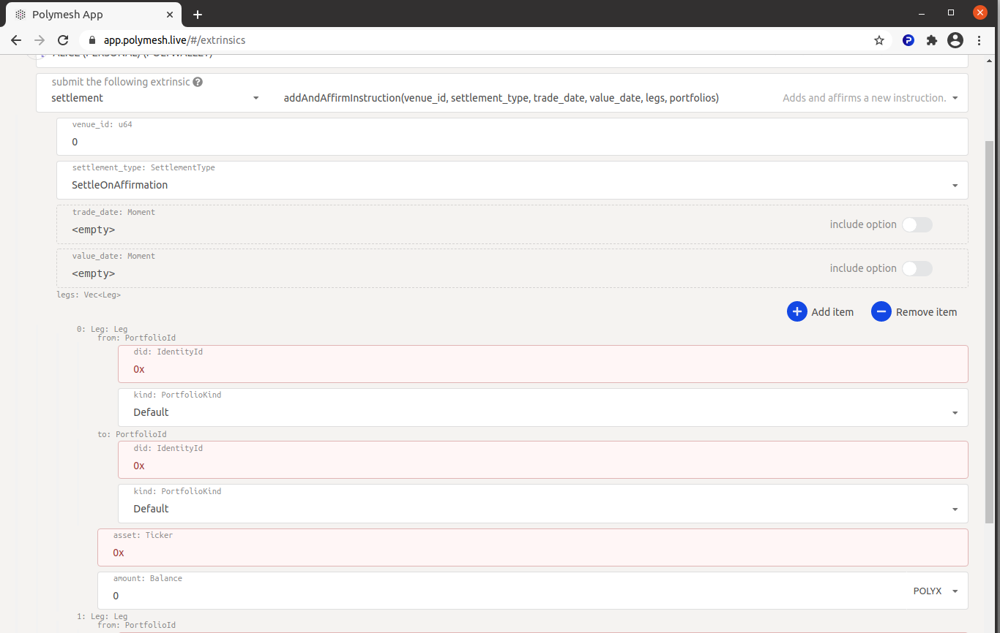

## Use-Case

If you have been following along up to this point, you have already seen an example of settlement in practice. ACME's distribution agent (also ACME) [sent shares](/distribute/dashboard) and Alice accepted the transfer. 

Behind the scenes, the transfer was an instruction with one leg and Alice was required to affirm the instruction. The dashboard portfolio gui presents the `send` and `accept` process. Behind the scenes, it works with the API through the SDK to create the instructions and affirmations that users sign to make it happen. 

Polymesh is designed to intregrate with existing systems that the counterparties operate in-house. Let us consider a deceptively simple-sounding example of an online exchange to highlight the many organizations and processes that _could be_ involved. 

Suppose Alice wishes to sell 1000 shares for $5/share. To accomplish this, she opens an account with her broker of choice, SafeHands, which has access to the exchange, NextDaq. She plans to instruct SafeHands to list her shares for sale. SafeHands wants to protect their own reputation with the NextDaq exchange, so they need to be sure Alice will execute any agreed trade before they would be willing to list her shares on NextDaq. There is more than one way to satisfy this requirement. SafeHands could be satisfied by Alice's credit, other collateral or possibly by taking custody of the shares Alice wants to sell for as long as the sell order remains open. This concern is something that Alice and SafeHands work out between them. 

With the execution risk managed, SafeHands will be ready to accept Alice's sell order and open a corresponding order on NextDaq. 

When NextDaq matches Alice's sell order with Bob's buy order, buyer, seller, and two brokers will legally obliged to execute the trade. Additionally, custodians may be required to transfer shares and Bob will be required to send funds to pay for his purchase. Once again, we see that there is no precise business process that would be satisfactory to all participants in all markets. Polymesh provides granular control and a high degree of flexibility within an overarching structure that provides assurances about transaction finality and regulatory compliance. 

## Off-chain and On-Chain legs

Let us consider the funds. Alice's broker needs to confirm receipt of the funds but there are many ways to accomplish this. If Alice and Bob are both SafeHands customers, possibly the order was matched in-house and was never even sent to NextDaq. The transfer of funds could be a simple, internal ledger entry. Or, the payment could rely on an existing agreement between the brokerages and their familiar settlement process. Or, the payment could be through an on-chain stable token representing the funds. 

While it is conceiveable that one day many fund transfers will be settled entirely on-chain using stable tokens it is important today to ensure that there is no requirement that all legs of all instructions have to be settled with on-chain transfers. When Alice's broker affirms the instruction, including the fund transfer leg, they are effectively _affirming their confidence that they have been or will be paid._ This affords everyone the flexibility of continuing to rely on their existing business processes to the extent that they want to. In the case that stable tokens clear regulatory hurdles and become a common method of transferring funds then the network will, of course, attend to the transfer of funds as an on-chain instruction leg. Even so, affirmation of the payment leg will still be important since it prescribes the _amount_ and _currency_ that will be transferred. The receiver will affirm that this information is correct before agreeing to it. 

## Importance of Integration

It is expected that brokers, custodians, transfer agents and other parties will integrate their existing systems with Polymesh. Alice and Bob don't generally have any contact with the trade settlement process beyond funding their accounts and managing their orders, so they wouldn't generally have contact with the settlement process other than brief encounters like [when Alice accepted the shares from ACME](/distribute/dashboard). 

Each organization that integrates with the system will have unique blend of concerns depending the services offered, existing business processes and existing systems. For this reason, the dashboard and token studio do not model a specific way of approaching this process at this time. Rather, the SDK provides granular methods for participants like SafeHands to create bespoke, in-house integration. The end result is automation of the processes that let Alice and Bob trade security tokens through familiar customer-facing user interfaces, and B2B processes that allow for efficient settlement. This facilitates acceptance of security tokens and delivery of related services with minimal disruption of existing business, technical and legal processes. 

## Polymesh Substrate App

Recall that [Polymesh is built with Substrate](/introduction/intro-stack) which is a set of modules for creating a blockchain. Substrate provides tools that offer low-level access to everything that happens on a Substrate network and these tools work with Polymesh. 

The [Polymesh Substrate App](https://app.polymesh.live) is such a tool. Blockchain enthusiasts will recognize that it is similar to block explorers found in other settings. One can use it to explore the blockchain and transactions in depth. 

The methods that define what Polymesh does and how it does it are called extrinsics in the Substrate lexicon. This tool facilitates direct iteraction with the extrinsics, i.e. creating, signing and sending transactions. Consequently, this tool is an avenue to interact with any Polymesh method directly and witness the result.

We will use the [Polymesh Substrate App](https://app.polymesh.live) to create a simple instruction. As we go, we will observe the granularity and flexibility of the methods that support automations and integrations that can be constructed using the SDK. A more advanced example is unfolded in the next section.

Open the Polymesh Substrate App at https://app.polymesh.live. It opens on the `Explorer` tab and displays recent blocks and events. 

Feel free to peruse recent blocks and see that the extrinsics describe the methods and parameters that were signed and the results of the transactions, but don't be alarmed if it seems technical. This information is of interest to developers who create automated systems and user-friendly interfaces. 

## Pause Compliance Rules

Before we proceed too far, we must remove an obstacle. When we originated the ACME shares we created a basic compliance regime as would normally be the case. We designated ACME themselves as the KYC Service Provider, meaning that they would attend to verifying information about their shareholders internally. We did not, however, explore how they perform this function or how the users complete the process. So, compliance rules are in effect and Alice hasn't met the requirements. She will be unable to trade and you will see that the network prevents a non-compliant transfer at a deep level if you attempt this exercise while skipping this step. 

KYC is explained in detail in the [KYC section](/kyc/landingpage). 

To keep this settlement exercise as simple as possible, let us remove the obstacle by relaxing the rules. Return to the Token Studio, as ACME, navigate to `Compliance` and `Pause Rule`. 

Confirm and sign, of course. 

## Settlement Instruction

Navigate to `Extrinsics` on the `Developer` menu. 

If you don't see Alice's personal "POLYWALLET", open the wallet and select Alice's personal primary key to set the context. The page will refresh. 

Explore the options under `submit the following extrinsic`. We will create a settlement, so select `settlement`. Notice that the subcategory updates to show the variants of this extrinsic and each variant includes a short, human-readable desciption of what it does. For example `addAndAffirmInstruction` _adds and affirms a new instruction_. It makes sense to cover both steps in one transaction since one would not generally add a disagreeable instruction. Remember, the receiver will also affirm the instruction before it executes. 

Next is the `Venue`. All settlements occur in a venue. More on this later. For now, the default venue is acceptable. 

Moving on, we come to `settlement_type` which defaults to _Settle on Affirmation_ which means that the transaction will settle when everyone agrees, or shortly thereafter. Notice that the instruction can be forward-dated to a future block. Let's leave it set to _SettleOnAffirmation_. 

Further options to exist to set the trade date and value date in the future. Again, for simplicity, let's leave those unselected but note that they exist. 

## Legs

Legs are where the purpose of the transaction is defined. For example, if Alice wants to transfer shares to Bob and Bob will pay Alice (and no one else is involved) then one or two legs would be used to describe the share transfer and payment.

You can, if you like, at this point create a new personal account for Bob. Bob will need to clear customer due diligence and get some POLYX before he can receive Alice's shares. If you have been following along, you already have an Polymesh DID for ACME and we can imagine that ACME is buying back some of Alice's shares. This transaction will transfer some shares from Alice to ACME. 

Astute readers will note that the dashboard has a purpose-built user interface for such a simple transfer, but our purpose to unfold the tools one can use to create more complex settlements. 

Click `Add item` next to `legs:` at the bottom of the form. This opens the legs form as it is defined within the `addAndAffirmInstruction` extrinsic. Each activity has its own parameters. Settlements have 0-n legs each with `from` and `to` portfolios, and an `asset` and an `amount`. 

Let us return 100 shares to ACME. 

Copy Alice's Polymesh DID and paste into the `from: did: IdentityId`. 

Copy ACME's Polymesh DID and paste into the `to: did: IdentityId`.

Recall that Alice moved her shares to her `cold store` portfolio. Here, we have some choices. Alice could leave this partially-completed form for a moment and transfer 100 or more shares to her default portfolio, or she can another detail to this leg. 

In `fron: PortfolioId: Kind: PortfolioKind`, select `User`. The Portfolio number is a little tricky to verify using only gui tools but developers can easily enumerate the user portfolios that exist, their friendly names and their numbers. We will wave our hands slightly for simplicity here and discern that it must be `1`. 

Now, we will `Submit transaction`. The web site reports what it intends to do. We `Sign and Submit`. A signature is required, so that prompts the wallet to request it. 

## Links

- Polymesh Substrate App https://app.polymesh.live 