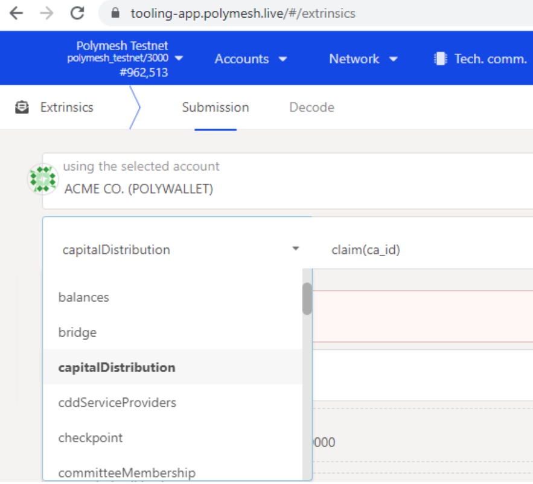

import HighlightBox from "../../src/components/HighlightBox"

It is common for issuers of regulated securities to delegate certain responsibilities to specialized service providers. For example, ACME may want that a specialist publishes documentation related to the security token.

In Polymesh, **external agents** and **agent groups** with granular permissions assist with representing the contractual relationships with these parties. The external agents module provides extrinsics to manage:

* The set of agents for an asset,
* The group agents belong to, and
* The permissions a group gives an agent.

By providing functions to allow for managing the external agents of an asset, adding and altering custom agent groups, and ensuring sufficient permissions of an agent for an extrinsic. The following dispatchable functions are available:

* `create_group`: Creates a custom agent group (CAG) with certain permissions for an asset;
* `set_group_permissions`: Changes the permissions of a CAG for an asset;
* `change_group`: Changes the agent group an asset belongs to; 
* `remove_agent`: Removes an agent from an asset;
* `abdicate`: Removes the caller as an agent from an asset.

The extrinsics of the external agents module can be split into:

* Managing groups: `create_group` and `set_group_permissions`, and
* Managing agents: `remove_agent`, `abdicate`, `change_group`, and hooks for the identity module to enable adding agents.

## Default configuration

If you have been following along by reading the previous chapters and sections, Alice issued a security token and then transferred ownership to ACME. Behind the scenes, Alice and then ACME were given full permission. In Polymesh version 1 (V1), **two distinct permission** were granted:

* **Primary issuance agent (PIA):** ACME needed this permission to perform the minting operation;
* **Corporate actions agent (CAA):** Needed for activities such as dividends.

<highlightBox type="tip">

For more information on the corporate actions agent and corporate actions in general, take another look at the previous chapter on [Executing Actions: Corporate actions on Polymesh](./actions/).

</highlightBox>

Version 2 (V2, the most current version at the time of writing) models the roles of PIA and CAA in a new, more granular permission system. By default, the asset creator and owner has _full_ permission. Thus, ACME has full permission over the ACME token by default.

The permission system is _not surfaced in the Token Studio_. It is explored and configured via the [Polymesh App](https://tooling-app.polymesh.live/) or the SDK. This helps reduce complexity at the Token Studio level.

<highlightBox type="info">

V1 functionality can be replicated in V2 by assigning an agent to the PolymeshV1CAA (corporate actions agent) and PolymeshV1PIA (primary issuance agent). In the [Polymesh App](https://tooling-app.polymesh.live/), navigate to `Developer` => `Extrinsics` then select `externalAgents` in the field _submit the following extrinsic_ and `changeGroup(ticker, agent, group)`.

</highlightBox>

## Permissions: Extrinsics, pallets, and groups

Agents are assigned to agent groups from which they derive their permissions for a given asset. As you might have guessed, **an agent group** _defines a set of permissions granted to members_. Each asset can have one or more agent groups. There is always at least one user with full permission as the system prevents the removal of the last user with full permission. Initially, the asset creator has full permission by default.

<highlightBox type="info">

The last full agent cannot leave the abdicate before another ID is added as an agent with full permissions. This default avoids an asset not having an agent with all permissions, i.e. not being managed because of missing permissions and agents.

</highlightBox>

In practice, ACME will grant minimal permission to external agents (or internal staff) so that agent can execute their duties while at the same time it cannot stray into sensitive areas where the agent should not be engaged.

For convenience, permissions can be defined as:

* Full: Everything;
* These: Only these;
* Except: Everything except these.

The system is hierarchical. The default full permission simply includes all pallets and all extrinsics. A documentation permission, for example, might be defined as:

* These: Only the asset pallet;
* These: Only the `addDocument` and `removeDocument` extrinsics.

ACME would then assign an account, the external agent, to such an agent group to allow the responsible agent to maintain the documentation related to an asset and nothing more.

## Explore

ACME was created with the default full permission agent group. We can see that in the Polymesh App under the `Developer` tab `Chain state`.

The `externalAgents` pallet query called `groupOfAgent(Ticker, IdentityId): Option<AgentGroup>` returns the agents mapped to a ticker.

Here we can see that ACME has one agent, the agent with full permission. The agent is the ACME Corp account. The previous field is the ticker symbol ("ACME") in hex.

The query can be further refined to filter agents in a specific agent group, meaning with a certain set of permissions.

## Create a permission group

Recall that **permissions are defined by including or excluding pallets and extrinsic**. Pallets encompass activities and extrinsics are discrete actions.

For example, the `capitalDistribution` pallet:

contains granular transaction types:

These can be granted or revoked in whole or in part using an agent group.

Let us suppose that we want to create an agent group for an external party that will maintain the corporate documents _and nothing else_.

1. Navigate to the `externalAgents` pallet and `createGroup(ticker, perms)` extrinsic.
2. Use the ACME Corp account, the owner of the asset, since that account will be the only account with permission to do this unless you have already experimented with permissions.
3. Input the ticker system. At the time of writing, this is in hex format, which you can get from the query above. It should be 12 bytes long with trailing zeroes.
4. Create the permissions defined as:
   * _these_: Asset (the pallet containing the extrinsics to grant);
   * _these_: `addDocument` and `removeDocument` - the two activities that will be permissible for members of this group.

Submit the transaction and the new agent group is created. Return to the Explore section (as described above) and check that the new agent group was added to the asset.

## Assign an account to an agent group

An agent group's permission can be discovered by navigating to `Chain state` under the `Developer` tab and then selecting `externalAgents` in the _selected state query_ field and `groupPermissions(Ticker, AGId): Option<ExtrinsicPermissions>`. To add an account to an agent group, navigate to `Extrinsics` under the `Developer` tab, and select `externalAgents` in the `submit the following extrinsic` field and `changeGroup(ticker, agent, group)`. Input the ticker, group, and agent ID.

There are several options for agent groups:

* **Full:** The account can be given full permission;
* **Custom:** Used to specify the agent group just created;
* **ExceptMeta:** Manages identities of external agents;
* **PolymeshV1CAA:** Used to replicate the permission scheme for a corporate actions agent (CAA) in Polymesh's version 1 (V1);
* **PolymeshV1PIA:** Used to replicate the permission scheme for a primary issuance agent (PIA) in Polymesh version 1 (V1).

If you have been following along and created an agent group for the asset's documentation, then select `Custom` and set the `Custom: AGId` to 1. For example, let Alice, or someone else, maintain the asset's documentation.

## Accept permission and abdication

As with other aspects of the system, Polymesh recognizes that an agent may not accept the responsibilities that come with being assigned to an agent group. It is therefore a **two-stage process**. An agent accepts membership by navigating to `Extrinsics` under the `Developer` tab, and selecting `externalAgents` and `acceptBecomeAgent(auth_id)`.

An agent may also self-demote (i.e. leave the agent group) by navigating to `Extrinsics` under the `Developer` tab, and select `externalAgents` and `abdicate(ticker)`. Abdicating is not unconditional. The last member with full permission is not permitted to abdicate.

## Summary

Polymesh offers granular permission at the transaction type and user level. These facilitate the creation of strictly enforced rules that directly map contractual relationships between the asset owner and its business partners.

There is always at least one account with full permission and the system does not permit the removal of the last account with full permission. This helps prevent situations in which the owner could inadvertently lock themselves out of the permission management.

Agent groups are used to describe functional requirements and access privileges and assign users to agent groups.

When a user creates an asset with the Token Studio, that user automatically receives full permission. This condition holds when ownership is transferred.

The full granularity of the permission system is not exposed through the Token Studio. Use the Polymesh App and/or the SDK to configure agent groups, permissions, and members.

The V1 agent types, primary issuance agent (PIA) and corporate actions agent (CAA), are replicated as built-in agent groups.
