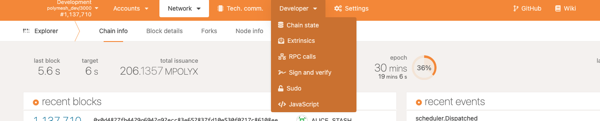
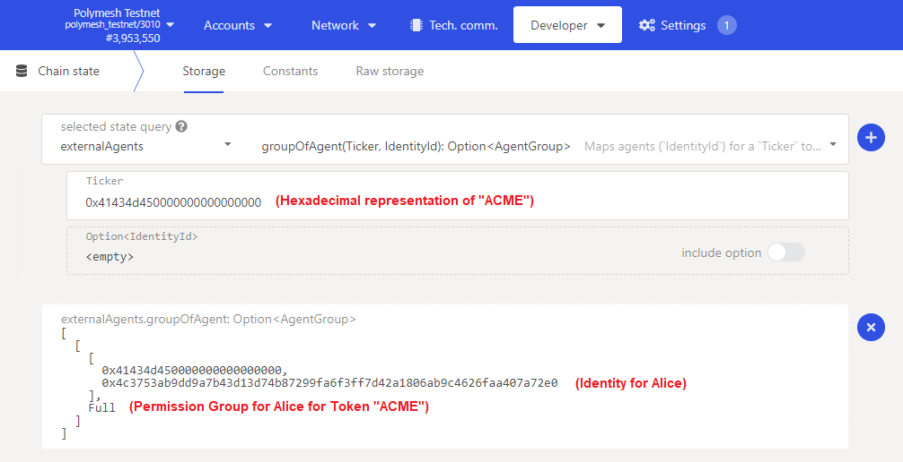
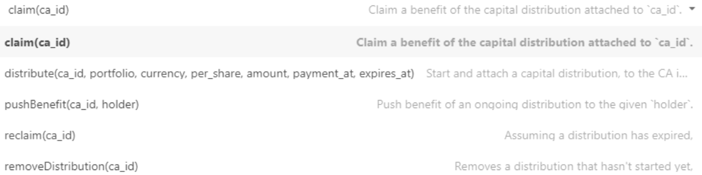
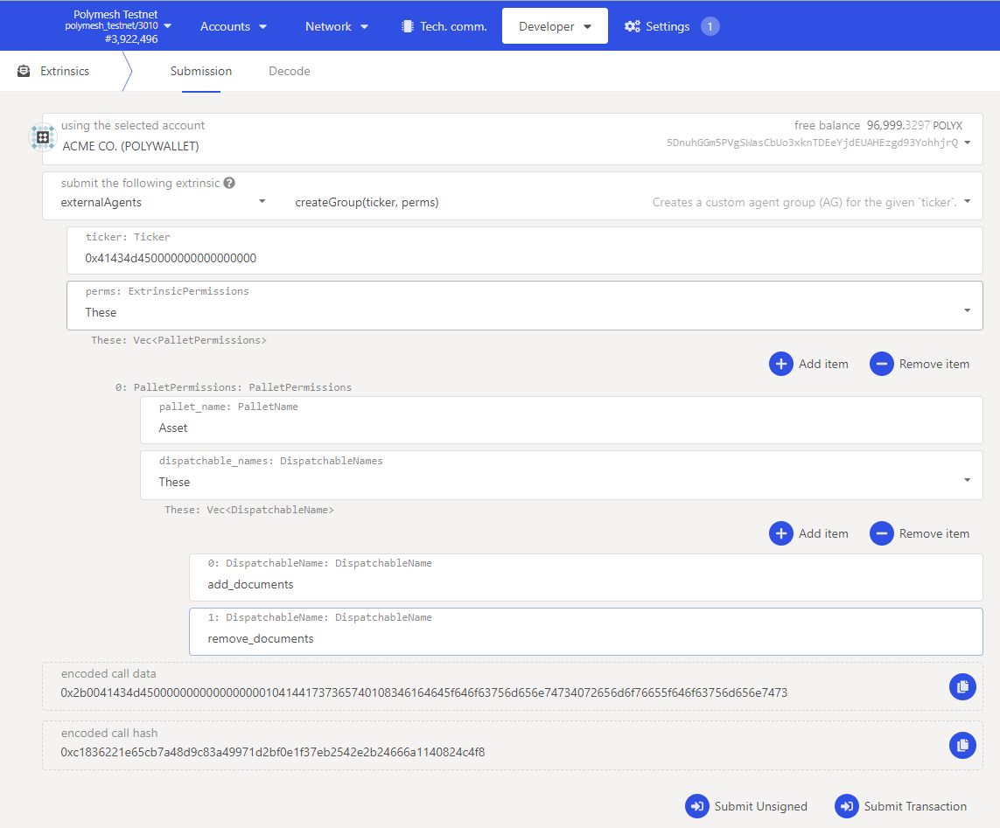
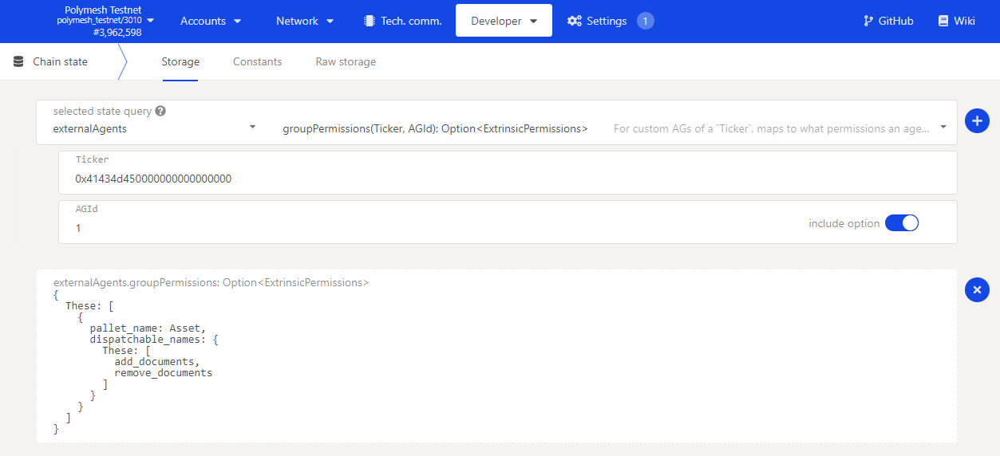
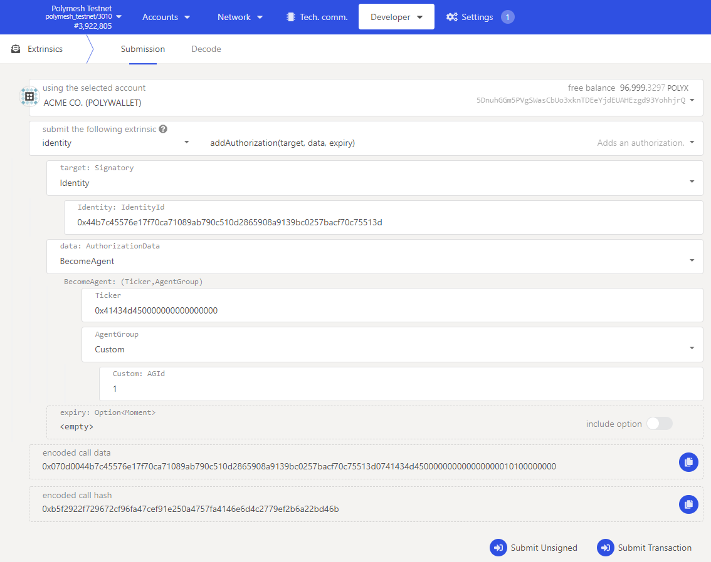
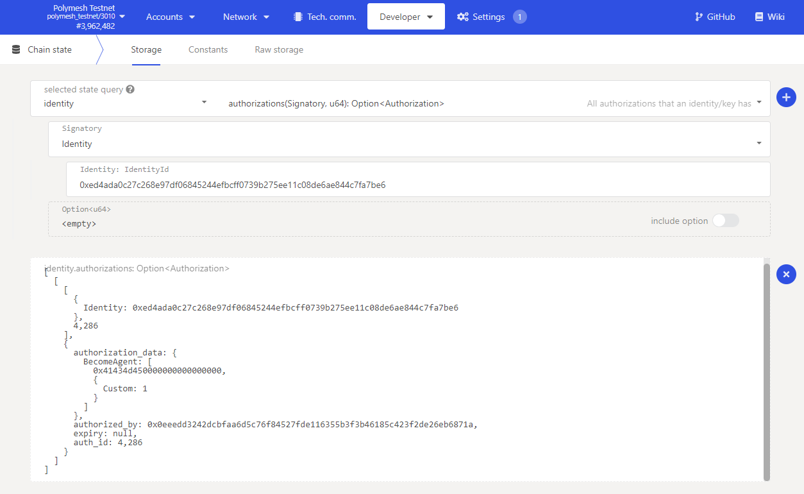

import HighlightBox from "../../src/components/HighlightBox"

It is common for issuers of regulated securities to delegate certain responsibilities to specialized service providers. For example, ACME may want that a specialist publishes documentation related to the security token.

In Polymesh, **external agents** and **agent groups**, with granular permissions, assist with representing the contractual relationships with these parties. The external agents module provides extrinsics to manage:

* The set of agents for an asset,
* The group agents belong to, and
* The permissions a group gives an agent.

By providing functions to allow for managing the external agents of an asset, adding and altering custom agent groups, and ensuring sufficient permissions of an agent for an extrinsic. The following dispatchable functions are available:

* `create_group`: Creates a custom agent group (CAG) with certain permissions for an asset;
* `set_group_permissions`: Changes the permissions of a CAG for an asset;
* `change_group`: Changes the agent group an asset belongs to;
* `remove_agent`: Removes an agent from an asset;
* `acceptBecomeAgent`: Accept an authorization to become an agent of the account that issued `auth_id` and to also become an agent of the ticker the account specified.
* `abdicate`: Removes the caller as an agent from an asset.

The extrinsics of the external agents module can be split into:

* Managing groups: `create_group` and `set_group_permissions`, and
* Managing agents: `remove_agent`, `abdicate`, `change_group` and `acceptBecomeAgent`, and hooks for the identity module to enable adding agents.

## Default configuration

If you have been following along by reading the previous chapters and sections, Alice issued a security token and then transferred ownership to ACME. Behind the scenes, Alice and then ACME were given **Full** permission. In Polymesh version 1 (V1), **two distinct permissions** were granted:

* **Primary issuance agent (PIA):** ACME needed this permission to perform the minting operation;
* **Corporate actions agent (CAA):** Needed for activities such as dividend distributions.

<HighlightBox type="tip">

For more information on the corporate actions agent and corporate actions in general, take another look at the previous chapter on [Executing Actions: Corporate actions on Polymesh](../actions/).

</HighlightBox>

Version 2 (V2, the most current version at the time of writing) models the roles of PIA and CAA in a new, more granular permission system. By default, the asset creator and owner has _Full_ permission. Thus, ACME has full permission over the ACME token by default.

The permission system is _not surfaced in the Token Studio_. It is explored and configured via the [Polymesh App](https://mainnet-app.polymesh.network/) or the SDK. This helps reduce complexity at the Token Studio level.

<HighlightBox type="info">

V1 functionality can be replicated in V2 by assigning an agent to the PolymeshV1CAA (corporate actions agent) group or PolymeshV1PIA (primary issuance agent) group. In the [Polymesh App](https://mainnet-app.polymesh.network/), navigate to `Developer` => `Extrinsics` then select `externalAgents`. Use the extrinsic `changeGroup(ticker, agent, group)` to set the desired group for an existing agent.

</HighlightBox>

## Permissions: Extrinsics, pallets, and groups

Agents are assigned to agent groups from which they derive their permissions for a given asset. As you might have guessed, **an agent group** _defines a set of permissions granted to members_. Each asset can have one or more agent groups but each agent can only be assigned to a single group for that asset. There is always at least one user with full permission as the system prevents the removal of the last user with full permission. Initially, the asset creator has full permission by default.

<HighlightBox type="info">

The last full agent cannot leave or abdicate before another ID is added as an agent with full permissions. This default avoids an asset not having an agent with all permissions, i.e. not being managed because of missing permissions and agents.

</HighlightBox>

In practice, ACME will grant minimal permission to external agents (or internal staff) so that agents can execute their duties while at the same time it cannot stray into sensitive areas where the agent should not be engaged.

For convenience, permissions can be defined as:

* Full: Everything;
* These: Only these;
* Except: Everything except these.

The system is hierarchical. The default full permission simply includes all pallets and all extrinsics. A documentation permission, for example, might be defined as:

* These: Only the `Asset` pallet;
* These: Only the `add_document` and `remove_document` extrinsics.

ACME would then assign an account, the external agent, to such an agent group to allow the responsible agent to maintain the documentation related to an asset and nothing more.

## Explore

ACME was created with the default full permission agent group. We can see that in the Polymesh App under the `Developer` tab `Chain state`.

The `externalAgents` pallet query called `groupOfAgent(Ticker, IdentityId): Option<AgentGroup>` returns the agents mapped to a ticker.

Here we can see that ACME has one agent, the agent with full permission. The agent is the ACME Corp account. The ticker input field for the call is the symbol "ACME" in hexadecimal (0x41434d450000000000000000).

The query can optionally be further refined to filter specific agent identities and return only the group they are associated with, meaning with a certain set of permissions.

## Create a permission group

Recall that **permissions are defined by including or excluding pallets and extrinsic**. Pallets encompass activities and extrinsics are discrete actions.

For example, the `capitalDistribution` pallet contains granular transaction types:

These can be granted or revoked in whole or in part using an agent group. A conveniently formatted list of all available pallets and extrinsics, along with descriptions, can found in the [Subscan Polymesh blockchain explorer](https://polymesh.subscan.io/runtime/) or retrieved directly from the chain using the Polymesh App under the `Developer` tab `RPC calls` using the `state`, `getMetadata` method.

Let us suppose that we want to create an agent group for an external party that will maintain the corporate documents _and nothing else_.

1. Navigate to the `externalAgents` pallet and `createGroup(ticker, perms)` extrinsic.
2. Use the ACME Corp account, the owner of the asset, since that account will be the only account with permission to do this unless you have already experimented with permissions.
3. Input the ticker symbol. At the time of writing, this is required to be in hexadecimal format, which you can get from the query above. It should be 12 bytes long with trailing zeroes.
4. Create the permissions defined as:
   * _ExtrinsicPermission_: These - to indicate we will define pallets to configure permissions for;
   * _PalletName_: `Asset` - the pallet containing the extrinsics to define permissions for. The pallet name must be written in UpperCamelCase;
   * _DispatchableNames_: These - to indicate we will define permissions for specific actions;
   * _DispatchableName_: `add_documents` and `remove_documents` - the two activities that will be permissible for members of this group. The dispatchable name must be written in snake_case.

Submit the transaction and the new agent group is created. 

Review the `GroupCreated` event in a the blockchain explorer for the submitted transaction to identify the assigned group ID or navigate to `Chain state` under the `Developer` tab and then select `externalAgents` and use the `aGIdSequence` call to identify the most recently created agent group ID. Configured permissions for the group ID can be viewed using the `groupPermissions` call.

## Assign an account to an agent group

Once a custom agent group has been defined lets say we now want Alice, or someone else, to maintain the asset's documentation. Before we do this we need to assign the custom group to the external agent to allow them access to the token extrinsics configured in the `groupPermissions`. As with other authorizations this is done using the `identity` pallet `addAuthorization` extrinsic.

1. Navigate to the `identity` pallet and `addAuthorization(target, data, expiry)` extrinsic.
2. Use the ACME Corp account, the owner of the asset, since that account will be the only account with permission to do this unless you have already experimented with permissions.
3. Input the DID for the external agent (dding authorization for an external agent only accepts an identity and not an account).
4. Under data: `AuthorizationData` select `BecomeAgent`
5. Input the ticker symbol as previously used (in hexadecimal format, 12 bytes long with trailing zeroes if required).
6. Finally select `Custom` for the agent group and enter the number for the group ID previously created. If you have been following along and created an agent group for the asset's documentation as the first custom permission group for your token set the Custom: AGId to 1. For example, let Alice, or someone else, maintain the asset's documentation.
   
Submit the transaction and the authorization request is created.

In addition to the **Custom** agent group, just created, there are several predefined agent groups:

* **Full:** The account can be given full permission;
* **ExceptMeta:** Everything except the external agents pallet;
* **PolymeshV1CAA:** Used to replicate the permission scheme for a corporate actions agent (CAA) in Polymesh's version 1 (V1);
* **PolymeshV1PIA:** Used to replicate the permission scheme for a primary issuance agent (PIA) in Polymesh version 1 (V1).

## Accept permission and abdication

As with other aspects of the system, Polymesh recognizes that an agent may not accept the responsibilities that come with being assigned to an agent group. It is therefore a **two-stage process**. 

Before an agent accepts membership of the permission group for the token, they must first determine the authorization ID they wish to accept and should review the details of the request. The authorization ID can be found in the event outputs of the transaction used to create the authorization using a blockchain explorer. Alternatively the agent can view a list of pending authorizations for their identity by navigating to the `Developer` tab, `Chain state` in the Polymesh App. Select the `identity` pallet, `authorizations` call and inputting their identity ID.

The permissions associated with the shown Custom group ID can be viewed using the externalAgents `groupPermissions` call, previously described. An agent accepts membership by navigating to `Extrinsics` under the `Developer` tab, and selecting `externalAgents` and `acceptBecomeAgent(auth_id)` and inputting the previously identified authorization ID. Should the agent not want to accept the authorization they can reject it using the `removeAuthorization` extrinsic from the identity pallet.

**Note: When accepting to become an agent, your acceptance is not tied to the specific permission group at the time of acceptance.  Permissions may be altered, by the token owner or external agent with permissions for the externalAgents pallet, without the need to subsequently reconfirm acceptance.** 

An agent may also self-demote (i.e. leave the agent group) by navigating to `Extrinsics` under the `Developer` tab, and select `externalAgents` and `abdicate(ticker)`. Abdicating is not unconditional. The last member with full permission is not permitted to abdicate.

## Summary

Polymesh offers granular permission at the transaction type and user level. These facilitate the creation of strictly enforced rules that directly map contractual relationships between the asset owner and its business partners.

There is always at least one account with full permission and the system does not permit the removal of the last account with full permission. This helps prevent situations in which the owner could inadvertently lock themselves out of the permission management.

Agent groups are used to describe functional requirements and access privileges and assign users to agent groups.

When a user creates an asset with the Token Studio, that user automatically receives full permission.

<HighlightBox type="info">

Permissions hold when token ownership is transferred. In order to transfer ownership of a token to a new identity they need to first be made an agent of that token. Previous owner permissions are **not** automatically removed. Therefore, managing external agent permission is a key part of the ownership transfer process.

</HighlightBox>

The full granularity of the permission system is not exposed through the Token Studio. Use the Polymesh App and/or the SDK to configure agent groups, permissions, and members.

The V1 agent types, primary issuance agent (PIA) and corporate actions agent (CAA), are replicated as built-in agent groups.
