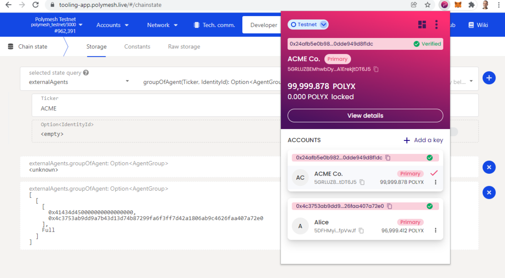
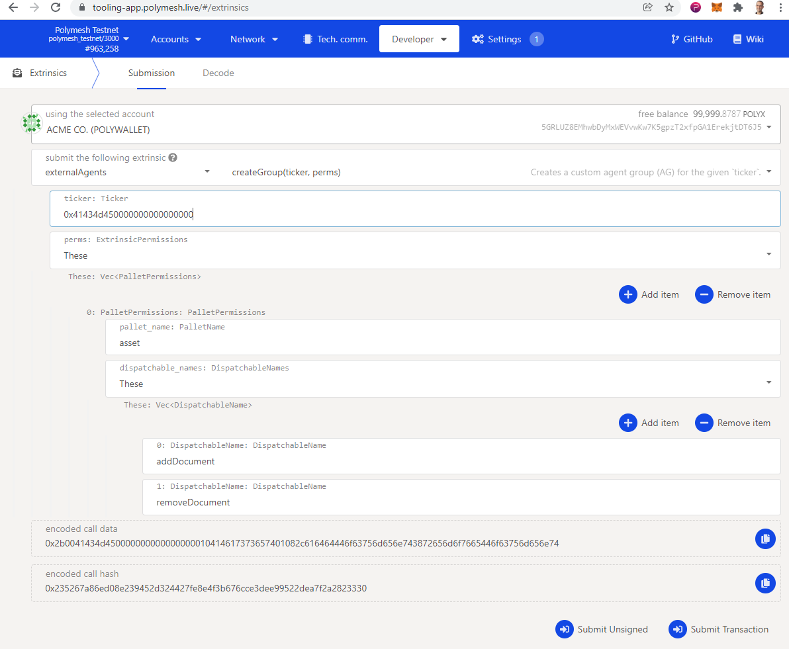
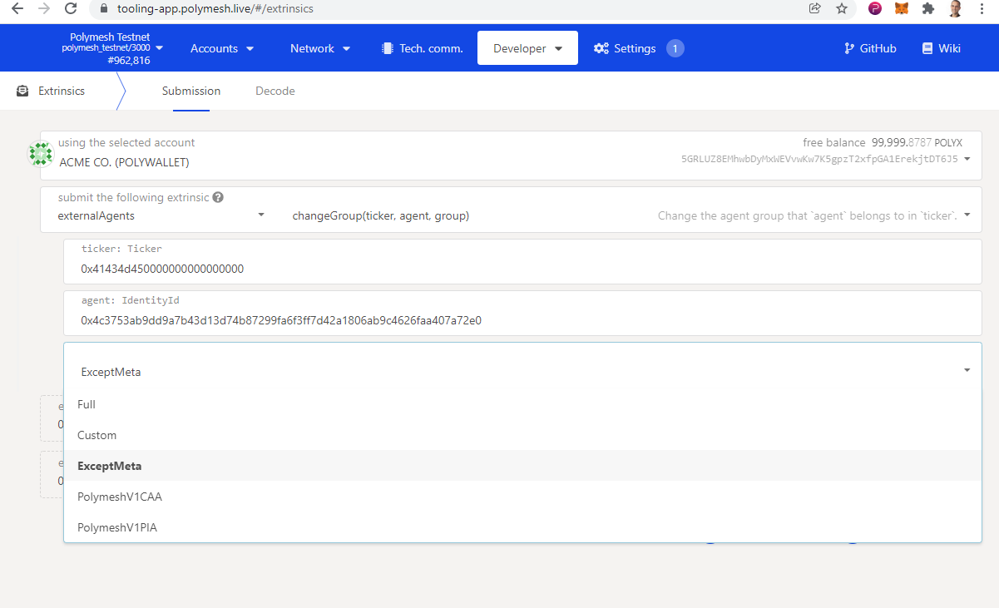

import HighlightBox from "../../src/components/HighlightBox"

# External Agents

It is commonplace for issuers of regulated securities to delegate certain responsibilities to specialized service providers. For example, ACME may wish for a specialist to publish documentation related to the security token. 

In Polymesh, _External Agents_ and Agent Groups with granular permissions represent the contractual relationships with these parties. 

## Default Configuration

If you have been following along, Alice issued a security token and then transferred ownership to ACME. Behind the scenes, Alice and then ACME were given full permission. In version 1 of Polymesh, two distinct permission were granted:

Primary Issuance Agent: ACME needed this permission to perform the minting operation. 
Corporate Actions Agent: Needed for activities such as dividends (see Corporate Actions). 

Version 2 (current, at time of writing) models those roles in the new, more granular permission system. By default, the asset creator and owner has _full_ permission. ACME has full permission over the ACME token at this time. 

<highlightBox type=”info”>
V1 functionality can be replicated in V2 by assigning an agent to the PolymeshV1CAA (corporate actions agent) and PolymeshV1PIA (primary issuance agent). In the App Portal, navigate to extrinsics => externalAgents => changeGroup().
</highlightBox>

The permission system is _not surfaced in the Token Studio_. It is explored and configured via the App Portal or the SDK. This helps reduce complexity at the Token Studio level. 

## Permissions: Extrinsics, Pallets and Groups

Agents are assigned to Agent Groups from which they derive their permissions for a given token. As you might guess, an Agent Group defines a set of permissions granted to members. Each token can have one or more Agent Groups. There is always at least one user with full permission and the system will prevent the removal of the last user with full permission. Initially, the token creator has full permission. 

In practice, ACME will grant minimal permission to External Agents (or internal staff) such that they can execute their duties and cannot stray into sensitive areas where they should not be engaged. 

For convenience, permissions can be defined as:

* Full: everything
* These: only these
* Except: everything except these

The system is hierarchical. For example, the default full permission is simply all pallets and all extrinsics. A documentation permission might be defined as:

* These: only the Asset pallet
* These: only the addDocument and removeDocument extrinsics

ACME would then assign an account, the Agent, to such an Agent Group so that the responsible Agent would be able to maintain the documentation about the asset and nothing more. 

## Explore

ACME was created with the default full permission Agent Group. We can see that through the Chain State in the App Portal. The externalAgents pallet query called groupOfAgent() returns the Agents mapped to a Ticker. Here we see that ACME has one Agent, the Agent with full permission. It is the ACME Co. account. The previous field is the ticker symbol (“ACME”) in hex. 

The query can be further refined to filter Agents in a specific Agent Group, meaning with a certain set of permissions. 

## Create a Permission Group

Recall that permissions are defined by including or excluding pallets and extrinsic. Pallets encompass activities, generally and extrinsics are discrete actions. 

For example, the capitalDistribution pallet:

contains granular transaction types:

These can be granted or revoked in whole or in part using an Agent Group. 

Let us suppose that we want to create an Agent Group for an external party that will maintain the corporate documents _and nothing else_. 

1. Navigate to the _externalAgents_ pallet and _createGroup()_ extrinsic. 
2. Use the ACME Co. account, the owner of the token, since that account will be the only account with permission to do this unless you have already experimented with permissions. 
3. Input the ticker system. At the time of writing, this is in hex format which you can get from the query above. It should be 12 bytes long with trailing zeroes. 
4. Create the permissions defined as:
   * _these_: asset (the pallet containing the extrinsics to grant). 
   * _these_: addDocument and removeDocument (the two activities that will be permissible for members of this group. 

Submit the transaction and the new Agent Group is created. Return to Explore (above) and see that a new Agent Group is added to the token. 

## Assign an Account to an Agent Group

An Agent Group’s permissions can be discovered through Chain state => externalAgents => groupPermissions. To add an account to an Agent Group, navigate to Extrinsics => externalAgents => changeGroup. Input the ticker, group and Agent id. 

There are several options for Agent Group. 

* Full: The account can be given full permission. 
* Custom: Use this to specify the Agent Group you just created. 
* ExceptMeta: Manages identities of external agents themselves.
* PolymeshV1CAA: Use this to replicate the permission scheme for a Corporate Actions Agent in Polymesh version 1. 
* PolymeshV1PIA: Use this to replicate the permission scheme for a Primary Issuance Agent in Polymesh version 1. 

If you have been following along and created an Agent Group for documentation, then select Custom and AGId 1. For example, let Alice (or someone else) maintain documentation. 

## Accept Permission and Abdication

As with other aspects of the system, Polymesh recognizes that an Agent may not accept the responsibilities that accompany assignment to an Agent Group. It is therefore a two-stage process. An Agent accepts membership using Extrinsics => externalAgents => acceptBecomeAgent(). 

An Agent may also self-demote, meaning leave the Agent Group using Extrinsics => externalAgents => abdicate(). This is not unconditional. The last member with full permission is not permitted to abdicate. 

## Summary

Polymesh offers granular permission at the transaction type and user level. These facilitate the creation of strictly enforced rules that map directly to contractual relationships between the token owner and business partners. 

There is always at least one account with full permission and the system does not permit the removal of the last account with full permission. This helps prevent situations in which the owner could inadvertently lock themselves of permission management. 

Use Agent Groups to describe functional requirements and access privileges and assign users to Agent Groups. 

When a user creates a token through the Token Studio, that user automatically receives full permission. This condition holds when ownership is transferred. 

The full granularity of the permission system is not exposed through the Token Studio. Use the App Portal and/or the SDK to configure Agent Groups, permissions and members. 

The V1 agent types, Primary Issuance Agent and Corporate Actions Agent are replicated as built-in Agent Groups.
