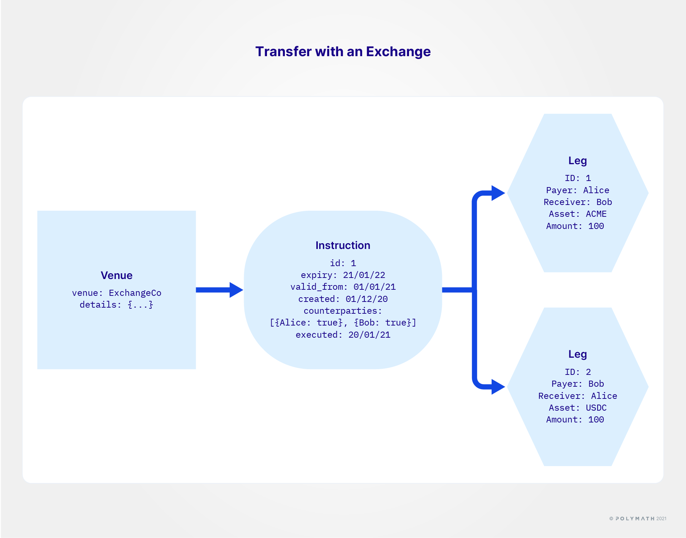

import HighlightBox from "../../src/components/HighlightBox"

**Settlement** is where _an action that was agreed beforehand is effectively acted upon_. It is a term often found in finance. In the case of Polymesh, the prior agreement is that of **an exchange or transfer of securities between accounts**. A settlement in Polymesh represents the contractual obligation to which the involved parties have agreed. Regulatory requirements and compliance are both important aspects of modern settlements.

When looking at current settlement processes, for example in case of post-trade security clearings, one can notice:

* a large number of entities is involved,
* feasible transaction time has its limits, especially in case of cross-border payments,
* transaction time and the speed of trade don't coincide,
* the number of intermediaries is quite high - each intermediary involved can make a process more expensive, and
* many regulatory requirements apply, which keep evolving.

As you can guess, there is **potential for efficiency and cost-saving**.

## Deconstructing settlements

Let's introduce some important Polymesh terminology that we will use throughout:

* a **leg** is the _smallest action of a settlement_. This could be one transfer of securities from Alice to Bob or the recognition of an off-chain payment. Creating legs doesn't execute them immediately, but they describe what is meant to happen after compliance and other concerns are satisfied. Legs cannot exist by themselves. One or more legs of a settlement need to be part of:
* an **instruction**, which _aggregates related legs to create an indivisible action_, an atomic transaction in computer parlance. This means that when an instruction is executed, all its legs are executed concurrently. There is no situation where only some of an instruction's legs have executed. This also means that a single unconfirmed leg can hold up the whole instruction's execution. Additionally, an instruction cannot exist by itself. Instructions are created and executed when _housed_ in:
* a **venue**, which is _a logical object meant for the purpose of collecting instructions_. It is also associated with certain access rights such as who can add an instruction to it.

Let's review these terms separately and in greater detail.

### Legs

> Alice sends 100 ACME shares from her _trading_ portfolio to Bob's default portfolio.

This is a **valid leg description**. It should be evident that Alice's **approval is necessary** here for the action to eventually take place - We are talking about _her_ shares here. It is also necessary for Bob's approval to be collected as, despite Alice's generosity, receiving securities has tax implications that he may not want to shoulder.

> Bob sent 10 USD off-chain to Alice with reference `0x123bff`.

This is another valid leg description, called a **signed receipt**. Here again the **approval of both parties is required**, Bob may not want to give the impression that he has sent 10 USD off-chain, or 10 million, or that it was required of him. Alice may not want to let it be known that she has received cash, as she may be asked to return something she never received in the first place.

### Affirmations

We just saw that, depending on the situation, legs require approvals from relevant accounts. These approvals are called **affirmations**. At the risk of repeating, it is a relevant account that affirms a leg. **Affirming a leg** is, in effect, _placing a signature that is valid for the account concerned_. So a key associated with an account indicates agreement by signing an affirmation for a leg. **For a given leg to be affirmed, it needs to have received the required affirmations from all relevant accounts.**

And yes, a **secondary key**, or a custodian (see below) entrusted with sufficient rights, can affirm on behalf of a relevant account.

When the account owning an asset has affirmed a leg, then the asset's relevant quantity is _committed_. This commitment prevents double-booking in another instruction's leg, by mistake or malice. Failing to do so would eventually cause one of the two competing instructions to fail much later, at execution.

If a leg mentions a signed receipt for an off-chain action, this signed receipt is committed too.

For the avoidance of doubt, a party can reject a leg, thereby cancelling the whole instruction, and releasing all previously committed assets and signed receipts. A party can also _not_ affirm a leg, i.e. play for time, which would leave the instruction in limbo until some other resolution, like a cancellation or the instruction's expiry date being reached.

### Instructions - Multiparty transactions

Sending shares to Bob or sending USD to Alice in isolation, as a gift for instance, is all well and good, but, in our world, the overwhelming majority of securities transactions are **trades**. For instance, imagine:

* **Leg 1:** Alice sends 100 of her ACME shares to Bob on the condition that she receives 10 USD in exchange;
* **Leg 2:** Bob sends 10 USD to Alice on the condition that he receives 100 ACME shares.

Explicit in this trade is that the two legs should happen in concert or none should happen at all. In computer jargon, this is called an **atomic operation**, a.k.a. a **transaction**. Because the word _transaction_ is already used in Polymesh to describe _the serialised bits of information added to the blockchain_ - itself an atomic operation - such an atomic securities trade is called an **instruction**.

An instruction cannot be created without legs, and legs cannot be created outside of instructions. Also, after it has been created, an instruction cannot be modified. It should be obvious once you imagine what would happen if the first party could modify the second leg after the second party has already affirmed the first leg.

### Asset issuer requirements

In Polymesh, nothing material happens until the compliance rules have been met. This is true of instructions. So, in our two-legged instruction example, the KYC attestations attached to Alice's and Bob's accounts should comply with ACME's sending and receiving rules, respectively. The instruction will remain in a pending state until ACME's compliance rules are satisfied.

For the avoidance of doubt, an instruction may be affirmed by all parties and still be in a pending state while the KYC requirements remain unresolved. The reason for durability of the instruction is that it represents contractual committments. The compliance of parties is fluid and changeable. Failing to comply is merely a temporary setback. It can usually be resolved by addressing KYC requirements. Parties are compelled to resolve compliance issues by the contractual obligation represented by the instruction.

As a matter of detail, when an instruction has been fully affirmed but is still pending because of compliance, and it is finally possible for it to execute because the last compliance requirement has been satisfied, the instruction does not automagically execute. It still needs an account to explicitly send a transaction to execute it. Naturally, if an instruction is asked to be executed and it still fails because of compliance, then the instruction is not cancelled. It remains in a pending state.

As expected, it is also possible to cancel the whole instruction while compliance is pending.

Additionally, the securities token issuer can also restrict which accounts are allowed to create instructions transferring _their_ token. Although it is expected that this facility will seldom be used.

### Atomic execution

Instructions execute completely, or not at all - in technical parlance, "atomic". For example, the above-mentioned instruction has two legs to send shares from Alice to Bob and funds from Bob to Alice. Alice and Bob both need to affirm that the entire instruction is agreeable and properly represents their contractual agreement. Instructions contain other details such as when to actually execute, e.g. as soon as it's affirmed or at a scheduled point of time in the future. Alice and Bob's affirmations indicate their agreement with all such details.

The **actual execution** is atomic, meaning that the instructions are always **either completely executed or not executed at all**. There is no case in which one leg of an instruction has executed and the other has not.

With our example, after the instruction has executed:

* Alice has 100 fewer shares of ACME, and 10 more USD;
* Bob has 100 more shares of ACME, and 10 fewer USD.

And if the instruction had a signed receipt for an off-chain action, that receipt would be permanently marked as _used_.

### Custody

Having to keep track and affirm instructions that are relevant to you can be a tedious business. It also doesn't map well with today's world of securities. Today, securities holders, or beneficiaries, are typically represented by other parties that broadly act in the beneficiaries' interest with some guidance. These other parties are called **custodians**. You may know them as brokers too.

Polymesh provides a way to **mirror this off-chain world** with the use of **custody on-chain**. In this setup, a beneficiary account can designate another account as their custodian in one or more of their portfolios. After the custodian account accepts the responsibility, they can act on behalf of the beneficiary for matters related to settlement.

Assumed in the foregoing is that the beneficiary and the custodian entered into a legally binding contract, whose Polymesh custodial relationship is just the on-chain expression of it.

Belabouring the point, a custodian doesn't own the securities on-chain, the beneficiary still does, and **a custodial relationship can be revoked only by the custodian**.

It is therefore incumbent on the beneficiary to partition their portfolios and assets, and designate their custodian(s), so as to reflect the desired mix of responsibilities.

<HighlightBox type="info">

We will look more closely at custodians at the end of this section.

</HighlightBox>

### Venue

Finally, an instruction is not created in a void, but instead it is **created inside a venue**. Ultimately, an account is responsible for its own venues, for access rights, and for who can create, cancel, and remove instructions within them. Once an instruction has been created inside a venue, it cannot be moved to another.

An advantage of this setup is that the account owning the venue **lends its reputation to the instructions** that are published in it. A concrete example might be a securities exchange platform, let's name it NextDaq. It publishes matched trades on its _trade settlement_ venue. All brokers who have open positions with NextDaq can expect instructions relevant to themselves or their customers. What does a broker do when they see an instruction mentioning a customer of theirs sending funds or shares to an unknown account? Well, since it appeared in NextDaq's settlement venue, they assume that it is a valid matched trade and that the unknown recipient is the counterpart of the trade. As long as the broker can see that the price is right, according to their own records, they can reasonably proceed with the affirmations.

In fact, **the venue creator can also restrict the list of accounts allowed to affirm instructions** in its venue. You could for instance imagine that NextDaq would only allow known custodians from affirming instructions.

### Synopsis

An instruction is the vehicle for a settlement on Polymesh. It has many moving parts, all of which have to align for the instruction to be executed. Namely, the securities holders, their potential custodians, the asset issuer's requirements, as well as the venue and its creator.

## Lateral concerns

### Pre-authorisation

Putting signature to an instruction is not the only way to affirm it. There is another construct, that of **pre-authorisation**. In effect, _a signature that validates one, and only one, future instruction_. Not unlike a blank cheque.

So if Bob signed a pre-authorisation, Alice can include it when creating the instruction. The pre-authorisation will be committed before execution, and marked as consumed when the instruction executes.

This could also be used by an exchange, which would collect pre-authorisations from the brokers that list on it. A new instruction would therefore be authorised as soon as it is created, potentially leading to instant settlement.

### Netting process

Our trade example between Alice and Bob was simple, two legs and two parties. Now, we can imagine a busy exchange platform agreeing with its brokers that it will emit fewer instructions, which in effect batch trades, or express the net effect of a collection of trades that took place.

For instance, instead of three instructions that would see:

* Alice selling 100 ACME to Bob for 10 USD;
* Bob selling 40 ACME to Carol for 5 USD;
* Alice selling 20 ACME to Carol for 2 USD.

There could be a single instruction with four legs that would see:

* Alice sending 60 ACME to Bob;
* Alice sending 60 ACME to Carol;
* Bob sending 5 USD to Alice;
* Carol sending 7 USD to Alice.

In both situations, the net effect is that:

* Alice has 120 fewer ACME and 12 more USD;
* Bob has 60 more ACME and 5 fewer USD;
* Carol has 60 more ACME and 7 fewer USD.

So there is reason to believe that all three parties, or their respective custodians, would be agreeable to the single larger instruction. The instruction is still atomic so it would not be possible for Alice to send her shares without full compensation, for instance. A potential downside is that with more parties whose affirmations, and proper attestations, are required, there is a higher chance of a hold-up. Which is why an exchange would be expected to do this only with parties with higher trust or pre-authorisations.

### Chain of responsibility

A settlement is interesting for the parties who directly benefit from it, like Alice and Bob in our trading example. However, they are not the only parties that wish to see settlements unfold without problems.

To reflect the realities of capital markets and leverage Decentralised Finance (DeFi) models, Polymesh integrates multiparty transactions and provides a network that can include third parties such as exchanges and custodians, as seen earlier.

Let's take a closer look at these two stakeholders and how Polymesh integrates their roles.

#### Seen from exchanges

An **exchange** _matches parties for a trade to which they agreed in principle_. When the exchange has a match, the parties are legally bound to complete the trade, i.e. settle it. If a trading party fails to complete the trade, the reputational risk would jump back at the exchange, raising questions about the honesty of its traders. So exchanges have a **vested interest** in making sure that **all their matched trades settle**.

To achieve this, they monitor their participants' reputation, and they make sure to collect adequate information before creating a fully-descriptive instruction.

#### Seen from custodians

**Custodians** can represent a security beneficiary, for instance on an exchange. They may represent more than one beneficiary on an exchange too, and, from the point of view of an exchange, the _trader_ is the custodian. So the exchange is in effect keeping track of the custodians' reputations. In turn, when it comes to a given settlement, a custodian cannot override a beneficiary's failing compliance. This is a reputational risk for custodians. Therefore, custodians are compelled to monitor the compliance of their customers before they represent them on an exchange.

Also, given sufficient liquidity, a given custodian can act as an exchange between parties when it is possible to create such matches. In this case, as well, custodians have a vested interest in ensuring that settlement instructions complete.

### On custodians and portfolios

Linked to the inclusion of custody providers are the way assets are held on Polymesh, and how portfolios are conceptualised and implemented. How is that?

All assets on Polymesh are held at the **account level**. This helps enforce compliance in real time. At the same time, it allows to **organise assets under accounts**, and **assign key permissions and custody**. Another value added for entities opting for Polymesh, because an account can represent a whole organisation, which then can allow its employees access to the account based on operative requirements, or an account can represent a single person and provide for individual access.

Very important in this regard is the **portfolio** concept in Polymesh. One can _partition assets into logical portfolios_ within a single account. With this way of partitioning, assets across portfolios can have different balances while being connected to the same account. Asset partitioning into logical portfolios **facilitates good asset management**.

Portfolios are especially interesting when it comes to custody. Any assets in a portfolio can be assigned to a custodian, who then manages them exclusively. Each portfolio can **only** be assigned to a single custodian at the same time. And any new assets transferred into a portfolio managed by a custodian are also included in the custody.

When a user **assigns custodianship** to a portfolio, the _custodial control is transferred to a different identity_. This form of permission **separates beneficial ownership from custodial control**.

What is the difference between both?

**Beneficial ownership** means the _control over an asset or legal entity_. Following the United States of America _Securities Exchange Act_ (1934), beneficial ownership, when it comes to securities, is understood as any person holding voting or investment power. Translating into Polymesh, beneficial ownership is **always** held by the beneficiaries account and is the base criteria to participate in corporate actions.

**Custodial control** gives another entity, i.e. account, _the right to manage assets on behalf of the beneficiary_. This is where custody service providers come into play on Polymesh.

Performing actions for the beneficiaries, i.e. token holders, is possible for the custodian through **authorisations**. If another user is involved in an action, an _invitation to action_ becomes necessary. **The authorisation system remains on-chain at all times.**

Custodians with access to a portfolio are able to affirm instructions referencing the portfolio and given on behalf of the beneficial owner, token holder. Thus, beneficial ownership records are maintained consistently and ownership remains in the hands of the token holder, while allowing custodial control.

Why are authorisations necessary when dealing with custody services?

First, it ensures that custodians act in the beneficials interest. **On-chain authorisations** make everything transparent and provide on-chain tracking of authorisations. In addition, human errors are reduced by this process, i.e. a typo cannot pass unnoticed and result in an unintended consequence. Last but not least, it makes _dumps of toxicity_ less possible, thus improving regulatory compliance.

Custody management is simplified on Polymesh. For example, a custodian doesn't need to generate one key for every single client. Accounts use keys internally while keys/accounts are used externally for custody. Custody can be understood as **a form of proprietary key management**. This gives the setup  flexibility, due to which a custodian can maintain their key management concept and process structure when migrating to the network.

Then, what services can a custodian perform on-chain?

Once assigned, a custodian is able to:

* affirm or reject instructions regarding custodial assets on behalf of the beneficial asset holder, and
* revoke the custodianship over a portfolio.

A custodian can settle instructions only, but has full-autonomy to affirm these.

<HighlightBox type="tip">

If you are feeling unsure about accounts, signing keys and permissions, take a look at the [identity section](/introduction/identity)!

</HighlightBox>

## Links

- [Primitives: Settlement](/polymesh-docs/primitives/settlement/)
