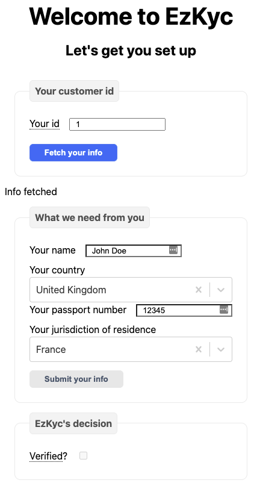
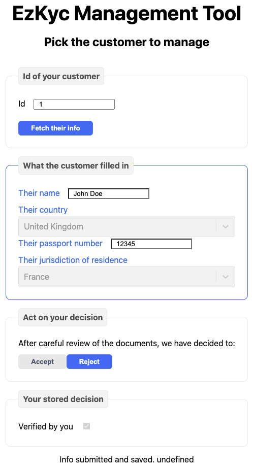
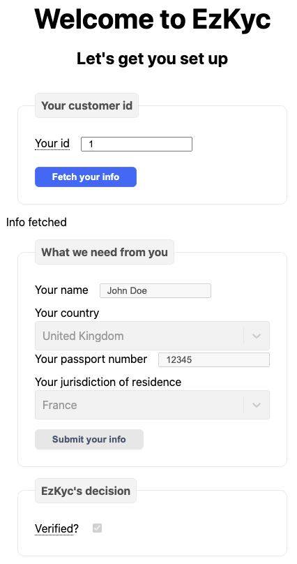
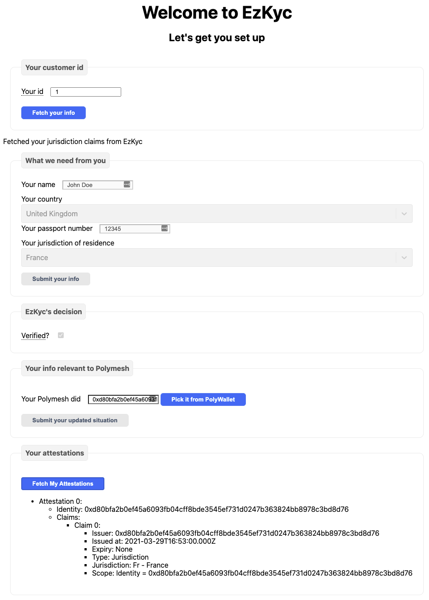
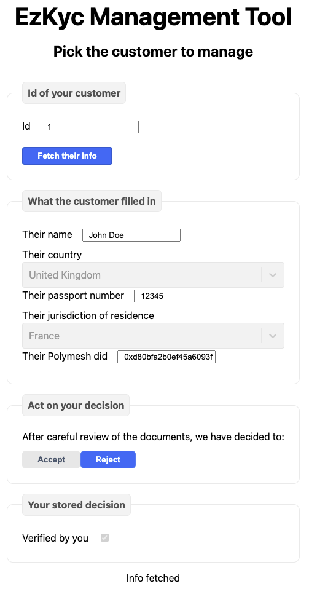

After learning about the SDK elements that work for KYC, let's have a look at a simplified example of what it would take to integrate an existing system with Polymesh. For this example, we will consider the case of EzKyc, a company that provides KYC services. Actually, EzKyc provides a very simple service, it provides an opinion about the validity of the documents provided by the customer to justify as being under a certain jurisdiction. In the same way we did for the settlement example app, to simplify, and not overburden the reader with elements not relevant to learning about Polymesh, we did not add any authentication nor authorisation mechanism.

## Pre Polymesh

Let's describe the EzKyc system before we integrate it with Polymesh.

### The setup

**2 pages** are served:

* `index.tsx`, [a page for the KYC customer](https://github.com/PolymathNetwork/technical-content-examples/blob/a9ca81ab05062f70e382fab0dae78716207aa698/kyc_provider/pages/index.tsx) to enter their information.
* `manager.tsx`, [a page for someone at EzKyc](https://github.com/PolymathNetwork/technical-content-examples/blob/a9ca81ab05062f70e382fab0dae78716207aa698/kyc_provider/pages/manager.tsx) to review a customer and make a decision.

There is a rudimentary server that exposes a **simple API**:

* `api/kycCustomer/[id].ts`, _the_ [end point](https://github.com/PolymathNetwork/technical-content-examples/blob/a9ca81ab05062f70e382fab0dae78716207aa698/kyc_provider/pages/api/kycCustomer/%5Bid%5D.ts) to get, put and patch customer information. Following the absence of login, it is used by both the customer and EzKyc.

On the server, a single **service** is running:

* `customerDbFs.ts`, a [service](https://github.com/PolymathNetwork/technical-content-examples/blob/a9ca81ab05062f70e382fab0dae78716207aa698/kyc_provider/src/customerDbFs.ts) to customers' information on disk in a large JSON file, instead of a proper database, for simplicity's stake.

The system describes its **information** in terms of:

* `CustomerInfo`, [an object](https://github.com/PolymathNetwork/technical-content-examples/blob/a9ca81ab05062f70e382fab0dae78716207aa698/kyc_provider/src/customerInfo.ts) that collects both the customer-provided information and EzKyc's decision.

### How it looks

When a customer of EzKyc _logs in_ on `/index`, using their customer id, they enter all their relevant information. Of course, since there is no authentication in this simplified example, anyone can use any id:

At a later stage, on `/manager`, someone from EzKyc will review the information and mark the information as accepted or rejected depending on the case:

Back to the customer view, when the information has been accepted, it is no longer possible to modify it:

## Post Polymesh

Time to integrate with Polymesh. What needs to be done?

### The setup

Let's go from the bottom up.

On the **configuration**:

* Some [basic information](https://github.com/PolymathNetwork/technical-content-examples/blob/109e888163eab902b9e1e184ab81af7dab886f66/kyc_provider/next.config.js) is added about EzKyc server's Polymesh account mnemonic.

On **objects**:

* in `CustomerInfo`, we [add information]https://github.com/PolymathNetwork/technical-content-examples/blob/109e888163eab902b9e1e184ab81af7dab886f66/kyc_provider/src/customerInfo.ts#L17-L18) about the customer's Polymesh information. We also use the `CountryCode` `enum`` provided by the Polymesh SDK.

On **services**:

* `customerDbFs.ts` does not have any change. There could have been a check on the Polymesh id of the customer.

On the **API** end points:

* `api/kycCustomer/[id].ts` [publishes](https://github.com/PolymathNetwork/technical-content-examples/blob/109e888163eab902b9e1e184ab81af7dab886f66/kyc_provider/pages/api/kycCustomer/%5Bid%5D.ts) an attestation when the customer is validated by EzKyc and the customer has a Polymesh id, whichever happens last.
* `api/kycProvider.ts` [exposes](https://github.com/PolymathNetwork/technical-content-examples/blob/109e888163eab902b9e1e184ab81af7dab886f66/kyc_provider/pages/api/kycProvider.ts) the Polymesh DID of EzKyc so the customer can check on their own whether the attestation has been published.

On **pages**:

* We add a [helper](https://github.com/PolymathNetwork/technical-content-examples/blob/109e888163eab902b9e1e184ab81af7dab886f66/kyc_provider/src/ui-helpers.ts) to get the Polywallet.
* On the `index.tsx` customer page, we add a [Polymesh id field](https://github.com/PolymathNetwork/technical-content-examples/blob/109e888163eab902b9e1e184ab81af7dab886f66/kyc_provider/pages/index.tsx#L259).
* We also make it possible to [pick it](https://github.com/PolymathNetwork/technical-content-examples/blob/109e888163eab902b9e1e184ab81af7dab886f66/kyc_provider/pages/index.tsx#L132-L136) directly from the Polymesh Wallet.
* We add a way to [collect EzKyc's DID](https://github.com/PolymathNetwork/technical-content-examples/blob/109e888163eab902b9e1e184ab81af7dab886f66/kyc_provider/pages/index.tsx#L40-L42).
* We add a place to [list the existing attestations](https://github.com/PolymathNetwork/technical-content-examples/blob/109e888163eab902b9e1e184ab81af7dab886f66/kyc_provider/pages/index.tsx#L270-L308) published by EzKyc for this account.
* And of course a way to [retrieve](https://github.com/PolymathNetwork/technical-content-examples/blob/109e888163eab902b9e1e184ab81af7dab886f66/kyc_provider/pages/index.tsx#L163-L170) said attestations.
* On the `manager.tsx` page, there only needs to have a place to [display the customer's Polymesh id](https://github.com/PolymathNetwork/technical-content-examples/blob/109e888163eab902b9e1e184ab81af7dab886f66/kyc_provider/pages/manager.tsx#L137-L140), the attestion is published from the server anyway.

### How it looks

There is more information to provide when submitting a buy order, and after the customer sends their Polymesh id, the attestation is published:

From EzKyc point of view, the only extra is the customer's Polymesh id:

## Conclusion

That's what it takes.

* Make your server able to access Polymesh.
* Store a bit more information in your database.
* Make your server able to publish attestions when relevant.
* Make your Web pages a bit more decentralised by having them fetch themselves the attestation.
