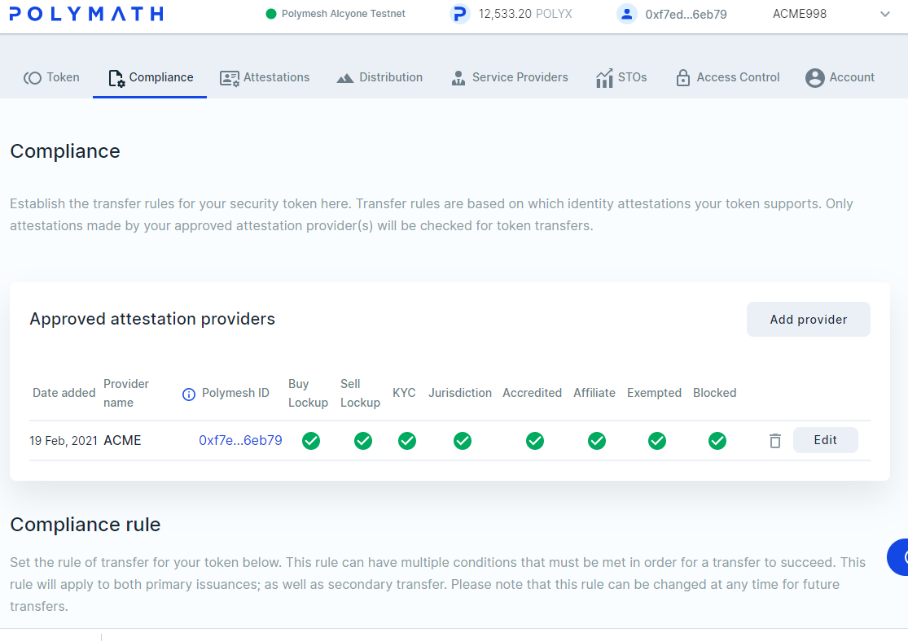
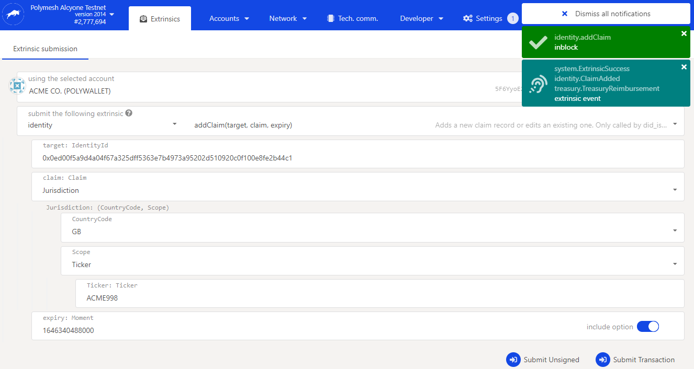
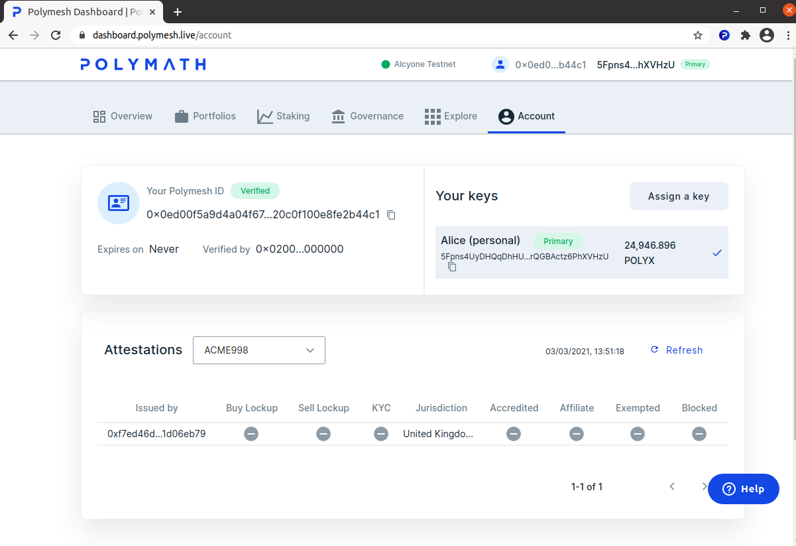

import HighlightBox from "../../src/components/HighlightBox"

## No code KYC process

It is possible to attach KYC attestations to a given Polymesh account using the Polymesh Dashboard. For reasons of scalability, Polymath expects that most KYC service providers will integrate Polymesh's on-chain attestations with their established business processes and automated systems using the SDK.

Even so, let's walk through the steps using the Polymesh API Explorer in order to get acquainted with the process.

## Trigger a KYC requirement

Security tokens enforce compliance rules defined at the token level. Consequently, incoming transfers can trigger KYC processes. For example, Alice trades with Bob and Bob is to receive ACME shares, but ACME has a compliance rule that states that holders must not be residents of Liechtenstein. It is incumbent on Bob to show that this is not the case, and to show it in a way that will be acceptable to ACME.

ACME can appoint a KYC service provider or attend to the communication and back-office process in house. In either case, ACME recognises the signature of the appointed KYC service provider. How does Bob know what to do? Recall that this process was kicked off by a trade, so we can infer that there is a trading system external to Polymesh itself. The SDK offers methods to signal that the receiver, Bob, needs to complete KYC process with ACME's appointed KYC service provider, so this concern is external to Polymesh. Polymesh will simply hold the transfer in a pending state until ACME's compliance needs are addressed.

## Off-chain processes

The asset owner, usually the originator, establishes the compliance rules, KYC requirements, and the process used to verify attestations. The KYC service provider generally offers a suite of services the originator can purchase, rather than an absolute assurance that the attestations are factual.

To understand how this works, consider a simple matter of someone's first name. Let's say the person claims their name is Alice. The originator's task is to establish a process that will ensure regulatory compliance, and then find a way to execute the process consistently. Consistent execution is how the KYC service provider can help.

There are many ways to verify such a claim. One method has already been hinted at. We might call this a self-attestation because the person has informally stated their name. To _verify_ that claim, the originator needs _evidence_.

The evidence can include examining identification documents, cross-checking other databases and in many cases includes facial recognition and other technologies. The originator determines what their process will be and the KYC service provider offers a buffet of options to choose from, usually in flexible combinations.

The agreement between the originator and the KYC service provider is an off-chain artefact. The decisions about what to do and how thorough the process should be is an off-chain concern. What is left?

In essence, the KYC Provider attests they followed the agreed procedure, whatever it happens to be, and found that the claim is valid or invalid.

The result is something approximating:

```
{
	name: Alice,
	verified by: EzKyc,
	onDate: March 1, 2021,
    validUntil: March 1, 2022
}
```
Since this is signed by the KYC Provider, it becomes a virtually inarguable fact that the KYC service provider did indeed attest to the facts on a certain day after following a well-defined process. This is subtly different from imagining that the blockchain cannot possibly be in error about Alice's name. The information about Alice is as good as the process that determined it.

## On-Chain enforcement

Polymesh allows originators to bind their KYC requirements to the assets they create. The system will not allow a transfer to someone who is not properly verified. It is therefore possible to assert that all owners of a given asset passed the KYC process that was in force at the time, and it is simultaneously possible to assert that every asset on Polymesh can have a unique KYC policy.

Trade and settlement may be stalled while the receiver completes the needed KYC Process with the KYC service provider that provides the service.

Since the process details are actually off-chain, the on-chain concerns are reduced approximately to a simple true/false response to identity claims.

## The KYC provider

Asset originators are KYC service providers, by default. That is to say, ACME is its own KYC service provider unless they appointed a third party such as EzKyc.

If you are unsure which Polymesh account, exactly, is ACME's KYC service provider at this time, return to the [token studio](https://tokenstudio.polymath.network/) as ACME and check the `Compliance` tab for your ACME token.



## Create an attestation

Let's create an attestation for Alice that will claim her jurisdiction is Great Britain.

As the KYC service provider (ACME or EzKyc), open the [Polymesh API Explorer](https://app.polymesh.live/).

Navigate to `Developer`, `Extrinsic`. Then, select `identity`, `addClaim(...)`.

Complete the form fields:

```
target: Alice's personal Polymesh DID. The claim is about Alice.
claim: Jurisdiction. The topic is Alice's jurisdiction.
Country Code: GB (near the bottom). The claim is her jurisdiction is Great Britain.
Scope: Ticker. This attestation applies to a security token.
Ticker: Your ACME token symbol
Expiry: Pick a time about 1 year in the future.
```

<HighlightBox type="tip">

Use a tool like [EpochConverter](https://www.epochconverter.com/) to create Unix time stamps for future dates. Use the time in milliseconds with the extra three zeros.

</HighlightBox>

`Submit Transaction`, confirm the action and sign the transaction in the usual way.



## Observe attestation

As you might expect, Alice now has an attestation, signed by ACME's KYC service provider and she can see it on her `Account` tab in the dashboard.

As Alice, visit the [dashboard Accounts tab](https://dashboard.polymath.network/account). The attestation is displayed and it shows her jurisdiction is Great Britain and this was signed by the KYC service provider ACME happens to be using.



## Re-enable compliance rules

You can now return to the [dashboard exercise in the distribution section](/distribute/token-dashboard) for a suggested compliance policy for the ACME token. Re-enable this policy now. Experiment with transfers between Alice, Bob and new identities you create, with and without the required jurisdiction attestations.

## Links

- Token Studio https://tokenstudio.polymath.network/
- API Explorer https://app.polymesh.live/
- EpochConverter: https://www.epochconverter.com/
