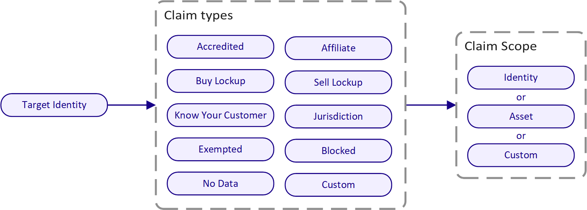
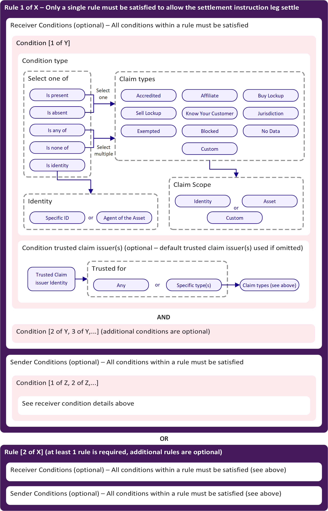

## Overview

Polymesh allows asset issuers to enforce relevant compliance on their assets in real-time, through the use of claim based transfer rules, and optional additional transfer restrictions.

The compliance manager, implemented in the base layer of the Polymesh blockchain, provides a flexible framework to allow asset issuers to easily configure complex transfer rules based on claims that must be held by their investors.

## Claims

There are several types of claims that can be attested from one identity to another. A claim should be interpreted simply as something which is being claimed, and does not have any on chain proof associated with it in general.

The above diagram shows the available claim types. Some of these claim types are parameterised with additional information relevant to the claim, for example `Jurisdiction` includes the country code of the users jurisdiction.

Each claim has an optional expiry, after which the claim is no longer considered valid. For `Buy Lockup` and `Sell Lockup` this can be used to prevent investors from buying or selling an asset until after the expiry date of the respective claim.

The `Custom` claim type allows the possibility to attach non default claim types which can further expand the options available to be used with compliance rules.

There are two additional "special" claims not shown above which are treated differently, these are:

- `CustomerDueDiligence`: This can only be issued by trusted [CDD](./cdd) service providers and allows a user general access to the Polymesh network.

- `InvestorUniqueness`: These are self-issued claims (an identity makes the claim about itself) that declare any [linkage](./confidential-identity) between identities owned by the same entity investing in the same asset.

## Trusted Claim Issuers and Scopes

Anyone can issue a claim for an identity but that does not mean the issuer should consider that claim as valid.

Asset issuers specify which other identities they trust for the purposes of assessing claims on their investors. This allows the issuer to set rules which are only satisfied if an investor has the relevant claims, issued by these trusted identities. An asset issuer can include themselves in this list of trusted claim issuers, as well as their partnered KYC organisations. An issuer can also restrict which specific claim types are considered valid from the trusted claim issuers. e.g. the `Affiliate` claim can be restricted to only be accepted from the issuer themselves.

An issuer may specify one or more **default** trusted claim issuers. If a rule does not explicitly specify a claim issuer for a condition, the default claim issuers are used.

## Claim Scopes

Claim issuers also specify a scope for an identity claim. Asset issuers use scopes in their compliance rules to further define what claims are accepted for their asset. A claim scope can apply to an asset, an identity or a custom scope. 

Examples of claim scopes are as follows:
-	A claim is scoped to the `ACME` token allows the claim to be used with rule conditions that accept claims scoped to only this asset. This is the most restrictive scope as claims must specifically be created for this asset, but provides most granular control of identity claims.
-	A claim is scoped to the `ACME Co.` identity. The issuer of the `ACME-A`, `ACME-B` and `ACME-C` assets. This can allow an issuer to reuse the identity claims across multiple assets they have issued. In this case, instead of claim issuers issuing multiple KYC claims scoped to individual assets, they can issue a single claim scoped to their identity that can be reused in the compliance rules of multiple assets.
-	A claim is scoped to a custom identifier e.g. `ACME Exchange`. The ACME Exchange could issue identity claims for every account holder that onboards with them under this custom scope. If an asset issuer lists their token on the ACME exchange and the issuer accepts the exchange as a trusted claim issuer, the issuer can allow exchange account holders to trade their token by accepting the exchange custom scope in their compliance rules.

## Compliance Rules

The compliance manager allows asset issuers to configure the compliance rules for their asset. The below diagram shows the construction of issuer defined compliance rules on Polymesh.

Asset issuers can specify one or more rules for their asset. Each individual compliance rule consists of a list of conditions that the sender must satisfy, and a list of conditions that the receiver must satisfy. If both parties of a settlement leg satisfy the conditions of any one of these rules, then the leg can be settled as part of the instruction.

All of the conditions for a particular compliance rule (for both the sender and receiver) must be satisfied, although it is possible for these lists to be empty. i.e. if sender conditions are left blank all asset holders can send the token without restriction, provided the receiver satisfies the defined receiver conditions.

An asset issuer can choose to also pause compliance on their asset allowing all settlement legs for their asset to execute upon affirmation. Pausing asset compliance rules may be useful for certain assets such as stable coins where the issuer does not want to impose transfer restrictions on either the sender or receiver.

A condition can specify that a particular claim (including a specific claim scope) must be present, or absent, or that a group of claims must be present, or absent, or that at least one of a claim type must be present. Conditions also define who are accepted as the trusted claim issuers for the condition. A condition can also enforce that the sender or receiver is a particular identity.

If any one of the compliance rules are satisfied in a particular leg settlement, then the compliance is considered to be complete. This allows asset issuers to add complex rule sets that combine logical sets of rules that their asset must remain compliant with. 

For example a rule set where only a single rule must be satisfied may be as follows:

-	Rule 1 - sender does not have a sell lockup, scoped to the asset, from the asset issuer and receiver has a KYC claim and is not from a jurisdiction of the USA with claims scoped to the asset or scoped to the issuers identity and from the issuers KYC partner.
-	Rule 2 - sender does not have a sell lockup, scoped to the asset, from the asset issuer and receiver has a KYC claim and an Accredited claim with claims scoped to the asset or scoped to the issuers identity and from the issuers KYC partner.
-	Rule 3 - senders identity is an agent of the asset and no receiver conditions.
-	Rule 4 - no sender restriction and the receiver's identity is an agent of the asset.
-	Rule 5 - no sender restriction and receiver has a claim of exempted, scoped to the asset, from the asset issuer.

## Additional Transfer Restrictions

In addition to the flexible claim based compliance manager, asset issuers can use transfer restrictions to further control the trading of their assets.