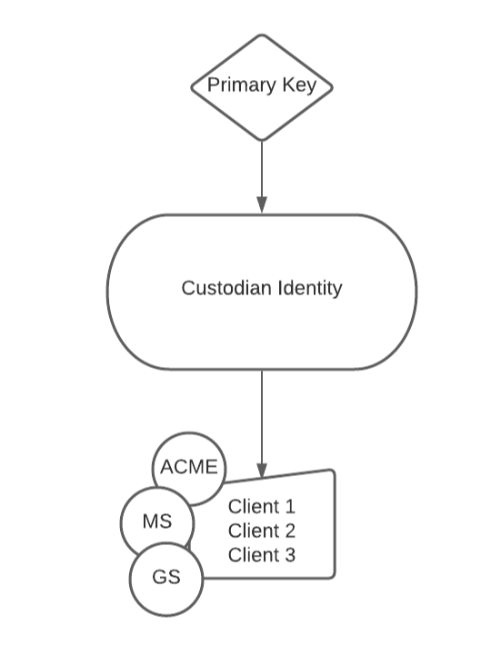
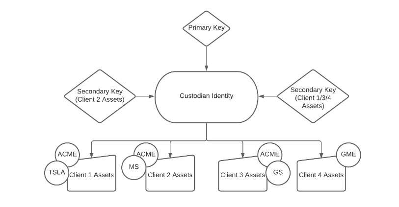
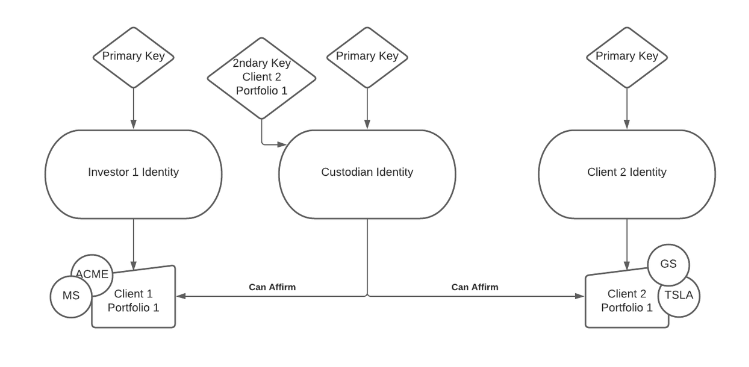

## Overview

In Polymesh, all assets (excluding the network native token POLYX) are held at the identity level. This allows Polymesh to enforce compliance in real time based on claims also held at the identity level.

To allow users to organise their assets underneath their identity, and to flexibly assign key permissions and custody, Polymesh has the concept of portfolios.

## Portfolio Diagram

## Portfolios

Assets can be partitioned into logical portfolios within a single identity.

A particular asset can have different balances across portfolios within the same identity.

Compliance is applied to the sum of balances across an identities portfolios (it can also be applied across all identities under a [single entity](./confidential-identity)).

Permissions for keys can be applied at the portfolio granularity.

Portfolios are not related to compliance - i.e. claims remain at the identity level and are shared across all portfolios. Transfer restrictions are at the identity level, not per portfolio.

Transfers of assets between portfolios of the same identity should always be possible (provided the identity has a CDD check) and not subject to any compliance rules.

Secondary keys are managed at the identity level, but can be granted access to specific portfolios under an identity.

The distribution of assets into portfolios, and the association of a portfolio with an identity are publicly stored on-chain.

Every identity has a default identity which is used in the case that a specific identity is not specified as part of a transfer or instruction settlement.

## Custody

A user can assign custodianship of a portfolio to another identity. This cleanly separates beneficial ownership of an asset (which always stays under the beneficiares identity) used for corporate actions, from custodial ownership where another entity may manage those assets on behalf of their beneficiary.

Any assets in a portfolio which has been assigned a custodian are managed exclusively by that custodian, and include any new assets which are transferred into the portfolio.

A portfolio can only be assigned to a single custodian at a time. Once assigned to a custodian, the custodian can:  

- affirm or reject instructions that relate to portfolios managed by the custodian on behalf of the owner

- revoke their custodianship over the portfolio

## Custody Models

The above features allow for different types of custody model that can be used to meet different use-cases and requirements.

The first use-case is when a user wants to delegate the full control and recorded beneficial ownership of assets to a third-party custodian.

The second use-case is when a user wants to retain beneficial ownership, but delegate settlement responsibilities to a third-party custodian.

### Custody with Full Control and Ownership

Since assets are held at the identity level, this involves transferring the assets from the users identity to the custodians identity.

From the perspective of Polymesh this would mean that the custodian is the beneficial owner of the securities. The custodian would require the appropriate attestations in order to hold any assets they are holding in custody. 

The custodian has full rights over these assets in-protocol. For example they can transfer them to another party.

For the purposes of any corporate actions, the custodian would be seen as the beneficial owner of these assets.

The custodian identity(s) would require any compliance claims necessary to hold the assets they are custodying. The custodian (or other agent) would need to enforce any underlying compliance for their clients required to own the assets on the issuers behalf.

#### Omnibus

Custodian creates one omnibus portfolio and holds all clients assets in a single portfolio within the corresponding identity.

Whilst this model is very simple and easy to manage it lacks many useful features available in the below more sophisticated approaches.

#### Omnibus Segregation

Custodian has a single identity and segregates client assets by portfolio (aka sub-accounts).

  - Smaller number of keys to manage - since secondary keys can be permissioned at the portfolio level, access to client assets can be flexibly segmented.

  - Clear separation of client funds on-chain.

  - Primary key can access all client funds.

Note: Omnibus Segregation could be extended to large Asset Managers or Broker-Dealers by creating a separate identity. This identity could be the custodian's identity OR the Asset Manager/Broker-Dealers Identity for which the custodian controls the Primary Key.

### Custody with beneficial interest separated from asset control

In this model the user retains full beneficial interest in their assets, for example for the purposes of dividend payments and corporate actions.

Polymesh has dedicated custody functionality for the on-chain settlement of assets.

This allows a user, who holds assets in a particular portfolio, to delegate control of that portfolio to a third-party identity, for the purposes of affirming settlements that relate to that portfolio.

The custodian can also invest (on behalf of their client) in any STOs using funds from the clients portfolio that they are a custodian of.

NB - this follows a similar approach to ERC-2258 as mentioned in:  
http://www.oecd.org/daf/fin/financial-markets/Regulatory-Approaches-to-the-Tokenisation-of-Assets.pdf

  - The user cannot unilaterally remove a custodian for one of their portfolios - the custodian must relinquish control of the portfolio. This prevents a user who has been “hacked” from being vulnerable to having their assets stolen, and means the custodian has full control over those assets.

  - The beneficial owner, for the purposes of cap tables and corporate actions, remains the investor, not the custodian. So if the issuer were to ask all token holders to vote, each token holder could vote using their own identity without the need for the custodian to intervene/participate.

  - A user can assign one custodian per portfolio they own. A portfolio can contain any number of different assets.